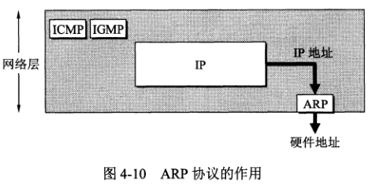
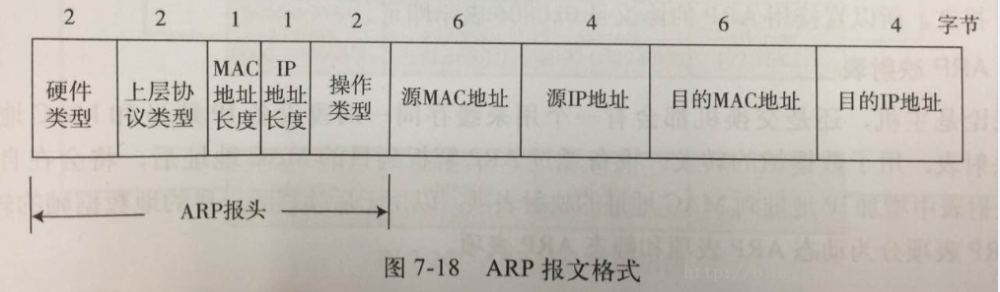

# ARP 地址解析协议文档
ARP 根据 IP 地址找出相应的物理地址，每一台主机都有 ARP 高速缓存，里面有本局域网上各主机和路由器的 IP 地址与硬件地址的映射表，并且动态更新。
ARP 只能解析同一局域网上的主机和路由器的 IP 地址与硬件地址的映射问题。

假设主机 A 想知道主机 B 的硬件地址，解析过程：
1. ARP 进程在本局域网广播一个 ARP 请求分组，请求内容相当于：“我的 IP 地址是 xxx，硬件地址是 yyy，我想知道 IP 地址为 zzz 的主机的硬件地址”。
2. 本局域网所有主机上运行的 ARP 进程都会收到此 ARP 请求分组。
3. 与这个请求分组要查询的 IP 地址一致的主机才会收下这个 ARP 请求分组，并向发出该请求的主机发送 ARP 响应分组（响应分组为单播），同时在分组上写入自己的硬件地址。主机 B 在这个过程中也会把主机 A 的 IP 地址与硬件地址映射关系更新到其 ARP 高速缓存。
4. 主机 A 在收到响应分组后，在其 ARP 高速缓存更新主机 B 的 IP 地址与硬件地址的映射。

ARP 对高速缓存中的表项设置生存时间，凡超过生存时间的表项就会删除掉。

## ARP 报文格式
