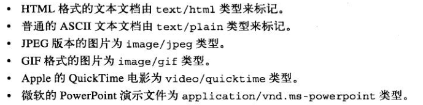
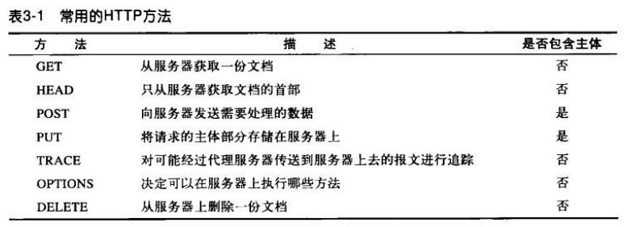

# HTTP 概述
## 资源
#### MIME
多用途因特网邮件扩展（MIME）用来描述并标记多媒体内容。HTTP 给每种要通过 Web 传输的对象都打上 MIME 类型的数据格式标签。
MIME 类型是一种文本标记，表示一种主要的对象类型和一个特定的子类型，中间由一条斜杠隔开。

[常见 MIME 类型列表](https://developer.mozilla.org/zh-CN/docs/Web/HTTP/Basics_of_HTTP/MIME_types/Common_types)
#### URI
每个服务器资源都有一个名字，被称为统一资源标识符 URI。URI 在世界范围内唯一标识并定位信息资源。

#### URL
统一资源定位符 URL 是资源标识符最常见的形式，它是 URI 的子集，URL 描述了一台特定服务器上某个资源的位置。

URL 格式包含三个部分：
1. 第一部分称为方案，说明了访问资源所使用的协议类型，通常是 http 协议。
2. 第二部分给出了因特网的服务器地址，例如 `www.baidu.com`。
3. 第三部分部分是资源路径，指定了服务器的某个资源，例如 `/a/b.html/`。

现在，几乎所有的 URI 都是 URL。

#### URN
URI 的第二种形式是统一资源名 URN。URN 是作为内容的唯一名称使用的，与目前资源的所在地无关。使用 URN，可以将资源四处移动，不管资源在哪都能通过 URN 找到。
例如，不管 RFC 2141 位于何处，都能通过 `urn:ietf:rfc:2141` 找到它。

## 事务
HTTP 事务由请求命令和响应结果组成，这种通信是通过名为 HTTP 报文的格式化数据完成的。一个网页可以包含多条事务。
#### 方法
HTTP 的请求命令被称为方法，每条 HTTP 请求包含一个方法。这个方法告诉服务器要执行什么动作。

#### 状态码
每条 HTTP 响应报文都会携带一个状态码，用来告知客户端请求结果或是否需要采取其他动作。除了数字状态码，HTTP 还会发送一条解释性的“原因短语”描述文本。

## 报文
HTTP 报文分为请求报文和响应报文，除此之外没有其他类型的报文。
HTTP 报文分为三部分：
1. 起始行，在请求报文中用来说明要做些什么，在响应报文中说明出现了什么情况。
2. 首部字段，起始行后面有零或多个首部字段。每个首部字段都会包含一个名字和一个值，两者之间用冒号隔开，首部以一个空行结束。
3. 主体，可选。起始行和首部字段都是文本形式且结构化的，而主体可以包含任意格式的数据。

## Web 的结构组件
1. 代理，位于客户端和服务器之间的实体。
2. 缓存，HTTP 的仓库，使常用页面的副本可以保存在离客户端更近的地方。
3. 网关，连接其他应用程序的特殊服务器。
4. 隧道，对 HTTP 报文进行盲转发的特殊代理。
5. Agent 代理，发起自动 HTTP 请求的半智能 Web 客户端。浏览器就是 Agent 代理。