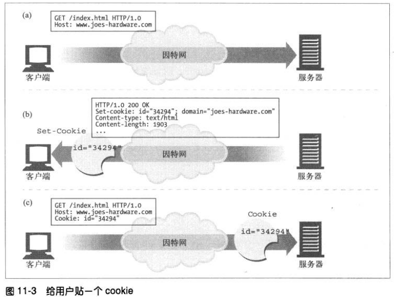
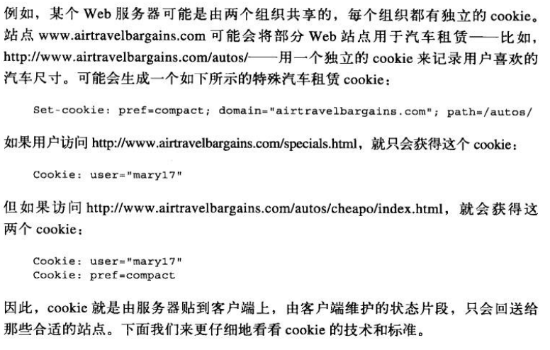
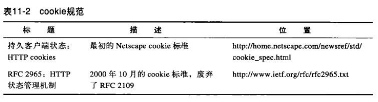
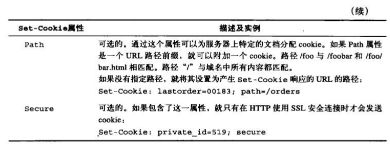
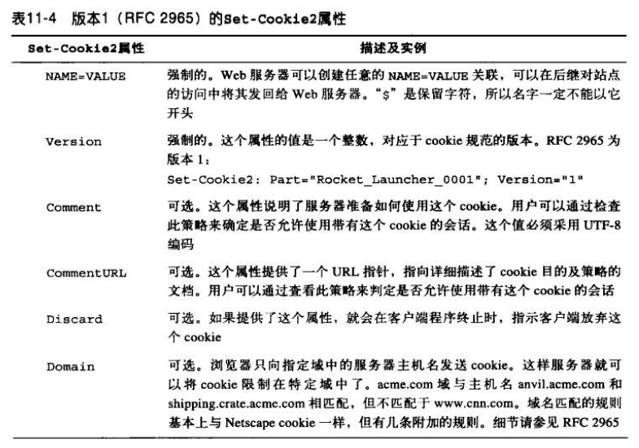
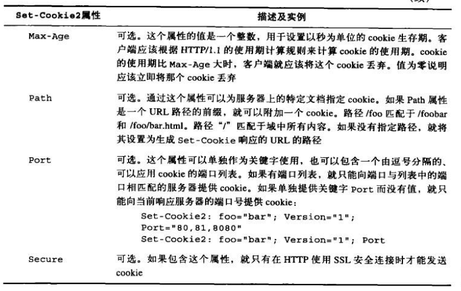

# 客户端识别与 cookie 机制
## HTTP 首部
下表列出了最常见的七种用来承载用户相关信息的 HTTP 首部。

From 首部可以用来发送用户的电子邮件地址，但服务器有可能会搜集这些信息来发垃圾邮件，所以很少浏览器会发送 From 首部。

User-Agent 首部可以将用户浏览器的相关信息发送给服务器。

Referer 首部提供了用户来源页面的 URL，根据它可以知道用户是从哪个页面跳过来的。

这三个首部都不能实现可靠的识别。

## 客户端的 IP 地址
使用客户端 IP 地址来识别用户存在很多缺点：
1. IP 地址描述的是机器，不是用户。如果多个用户共用一台机器，就无法对其进行区分了。
2. 很多 ISP 会在用户登录时为其分配动态 IP 地址，有可能用户每次登录都是不同的 IP 地址。
3. 很多用户都是通过网络地址转换 NAT 防火墙来浏览网络的。这些设备隐藏了用户真正的 IP 地址。
4. 客户的请求可能会经过很多网关或代理，导致服务器得到的是网关或代理的 IP 地址。

## 胖 URL
有些网站会为用户生成特定的 URL 来追踪用户身份，例如在 URL 后面加一个用户 ID。改动后包含了用户状态信息的 URL 称为胖 URL。

## cookie
大多数缓存和浏览器都不允许对 cookie 的内容进行缓存。
### cookie 类型
cookie 可分为会话 cookie 和持久 cookie。

会话 cookie 是临时的 cookie，它记录了用户访问网站时的设置和偏好。用户退出浏览器时，会话 cookie 就被删除了。

持久 cookie 生存时间更长一些，它存储在硬盘上，浏览器退出，计算机重启时它们仍然在。持久 cookie 通常用来维护某个用户周期性访问的网站的配置文件或登录名。

会话 cookie 和持久 cookie 之间唯一的区别就是它们的过期时间，如果设置了 Discard 参数，或者没有设置 Expires 或 Max-age 参数说明扩展的时间，那这个 cookie 就是会话 cookie。

### cookie 是如何工作的
服务器给每个用户分配一个 cookie。
cookie 包含了一个由 `name=value` 这样的信息构成的列表，并通过 Set-Cookie 或 Set-Cookie2 HTTP 响应（扩展）首部将其分配给用户。

浏览器会记住从服务器返回的 Set-Cookie 或 Set-Cookie2 首部中的 cookie 内容，并将 cookie 内容存储在浏览器的 cookie 数据库中。

### cookie 罐: 客户端的状态
cookie 的基本思想就是让浏览器存储一些服务器特有的信息，每次访问服务器都把这些信息提供给它。cookie 规范的正式名称为 HTTP 状态管理机制。
不同的浏览器有可能会将 cookie 存储在不同的文件夹。

### 不同的网站使用不同的 cookie
浏览器只向服务器发送服务器产生的那些 cookie，也就是说 A 网站的服务器只会获得 A 网站的 cookie，而不会是别的网站。

#### cookie 的域属性
产生 cookie 的服务器可以向 Set-cookie 响应首部添加一个 Domain 属性来控制哪些网站可以查看 cookie。

#### cookie 的路径属性
cookie 规范允许用户将 cookie 与部分网站关联起来。可以通过 Path 属性来实现这一功能，在这个属性列出的 URL 路径前缀下所有 cookie 都是有效的。

### cookie 的成分
cookie 有两个版本：版本 0 和版本 1。

#### 版本0

#### 版本1

