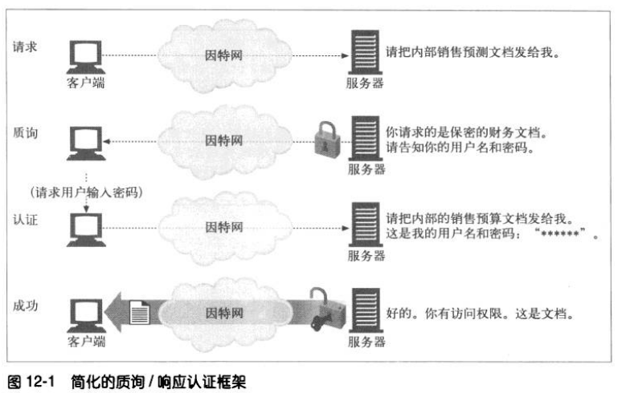
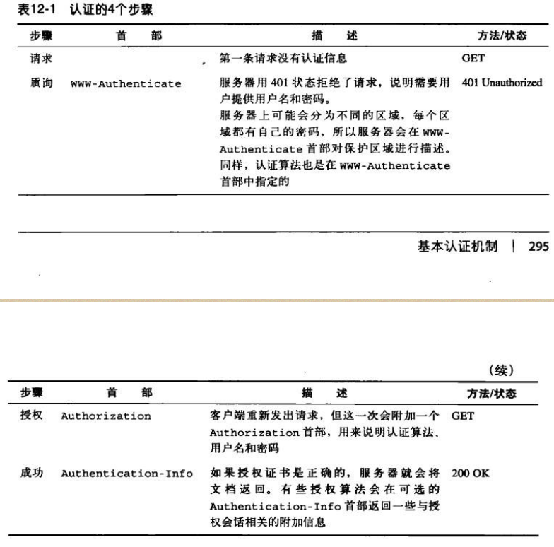
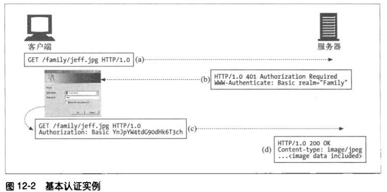
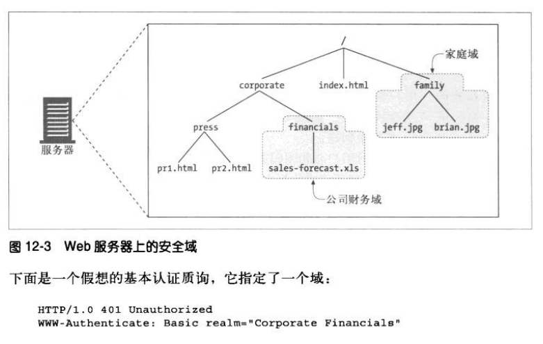
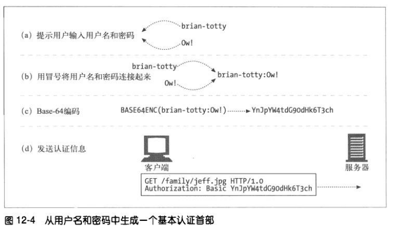
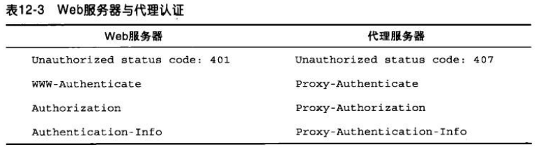

# 基本认证机制
## 认证
HTTP 提供了一个原生的质询/响应框架，用于用户的认证过程。

### 认证协议与首部
HTTP 通过一组可定制的控制首部，为不同的认证协议提供了一个可扩展框架。
HTTP 定义了两个官方的认证协议：基本认证和摘要认证。

### 安全域
www-Authenticate 质询中包含了一个 realm 指令，它可以为用户指定不同的安全域。

## 基本认证
基本认证是最流行的 HTTP 认证协议。
在基本认证中，服务器可以拒绝一个事务，质询客户端，请用户提供有效的用户名和密码。服务器会返回 401 状态码来初始化认证质询，并用 www-Authenticate 响应首部指定要访问的安全域。浏览器收到质询时，会打开一个对话框，请求用户输入这个域的用户名和密码。然后将用户名和密码稍加扰码，再用 Authorization 请求首部回送给服务器。

### Base-64 用户名/密码编码
HTTP 基本认证将用户名和密码打包在一起，并用 base64 编码方式对其进行编码。

### 代理认证
代理认证的步骤与 Web 服务器身份验证的步骤相同。但首部和状态码有所不同。

## 基本认证的安全缺陷
1. 虽然基本认证通过明文 BASE64 的编码方式发送，但是这很容易破解。
2. 即使采用更难解码的方式加密，第三方用户仍然能捕获用户名和密码，并将修改过的用户名和密码不停地重放给服务器。
3. 基本认证没有提供任何针对代理和中间人节点的防护措施。
4. 假冒服务器很容易骗过基本认证。