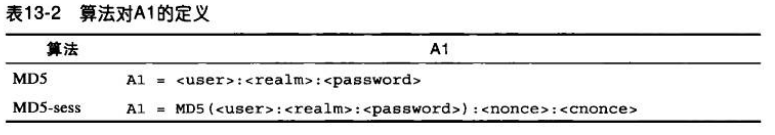
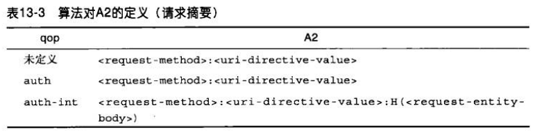
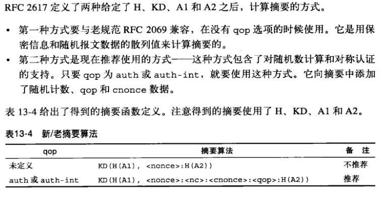
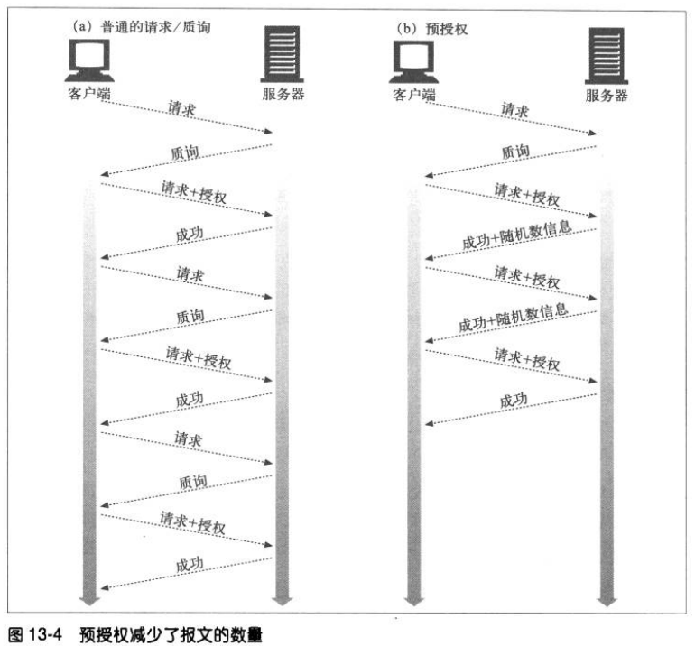

# 摘要认证
## 摘要认证的改进
摘要认证是另一种 HTTP 认证协议，相对 HTTP 基本认证协议，它做了如下改进：
1. 不以明文方式在网络上发送密码。
2. 可以防止恶意用户捕获并重放认证的握手过程。
3. 可以有选择地防止对报文内容的篡改。
4. 防范其他几种常见的攻击方式。

摘要认证不是最安全的的协议，它不能满足很多安全 HTTP 事务的需求。对这些需求来说，使用 TLS 和 HTTPS 协议更为合适一些。

### 单向摘要
使用 MD5 对输入进行摘要加密。

### 用随机数防止重放攻击
服务器可以向客户端发送一个称为随机数的特殊令牌，客户端在计算摘要前将这个随机数令牌附加到密码上去。如果没有随机数，摘要认证就会变得跟基本认证一样脆弱。
随机数是在 www-Authenticate 质询中从服务器传送给客户端的。

### 摘要认证的握手机制
摘要认证比基本认证多了一些首部字段，其中有一个可选的 Authorization-info。
下图是简化的摘要认证三步握手机制。

## 摘要的计算
摘要认证的核心就是对公共信息、保密信息和有时限的随机值这个组合的单向摘要。

### 摘要算法的输入数据
摘要是根据以下三个组件计算出来的：
1. 由单向散列函数 H(d) 和摘要 KD(s,d) 组成的一对函数，其中 s 表示密码，d 表示数据。
2. 一个包含了安全信息的数据块，包括密码，称为 A1。
3. 一个包含了请求报文中非保密属性的数据块，称为 A2。

### 与安全性相关的数据 A1
A1 数据块是密码和受保护信息的产物，它包含有用户名、密码、保护域和随机数等内容。A1 只涉及安全信息，与底层报文自身无关。

两种计算 A1 的方式：
1. MD5，为每条请求运行单向散列函数。A1 是由冒号连接起来的用户名、域以及密码三元组。
2. MD5-sess。

### 与报文有关的数据 A2
数据块 A2 表示的是与报文自身有关的信息，比如 URL、请求方法和报文实体的主体部分。A2 有助于防止方法、资源或报文篡改。

A2 有两种策略：
1. 第一种策略只包含 HTTP 请求方法和 URL。当 qop="auth" 时使用这种策略。
2. 第二种策略添加了报文实体的主体部分，以提供一定程度的报文完整性检测。qop="auth-int" 时使用。

### 摘要算法总述

### 预授权
在普通的认证方式中，每条请求都要有一次请求/质询的循环。如果客户端事先知道下一个随机数是什么，就可以取消这个请求/质询的循环，这样客户端就可以在服务器发出请求前，生成正确的 Authoirzation 首部了。这样可以预先将 Authoirzation 首部发送给服务器，而不用进行请求/质询了。

摘要认证提供了几种预授权方式：
1. 预先生成下一个随机数。
2. 受限的随机数重用机制。
3. 同步生成随机数。