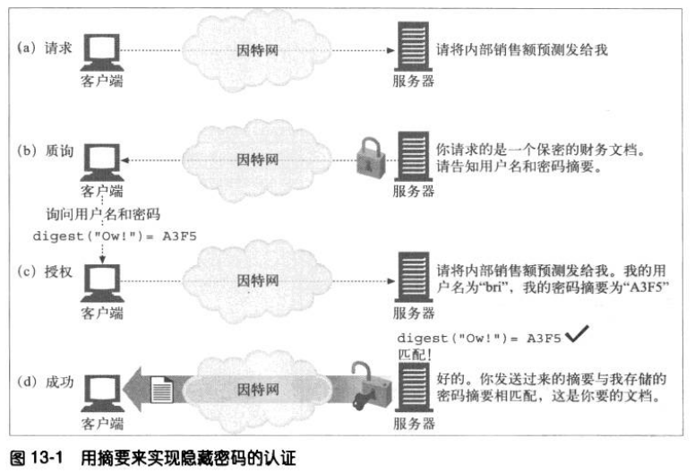
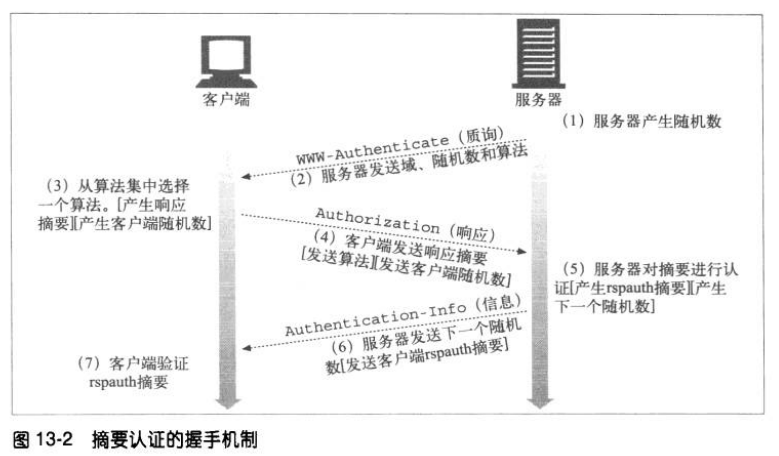
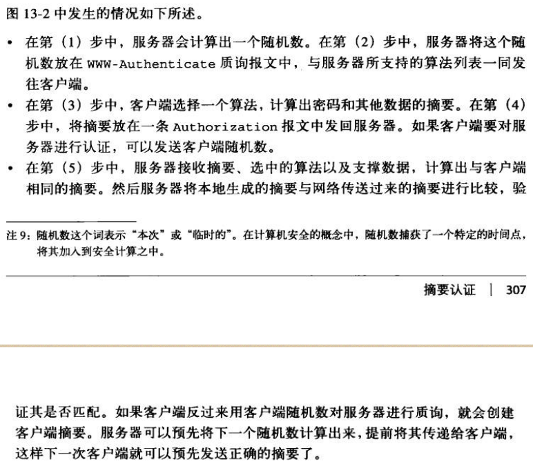

# 摘要认证
## 摘要认证的改进
摘要认证是另一种 HTTP 认证协议，相对 HTTP 基本认证协议，它做了如下改进：
1. 不以明文方式在网络上发送密码。
2. 可以防止恶意用户捕获并重放认证的握手过程。
3. 可以有选择地防止对报文内容的篡改。
4. 防范其他几种常见的攻击方式。

摘要认证不是最安全的的协议，它不能满足很多安全 HTTP 事务的需求。对这些需求来说，使用 TLS 和 HTTPS 协议更为合适一些。

### 单向摘要
使用 MD5 对输入进行摘要加密。

### 用随机数防止重放攻击
服务器可以向客户端发送一个称为随机数的特殊令牌，客户端在计算摘要前将这个随机数令牌附加到密码上去。如果没有随机数，摘要认证就会变得跟基本认证一样脆弱。
随机数是在 www-Authenticate 质询中从服务器传送给客户端的。

### 摘要认证的握手机制
摘要认证比基本认证多了一些首部字段，其中有一个可选的 Authorization-info。
下图是简化的摘要认证三步握手机制。

## 摘要的计算
摘要认证的核心就是对公共信息、保密信息和有时限的随机值这个组合的单向摘要。

### 摘要算法的输入数据
