# 安全 HTTP
基本认证和摘要认证属于轻量级的方法，对于访问机密数据来说不够强大。

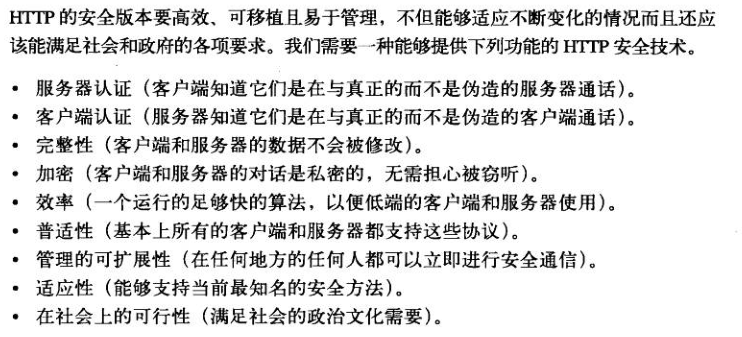
## HTTPS
HTTPS 是最流行的 HTTP 安全形式，由网景公司首创，所有主要的浏览器和服务器都支持此协议。
使用 HTTPS 时，所有的 HTTP 请求和响应数据在发送之前，都要进行加密。加密可以使用 SSL 或 TLS。

大部分困难的编码及解码工作都是在 SSL 库中完成的，客户端或服务器在使用安全 HTTP 时无需过多地修改其协议处理逻辑。

## 数字加密
在这个数字加密技术的入门介绍中，会讨论以下内容：
1. 密码，对文本进行编码，使偷窥者无法识别的算法。
2. 密钥，改变密码行为的数字化参数。
3. 对称密钥加密系统，编/解码使用相同密钥的算法。
4. 非对称密钥加密系统，编/解码使用不同密钥的算法。
5. 公开密钥加密系统，一种能使数百万计算机便捷地发送机密报文的系统。
6. 数字签名，用来验证报文未被伪造或篡改的校验和。
7. 数字证书，由一个可信的组织验证和签发的识别信息。

### 密码编制的机制与技巧
密码学是对报文进行编/解码的机制与技巧。

### 密码
密码学基于一种名为密码的秘密代码。密码是一套编码方案——一种特殊的报文编码方式和一种稍后使用的相应解码方式的结合体。
加密前的报文称为明文，加密后的报文称为密文。

### 数字密码
给定一段明文报文 P、一个编码函数 E 和一个数字编码密钥 e，就可以生成一段经过编码的密文 C。通过解码函数 D 和解码密钥 d，可以将密文 C 解码为原始的明文 P。

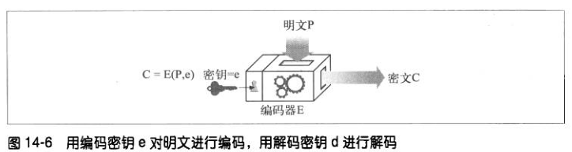

## 对称密钥加密技术
对称密钥加密技术是因为它们加/解密使用相同的密钥。对称密钥加密算法主要包括：DES、3DES、IDEA、RC5、RC6等。

### 密钥长度与枚举攻击
在很多情况下，编/解码算法都是众所周知的，因此密钥就是唯一保密的东西了。
用暴力去尝试所有的密钥值称为枚举攻击。通常来说，密钥长度越长就越安全。

对称密钥加密技术的缺点之一就是发送者和接收者在对话之前，一定要有一个共享的密钥。

## 公开密钥加密技术
公开密钥加密技术使用了两个非对称密钥：一个用来对主机报文编码，另一个用来对主机报文解码。编码密钥是众所周知的，但解码密钥是私有的。

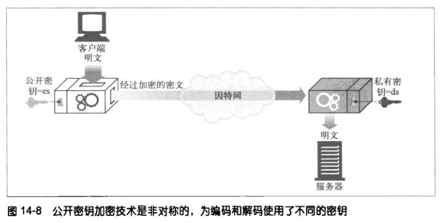

节点 x 可以将其加密密钥 ex 公之于众。任何想向节点 x 发送报文的人都可以使用相同的公开密钥，但只有 x 才能对报文进行解密。

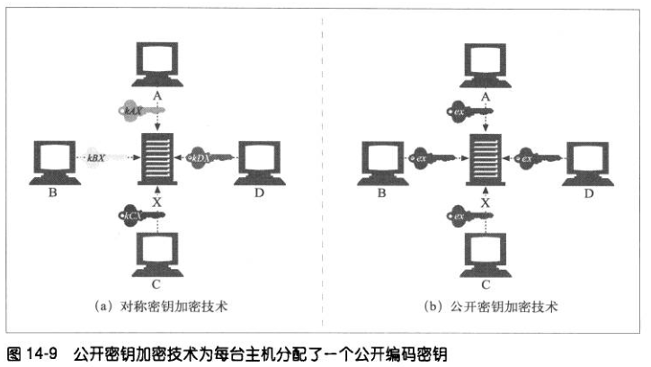

### RSA
公开密钥非对称加密系统所面临的共同挑战是，要确保即使有人拥有了下面所有的线索，也无法计算出保密的私有密钥：
1. 公开密钥。
2. 一小片拦截下来的密文。
3. 一条报文及与之相关的密文。

RSA 算法就是一个满足了所有这些条件的流行的公开密钥加密系统。

## 数字签名
用加密系统对报文进行签名，以说明是谁编写的报文，同时证明报文未被篡改过，这种技术称为数字签名。

数字签名是附加在报文上的特殊加密校验码。使用数字签名的好处有：
1. 签名可以证明是作者编写了这条报文。只有作者才会有最机密的私有密钥，因此，只有作者才能计算出这些校验和。
2. 签名可以防止报文被篡改，如果有人在报文传输过程中对其进行了修改，校验和就不再匹配了。

数字签名通常是用非对称公开密钥技术产生的。

看上图，任何人都能用 A 的公钥 PK 对密文进行 E 运算后得到 A 发送的明文。可见这种通信并非为了保密，而是为了进行签名和核实签名，即确认此信息是 A 发送的。
但上述过程仅对报文进行了签名，对报文 X 本身却未保密，所以要采用下图的方法，同时实现秘密通信和数字签名。

## 数字证书
数字证书中包含了由某个受信任组织担保的用户或公司的相关信息。

### 证书内容
数字证书通常包含以下内容：
1. 对象的名称（人、服务器、组织等）。
2. 过期时间。
3. 证书发布者（由谁为证书担保）。
4. 来自证书发布者的数字签名。

数字证书通常还包含对象的公开密钥、所用签名算法的描述性信息。任何人都可以创建一个数字证书，但并不是所有人都能获得受人尊敬的签发权，从而为证书信息担保，并用其私钥发证书。

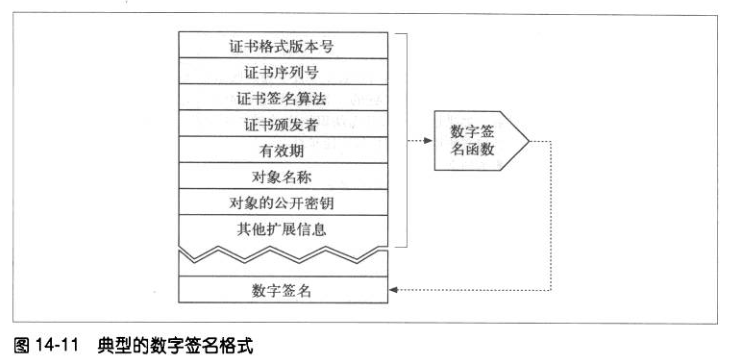

### X.509 V3 证书
数字证书没有统一的标准，现在大多数的证书都使用 X.509 V3 标准，来存储它们的信息。

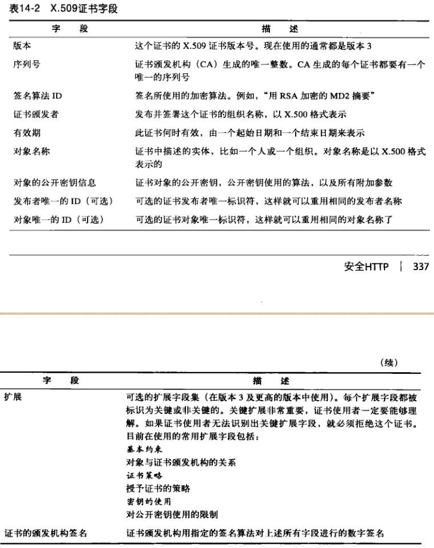

### 用证书对服务器进行认证
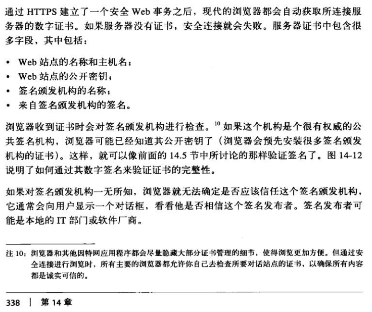

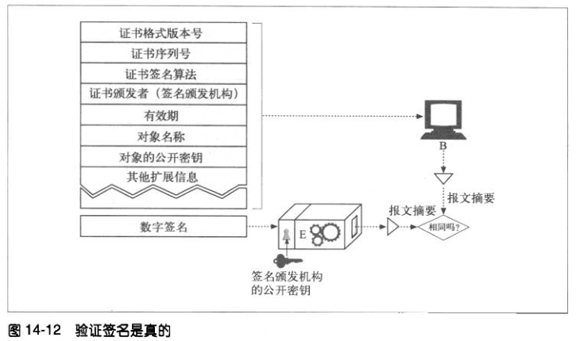

## HTTPS 细节介绍
HTTPS 不是直接将 HTTP 报文发送给 TCP，而是将 HTTP 报文发送给一个安全层，在那进行加密。HTTP 安全层由 SSL 或 TLS 来实现。

### HTTPS 方案
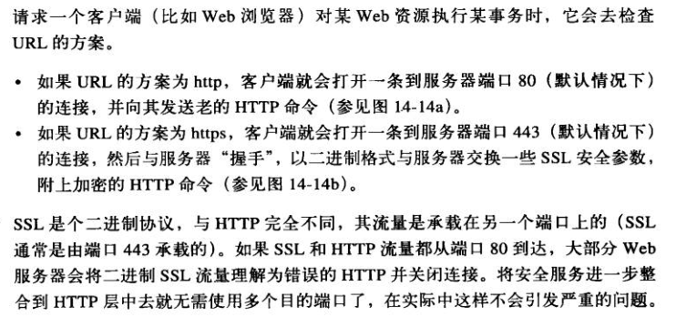

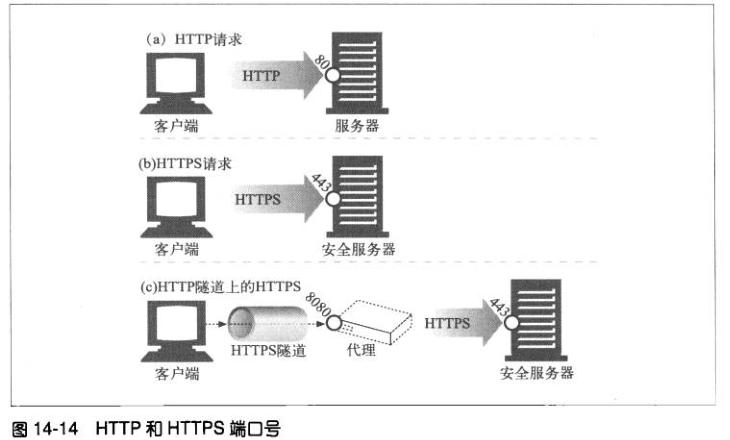

在 HTTPS 中，客户端首先打开一条到服务器端口 443 的连接。一旦建立了 TCP 连接，客户端和服务器就会初始化 SSL 层，对加密参数进行沟通，并交换密钥。
握手完成后，SSL 初始化就完成了，客户端就可以将请求报文发送给安全层了。在将报文发送给 TCP 之前，要先对其进行加密。

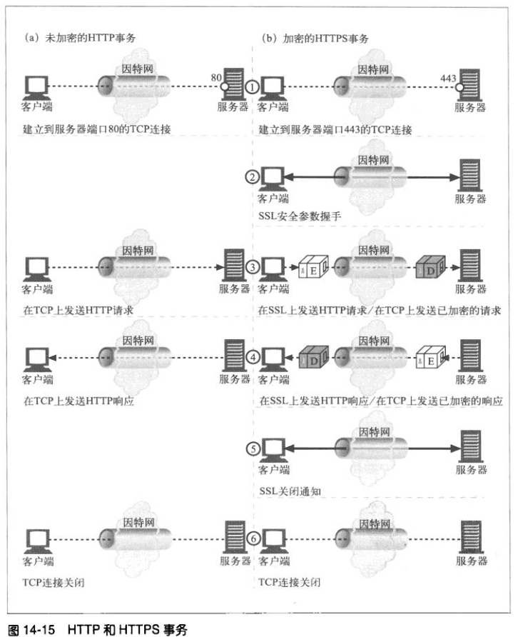

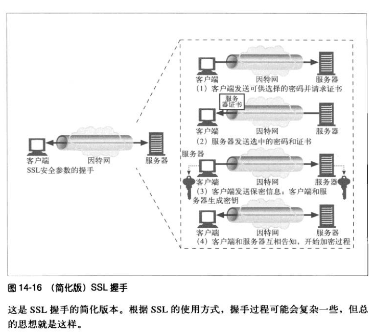

如果还想看详细的过程，建议看看这篇文章 [SSL/TLS 握手过程详解](https://www.jianshu.com/p/7158568e4867)。

### 服务器证书
SSL 支持双向认证，客户端和服务器都可以使用证书，但服务器要求使用客户端证书的情况很少。
服务器证书是一个显示了组织的名称、地址、服务器 DNS 域名以及其他信息的 X.509 V3 派生证书。客户端可以检查证书，以确保所有信息都是可靠的。

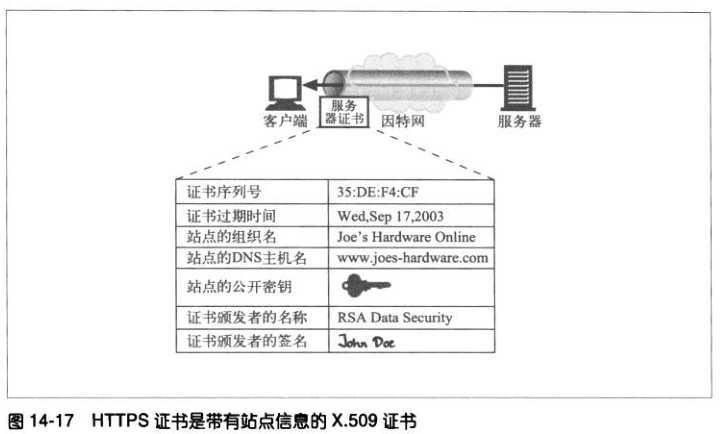

### 站点证书的有效性
浏览器对服务器证书的验证步骤：

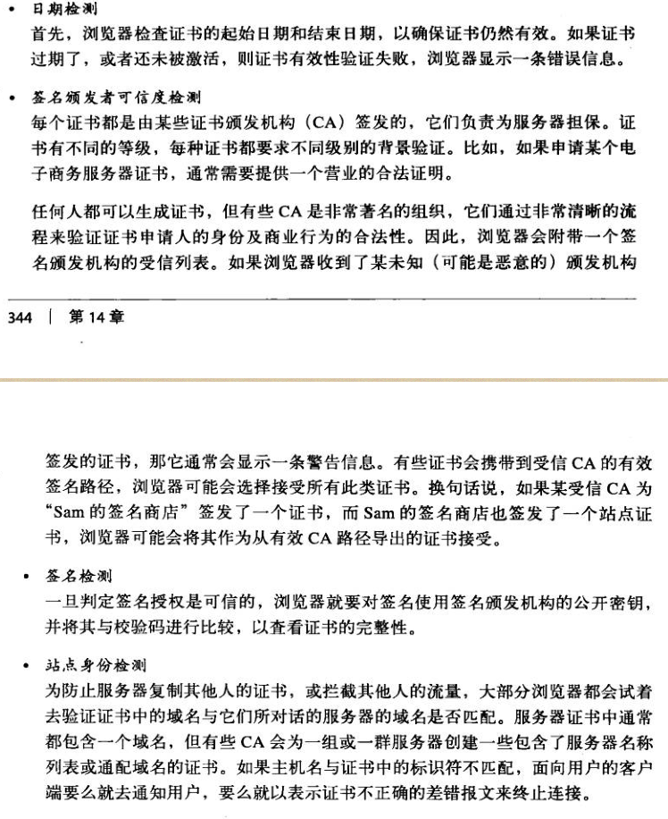

## HTTPS 客户端实例
SSL 是个复杂的二进制协议，借助一些开源的库，编写 SSL 客户端和服务器不会太难。
OpenSSL 是 SSL 和 TLS 最常见的开源实现。
