# 实体和编码
HTTP 要确保它所承载的“货物”满足以下条件：
1. 可以被正确地识别（通过 Content-Type 首部说明数据格式，Content-Language 首部说明语言）。
2. 可以被正确地解包（通过 Content-Length 首部和 Content-Encoding 首部）。
3. 是最新的（通过实体验证码和缓存过期控制）。
4. 符合用户的需要（基于 Accept 系列的内容协商首部）。
5. 在网络上可以快速有效地传输（通过范围请求、差异编码以及其他数据压缩方法）。
6. 完整到达、未被篡改（通过传输编码首部和 Content-MD5 校验和首部）。

为了实现这些目标，HTTP 使用了完善的标签来描述承载内容的实体。

## 报文是箱子，实体是货物
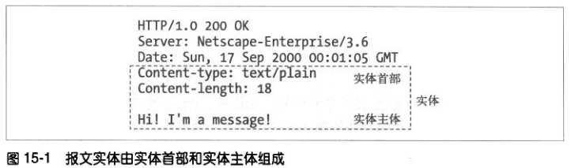

### 实体首部
HTTP 实体首部描述了 HTTP 报文的内容，HTTP/1.1 定义了 10 个基本实体首部字段。

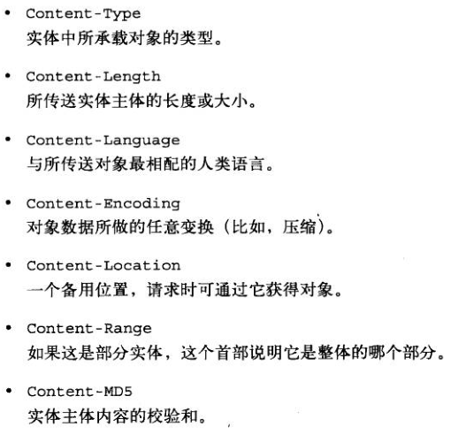

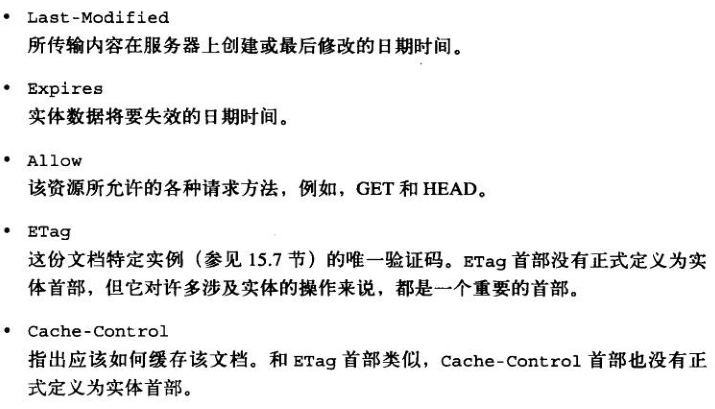

### 实体主体
实体主体中就是数据了，其他描述性的信息都包含在首部中。实体主体只是数据，它需要实体首部来描述数据的意义。
首部字段以一个空白的 CRLF 行结束，随后就是实体主体的内容。

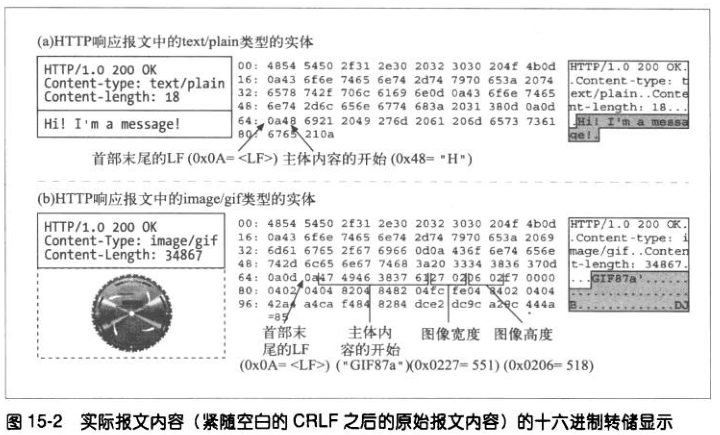

## Content-Length: 实体的大小
Content-Length 指的是实体主体的字节大小。除非使用了分块编码，否则 Content-Length 首部就是带有实体主体的报文必须使用的。
使用 Content-Length 首部是为了能够检测出服务器崩溃而导致的报文截尾，并对共享持久连接的多个报文进行正确分段。

### 检测截尾
HTTP 的早期版本采用关闭连接的方式来划定报文的结束。但是，没有 Content-Length 的话，客户端就无法确定到底是报文结束时正常的关闭连接，还是报文传输中由于服务器崩溃而导致的连接关闭。客户端要通过检测 Content-Length 来检测报文截尾。

缓存代理服务器通常不会缓存没有 Content-Length 首部的 HTTP 报文，以此来减小缓存已截尾报文的风险。

如果不能正确识别报文长度，就有可能获取不完整的内容从而导致错误发生。


### Content-Length 与持久连接
因为连接是持久的，客户端无法依赖连接关闭来判别报文的结束。那就需要 Content-Length 来确定一条报文在哪结束，下一条报文在哪开始。
有一种情况例外，就是采用分块编码。在分块编码情况下，数据是分为一系列的块来发送的，每块都有大小说明。
哪怕服务器在生成首部的时候不知道整个实体的大小（通常是因为实体是动态生成的），仍然可以使用分块编码传输若干已知大小的块。

### 内容编码
HTTP 允许对实体主体的内容进行编码，比如使之更安全或进行压缩。在这种情况下，Content-Length 首部说明的是编码后的主体的字节长度。

### 确定实体主体长度的原则
下列计算实体主体长度的规则，按顺序匹配，谁先匹配就用谁：

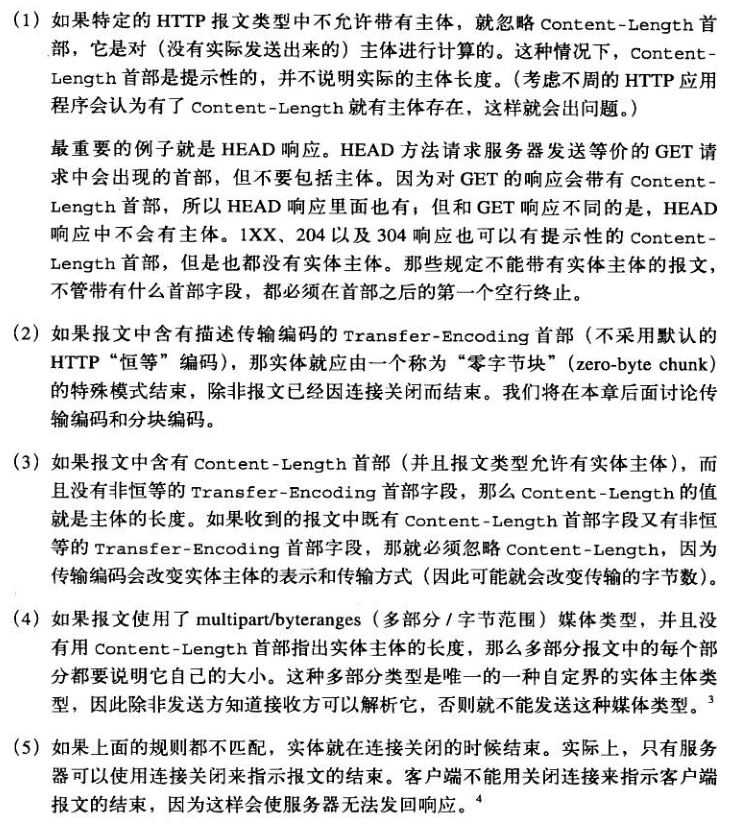

HTTP/1.1 规范中建议对于带有主体但没有 Content-Length 首部的请求，服务器应当发送 400 Bad Request 响应或 411 Length Required 响应，后一种情况表明服务器要求收到正确的 Content-Length 首部。 

## 实体摘要
为检测实体主体的数据是否被修改，发送方可以在生成主体时，生成一个数据的检验和，这样接收方可以通过检验这个校验和来检查实体是否被修改了。

服务器使用 Content-MD5 首部来发送对实体主体运行 MD5 算法的结果。只有产生响应的原始服务器才能发送 Content-MD5 首部。中间代理和缓存都不应当修改或添加这个首部。

除了检查报文完整性之外，MD5 还可以做散列表的关键字，用来快速定位文档。

除了这些可能的用法，一般不常用到 Content-MD5 首部。

## 媒体类型和字符集
Content-Type 首部字段说明了实体主体的 MIME 类型。MIME 类型由一个主媒体类型后面跟一条斜线以及一个子类型组成。

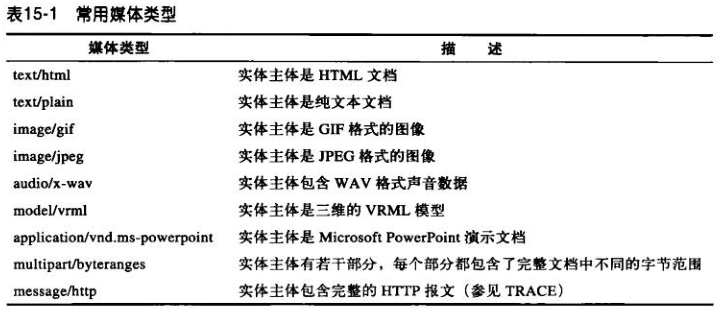

Content-Type 首部还支持可选的参数来进一步说明内容的类型。charset 参数就是个例子，它说明把实体中的比特转换为文本文件中的字符的方法：
```
Content-Type: text/html; charset=iso-8859-4
```

MIME 中的 multipart（多部分） 电子邮件报文中包含多个报文，它们合在一起作为单一的复杂报文发送。每一部分都是独立的，有各自的描述其内容的集。

HTTP 也支持多部分主体。不过，通常只用在两种情形：
1. 提交填写好的表单；
2. 作为承载若干文档片段的范围响应。

### 多部分表格提交
当提交填写的 HTTP 表单时，文本字段和上传的对象都作为多部分主体里面独立的部分发送。
HTTP 使用 Content-Type: multipart/form-data 或 Content-Type: multipart/mixed 这样的首部以及多部分主体来发送这种请求。
```
Content-Type: multipart/form-data; boundary=[abcdefghijklmnopqrstuvwxyz]
```
其中的 boundary 参数说明了分割主体中不同部分所用的字符串。

### 多部分范围响应
HTTP 对范围请求的响应也可以是多部分的。这样的响应中有 Content-Type: multipart/byteranges 首部和带有不同范围的多部分主体。

## 内容编码
### 内容编码过程
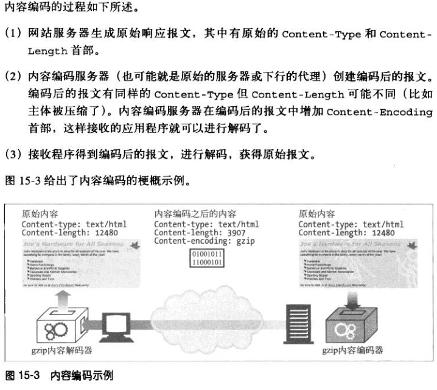

### 内容编码类型
Content-Encoding 首部说明了编码时使用的算法：

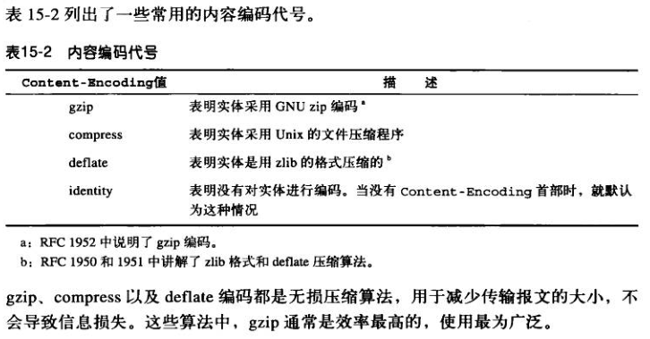

### Accept-Encoding 首部
为了避免服务器使用客户端不支持的编码方式，客户端把自己支持的内容编码方式列表放在请求的 Accept-Encoding 首部里发出去。
如果 HTTP 请求中没有包含 Accept-Encoding 首部，服务器就假设客户端能够接受任何的编码方式（等价于 Accept-Encoding: *）。

客户端可以给每种编码附带 Q（质量）值参数来说明编码的优先级（0.0-1.0）。0.0 说明客户端不想接受所说明的编码，1.0 则表明最希望使用的编码。

## 传输编码和分块编码
使用传输编码是为了改变报文中的数据在网络上传输的方式。

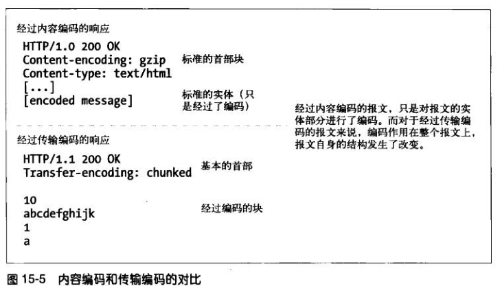

### 可靠传输
在 HTTP 中，只有少数情况下会出现所传输的报文主体有问题。其中两种情况如下：
1. 未知的尺寸；
2. 安全性。

### Transfer-Encoding 首部
HTTP 协议只定义了两个首部来描述和控制传输编码：
1. Transfer-Encoding，告知接收方为了可靠地传输报文，已经对其进行了何种编码；
2. TE，用在请求首部中，告知服务器可以使用哪些传输编码扩展。

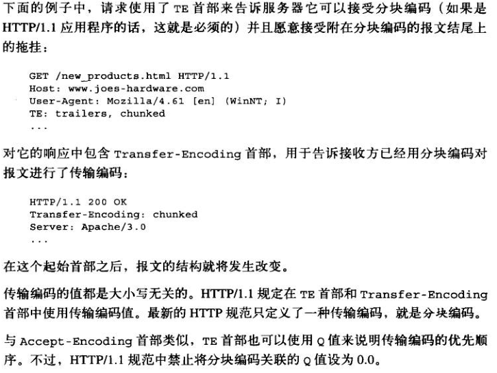

### 分块编码
分块编码把报文分割成若干个大小已知的块，块之间是紧挨着发送的，这样就不需要在发送之前知道整个报文的大小了。

分块编码是一种传输编码，是报文的属性，而不是主体的属性。之前讨论的多部分编码就是主体的属性，它和分块编码是独立的。

#### 分块与持久连接
如果客户端和服务器之间不是持久连接，那客户端不需要知道响应报文的实体主体长度。但如果是持久连接，就需要知道响应报文的实体主体长度。

分块编码为这种困难提供了解决方案，只要允许服务器把主体逐块发送，说明每块的大小就可以了。服务器可以用大小为 0 的块作为主体结束的信号，这样可以继续保持连接，为下一个响应做准备。

客户端也可以发送分块的数据给服务器。但客户端不知道服务器是否接受分块编码，所以客户端必须做好服务器用 411 Length Required（需要 Content-Length 首部） 响应来拒绝分块请求的准备。

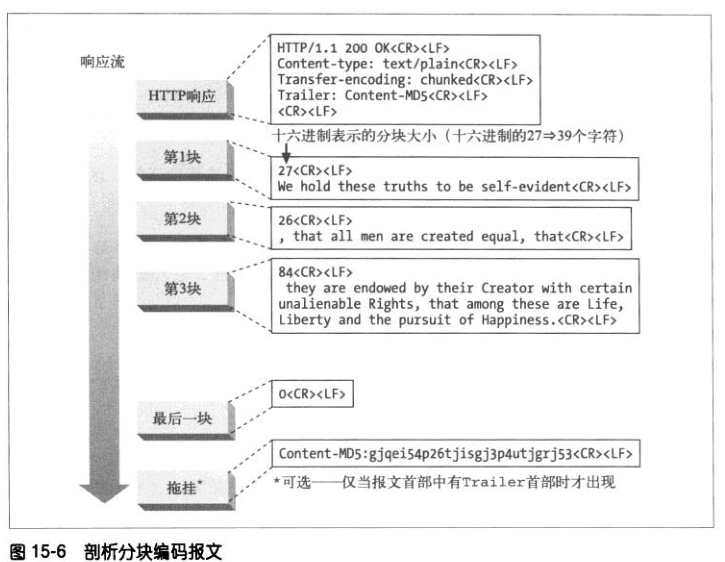

#### 分块报文的拖挂
如果客户端的 TE 首部中说明它是可以接受拖挂的话，就可以在分块的报文最后加上拖挂。拖挂的内容是可选的元数据，客户端不一定需要理解和使用（客户端可以忽略拖挂的内容）。

### 内容编码与传输编码的结合
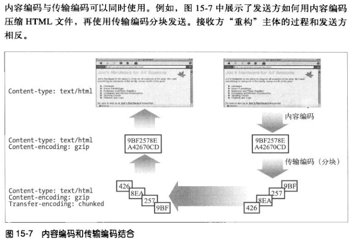

### 传输编码的规则
对报文主体使用传输编码时，必须遵守以下规则：
1. 传输编码集合中必须包含“分块”，唯一的例外是使用关闭连接来结束报文；
2. 当使用分块传输编码时，它必须是最后一个作用到报文主体之上的；
3. 分块传输编码不能多次作用到一个报文主体上。

这些规则使得接收方能确定报文的传输长度。

## 随时间变化的实例
网站对象不是静态的，同样的 URL 可能会随着时间的变化指向不同的版本。实例是资源在某个时间的“快照”。

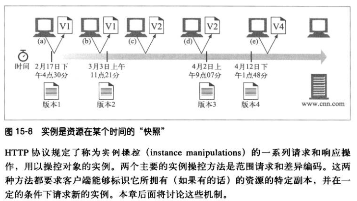

## 范围请求
HTTP 允许客户端只请求文档的一部分或者说某个范围。

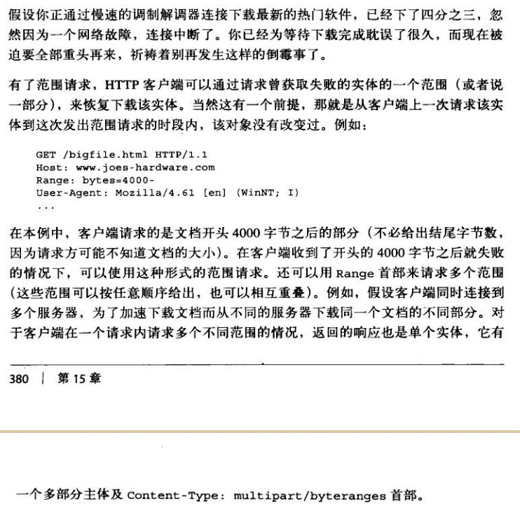

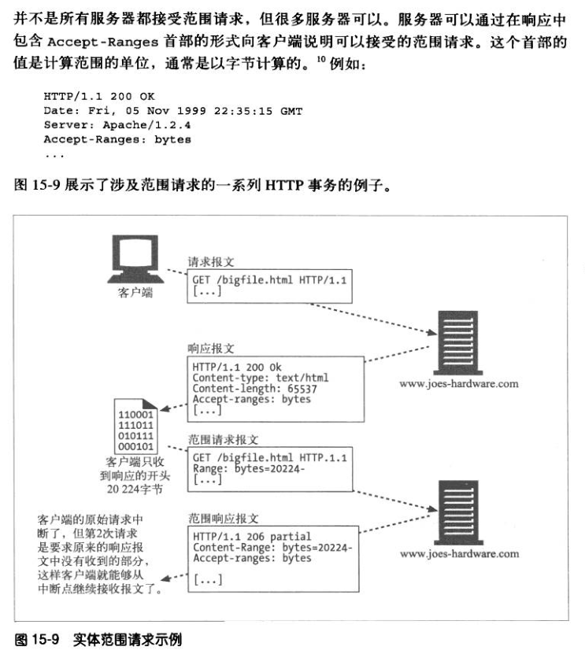

Range 首部在点对点（P2P）文件共享客户端软件中得到广泛应用，它们可以从不同的对等实体同时下载多媒体文件的不同部分。

## 差异编码
差异编码是 HTTP 协议的一个扩展，它通过交换对象改变的部分而不是完整的对象来优化传输性能。

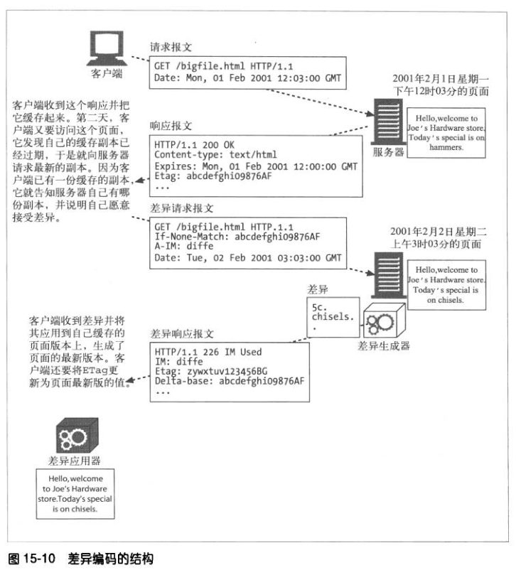

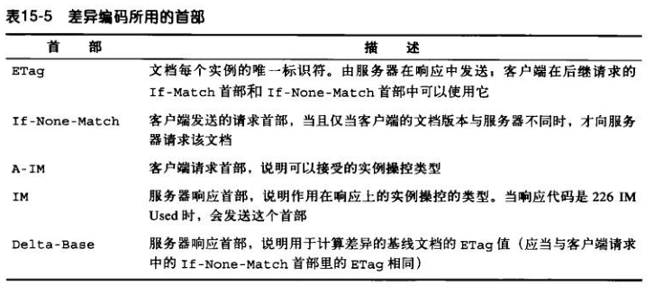