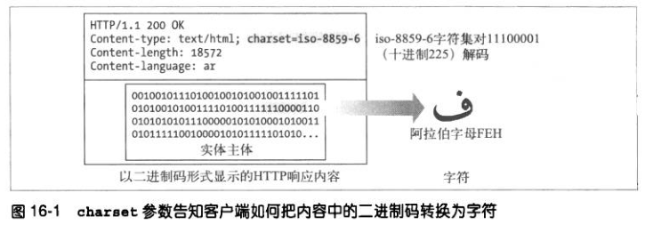
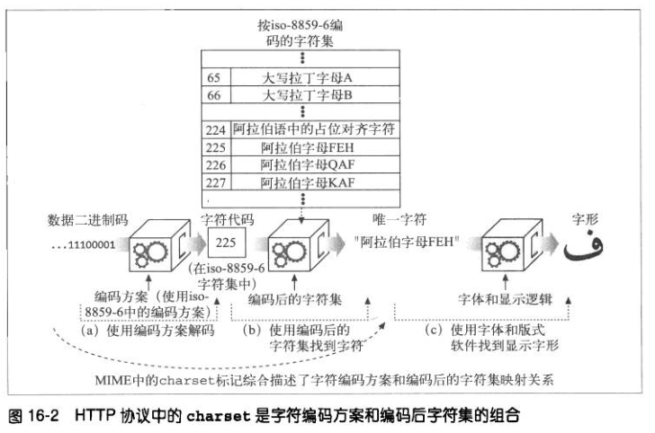
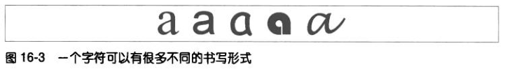
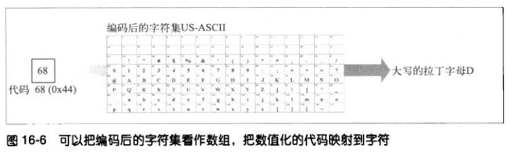
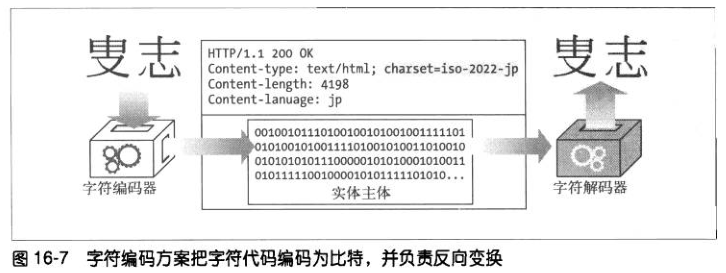
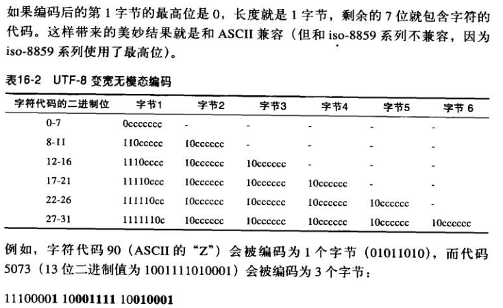
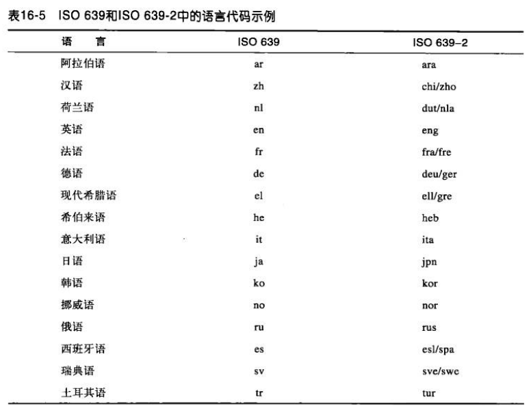
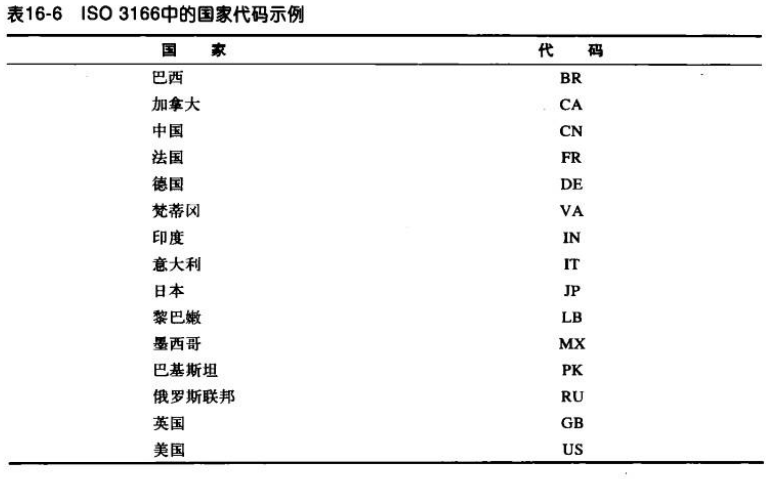

# 国际化
## HTTP 对国际性内容的支持
为了支持国际性的内容，服务器需要告知客户端每个文档的字母表和语言，这样客户端才能正确地把文档中的信息解包为字符并把内容呈现给用户。

服务器通过 Content-Type 首部中的 charset 参数和 Content-Language 首部告知客户端文档的字母表和语言。这些首部描述了服务器实体主体的内容格式。
同时，客户端通过 Accept-Charset 首部和 Accept-Language 首部告知服务器它理解哪些字符集编码算法和语言以及其中的优先顺序。

## 字符集与 HTTP
### 字符集是把字符转换为二进制码的编码
HTTP 字符集的值说明了如何把实体内容的二进制码转换为特定字母表中的字符。每个字符集标记都命名了一种把二进制码转换为字符的算法（反之亦然）。
字符集标记在由 IANA 维护的 MIME 字符集注册机构进行了标准化。



有些字符编码是可变长编码，这种类型的编码允许使用额外的二进制位表示拥有大量字符的字母表（比如汉语和日语），仅用较少的二进制位来表示标准的拉丁字符。

### 字符集和编码如何工作


国际化字符系统的关键目标是把语义（字母）和表示（图形化的显示形式）隔离开来。HTTP 只关心字符数据和相关语言及字符集标签的传输。字符形状的显示是由用户的图形显示软件（包括浏览器、操作系统、字体等）完成的。

### 字符集不对，字符就不对
如果客户端使用了错误的字符集参数，客户端就会显示一些奇怪的错乱字符。例如值 225 在不同的字符集中代表不同的字符。

### Content-Type 首部和 Charset 首部以及 META 标志
如果服务器没有在 Content-Type 首部中使用 Charset 参数指定字符集，那客户端就要设法从文档内容中推断出字符集。
对于 HTML 内容来说，可以在描述 charset 的 META 标记中找到字符集。

## 多语言字符编码入门
电子化字符系统的 8 个术语：
1. 字符，是指字母、数字、标点、表意文字、符号，或其他文本形式的书写“原子”。
2. 字形，描述字符的笔画图案或唯一的图形化形状。
3. 编码后的字符，分配给字符的唯一数字编号。
4. 代码空间，计划用于字符代码值的整数范围。
5. 代码宽度，每个字符代码所用的位数。
6. 字符库，特定的工作字符集（全体字符的一个子集）。
7. 编码后的字符集，组成字符库的已编码字符集，并为每个字符分配代码空间中的一个代码。它把数字化的字符代码映射为实际的字符。
8. 字符编码方案，把数字化的字符代码编码成一系列二进制码的算法（并能相应地反向解码）。

### 字符集的命名很糟糕
MIME 中的 charset 标记描述的压根不是字符集。MIME 中的 charset 值所命名的是把数据位映射为唯一的字符的一整套算法。它是字符编码方案和编码后的字符集的组合。

### 字符
字符是书写的最基本的构建单元。



### 字形、连笔以及表示形式
字符是唯一的，每个字符可以有多种字形。很多手写体和字体允许人们把相邻的字符漂亮地连写起来，这称为连笔。

### 编码后的字符集
编码后的字符集把整数映射到字符。通过代码数值来索引，数组的元素就是字符。



### 字符编码方案
字符编码方案规定如何把字符的代码数字打包装入内容比特，以及在另一端如何将其解包回字符代码。字符编码方案有 3 种主要类型：
1. 固定宽度，处理迅速，但可能浪费空间；
2. 可变宽度（无模态），对不同的字符代码数字采用不同数量的比特；
3. 可变宽度（有模态），有模态的编码使用特殊的“转义”模式在不同的模态之间切换。



常见的编码方案：
1. 8 位，把每个字符代码编码为相应的 8 位二进制值。只能支持有 256 个字符代码范围的字符集。
2. UTF-8，采用无模态的变宽编码，第一字节的高位表示编码后的字符所用的字节数，所需的每个后续字节都含有 6 位的代码值。



## 语言标记与 HTTP
### Content-Language 首部
Content-Language 首部字段用于描述实体的目标受众语言。如果内容是面向多种语言受众的，可以列出多种语言，用逗号分隔。

### Accept-Language 首部
Accept-Language 请求头允许客户端声明它可以理解的自然语言，以及优先选择的区域方言。借助内容协商机制，服务器可以从诸多备选项中选择一项进行应用， 并使用 Content-Language 应答头通知客户端它的选择。

### 子标记
语言标记有一个或多个部分，用连字号分隔，称为子标记：
1. 第一个子标记称为主子标记，其值是标准化的；
2. 第二个子标记是可选的，遵循它自己的命名标准；
3. 其他尾随的子标记都是未注册的。

主子标记只能含有字母。其后的子标记可以拥有字母和数字，长度最多 8 个字符。
```
sgn-US-MA
```

所有的标记都不区分大小写。但习惯上用大写字母表示国家，小写表示语言。

第一个和第二个语言子标记的值由各种标准文档以及相关的维护组织定义。

### 第一个子标记——名字空间
第一个子标记通常是标准化的语言记号，选自 ISO 639 中的语言标准集合。也可以用字母 i 来标识在 IANA 中注册的名字，或用 x 表示私有的或者扩展的名字。

如果第一个子标记含有：
1. 2 个字符，那就是来自 ISO 639 和 ISO 639-1 标准的语言代码；
2. 3 个字符，来自 ISO 639-2 标准及其扩展的语言代码；
3. 字母 i，该语言标记是在 IANA 显式注册的；
4. 字母 x，该语言标记是私有的、非标准的，或扩展的子标记。



### 第二个子标记——名字空间
第二个子标记通常是标准化的国家记号，选自 ISO 3166 中的国家代码和地区标准集合。不过也可以是在 IANA 注册过的其他字符串。

如果第二个子标记含有：
1. 2 个字符，那就是来自 ISO 3166 中定义的国家/地区；
2. 3~8 个字符，可能是在 IANA 中注册的值；
3. 单个字符，这是非法情况。



## 国际化的 URI
URI 没有为国际化提供足够的支持，它是由 US-ASCII 字符的一个子集组成的。

### URI 字符集合


### 转义和反转义
URI 转义提供了一种安全的方式，可以在 URI 内部插入保留字符以及原来不支持的字符（比如空白）。每个转义是一组 3 字符序列，由百分号 % 后面跟上两个十六进制数字的字符。

例如插入一个空白可以使用 %20（ASCII 32），如果想插入一个百分号并且不想被转义，就可以输入 %25，百分号的十六进制值是 25。

## 其他需要考虑的地方
### 首部和不合规范的数据
HTTP 首部必须由 US-ASCII 字符集中的字符构成。但有些 HTTP 应用程序使用操作系统和库例程来处理字符，但不是所有的库都支持 ASCII 范围（0~127）之外的字符。