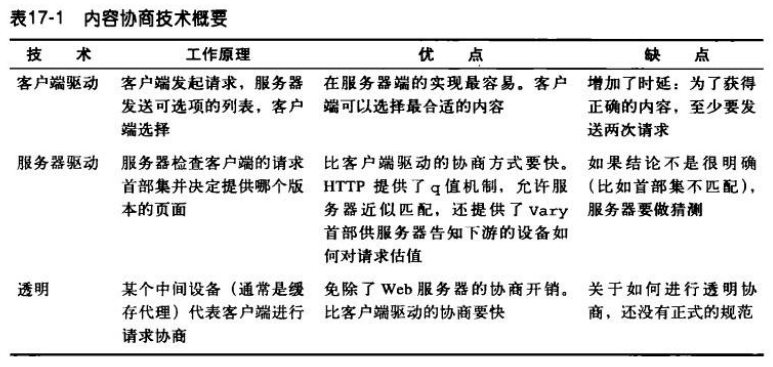
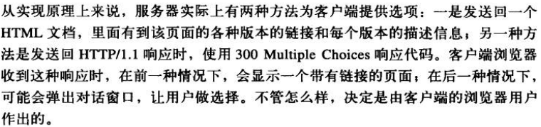
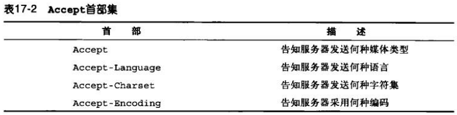
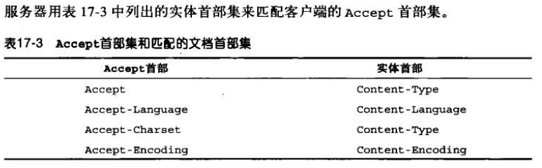
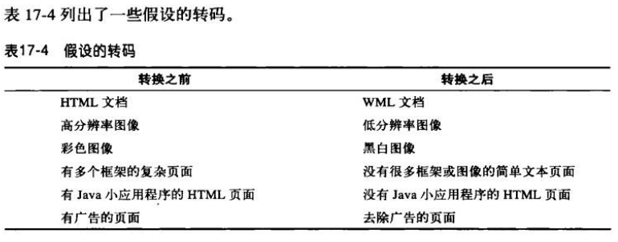

# 内容协商和转码
## 内容协商技术
共有 3 种不同的方法可以决定服务器上哪个页面最适合客户端。



## 客户端驱动的协商
这种方法客户端需要发送两次请求：第一次获取列表，第二次获取选择的副本。



## 服务器驱动的协商
有两种机制可供服务器评估发送什么响应给客户端：
1. 检查内容协商首部集。服务器查看客户端发送的 Accept 首部集，设法用相应的响应首部与之匹配。
2. 根据其他首部进行变通。例如，服务器可以根据客户端发送的 User-Agent 首部来发送响应。

### 内容协商首部集
客户端可以用下表中列出的 HTTP 首部集发送用户的偏好信息。





### 内容协商首部中的质量值
HTTP 协议中定义了质量值，允许客户端提供多个选项，并为选项关联一个优先次序。质量值 q 的范围按从低到高的值是 0.0~1.0。
```
Accept-Language: en;q=0.5, fr;q=0.0, nl;q=1.0, tr;q=0.0
``` 
从上面的代码可以看出，nl 的优先级最高。

### 随其他首部集而变化
服务器可以根据其他请求首部集来匹配响应，例如 User-Agent 首部。

## 透明协商
透明协商机制用中间代理来代表客户端与服务器协商。HTTP/1.1 规范中没有定义任何透明协商机制，但定义了 Vary 首部。服务器可以在响应中发送 Vary 首部，告知中间节点需要使用哪些请求首部进行内容协商。

HTTP 的 Vary 响应首部中列出了所有客户端请求首部，服务器可以用这些首部来选择文档或产生定制的内容。例如，若所提供的文档取决于 User-Agent 首部，Vary 首部就必须包含 User-Agent。

## 转码
如果服务器没有能满足客户端需求的文档，可以给出一个错误响应，或者可以把现存的文档转换成客户端可用的文档，这叫转码。



有 3 种类别的转码：格式转换、信息综合以及内容注入。

### 格式转换
格式转换是指将数据从一种格式转换为另一种格式，使之可以被客户端查看。

### 信息综合
从文档中提取关键的信息片段称为信息综合。这种操作的例子包括根据小节标题生成文档的大纲，或者从页面中删除广告和商标。

### 内容注入
内容注入转码会增加文档的内容。这种例子有自动广告生成器和用户追踪系统。