# 重定向与负载均衡
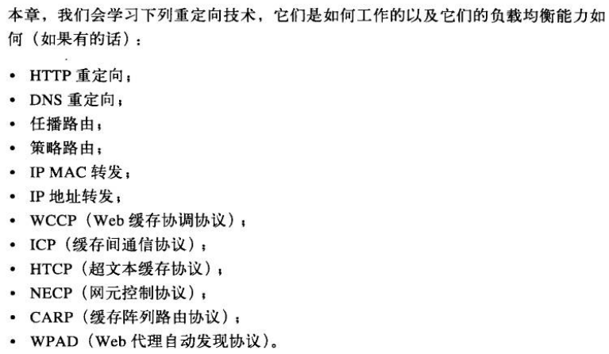

## 为什么要重定向
Web 内容通常分布在很多地方，这么做是出于可靠性地考虑。
如果一个位置出问题了，还有其他的可用；
如果客户端能访问较近的内容，就可以减小时延；
目标服务器分散，还可以减小时延。

可以将重定向当作一组有助于找到最佳分布式内容的技术。

## 重定向到何地
从客户端的角度来看，服务器、代理、缓存、网关对它来说都是服务器，很多重定向技术都能应用在它们身上。

服务器会根据每个 IP 来处理请求，将请求分摊到复制服务器中去。

## 重定向协议概览
重定向的目标是尽快地将 HTTP 报文发送到可用的服务器上去。

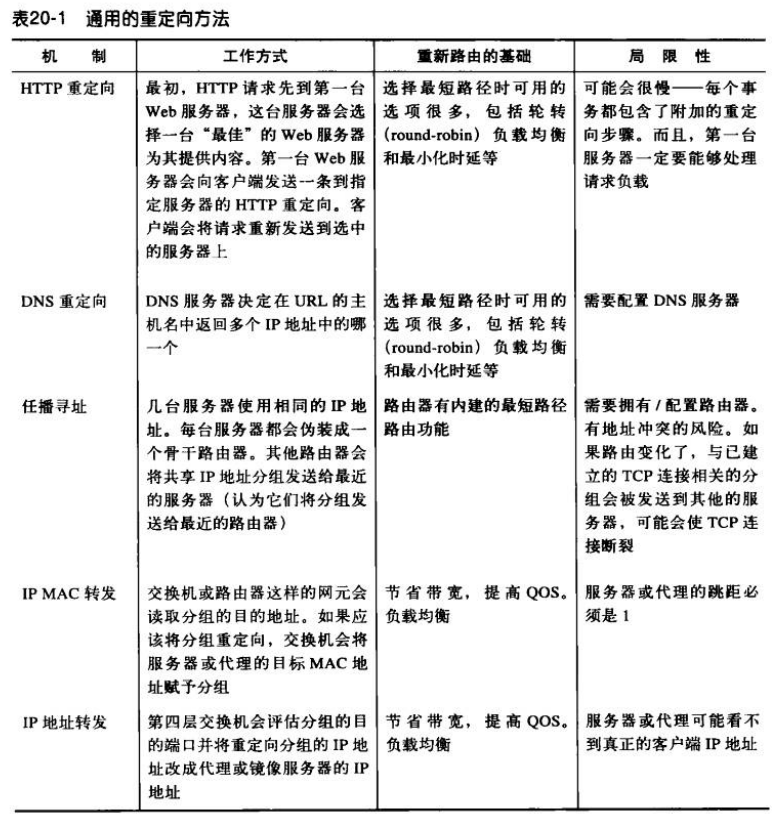

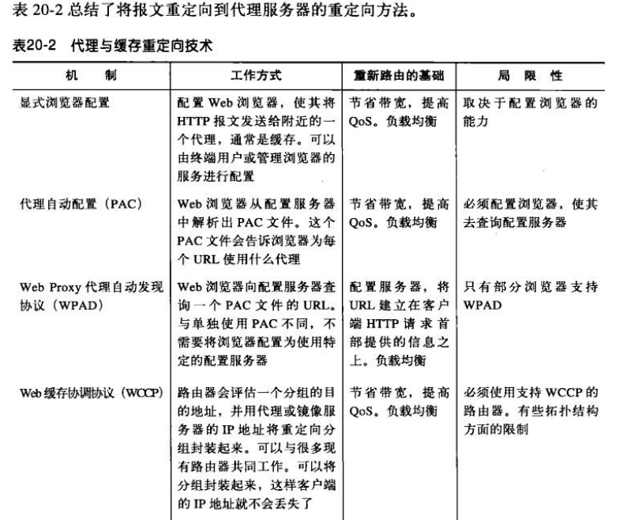

## 通用的重定向方法
### HTTP 重定向
HTTP 重定向可作为一种简单的负载均衡形式来使用。处理重定向的服务器找到可用的负载最小的内容服务器，并将浏览器重定向到那台服务器上去。
HTTP 重定向的优点之一就是知道客户端的 IP 地址，所以它能作出更合理地选择。

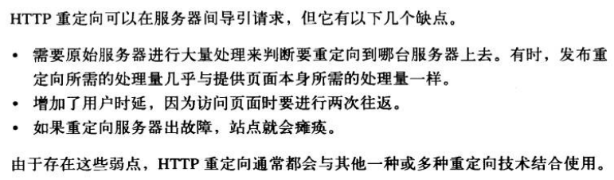

### DNS 重定向
DNS 允许将多个 IP 地址关联到一个域。最简单的 DNS 决策算法就是轮转。

大多数 DNS 客户端只会使用多地址集中的第一个地址，为了负载均衡，DNS 服务器会在每次完成查询后对地址进行轮转。这通常称为 DNS 轮转。

#### DNS 缓存带来的影响
DNS 的结果有可能会被缓存起来，很多浏览器都会使用 DNS 缓存，从而减少 DNS 查找的开销。这样可能会让 DNS 轮转起不到想要的效果。

#### 其他基于 DNS 的重定向算法
1. 负载均衡算法。有些 DNS 服务器会跟踪服务器的负载，将负载最轻的服务器放在列表最前面。
2. 邻接路由算法，服务器集群在地理上分散时，DNS 服务器会尝试将用户导向最近的服务器。
3. 故障屏蔽算法，DNS 服务器可以监视网络的状况，并将请求绕过有故障的地方。 

### 任播寻址
任播（英语：anycast）是一种网络定址和路由的策略，使得数据可以根据路由拓扑来决定送到“最近”或“最好”的目的地。

任播是与单播（unicast）、广播（broadcast）和多播（multicast）不同的方式。

* 在单播中，在网络地址和网络节点之间存在一一对应的关系。
* 在广播和多播中，在网络地址和网络节点之间存在一对多的关系：每一个发送地址对应一群接收可以复制信息的节点。
* 在任播中，在网络地址和网络节点之间存在一对多的关系：每一个地址对应一群接收节点，但在任何给定时间，只有其中之一可以接收到发送端来的信息。

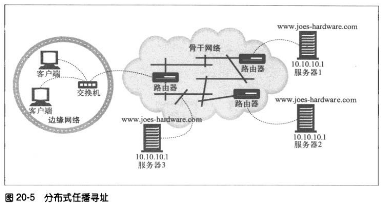

### IP MAC 转发
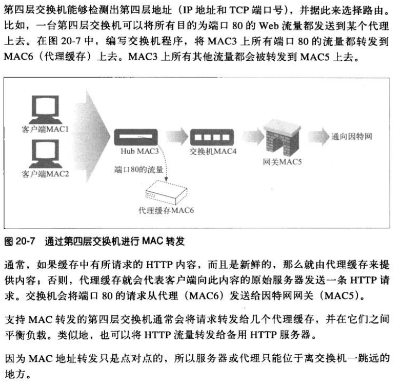

### IP 地址转发
NAT 网络地址转发。

## 代理的重定向方法
### 显式浏览器配置
### 代理自动配置
自动配置方式可以动态配置浏览器，需要使用代理自动配置协议（PAC）。

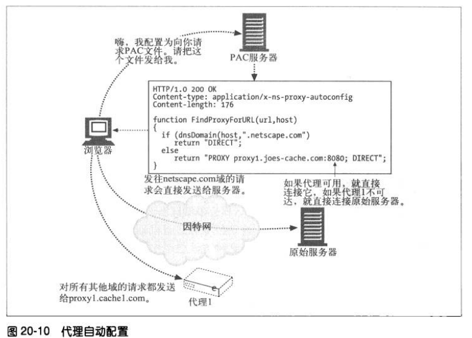

### Web 代理自动发现协议
WPAD 的目标是在不要求终端用户手工配置代理设置，而且不依赖透明流量拦截的情况下，为浏览器提供一种发现并使用附近代理的方式。

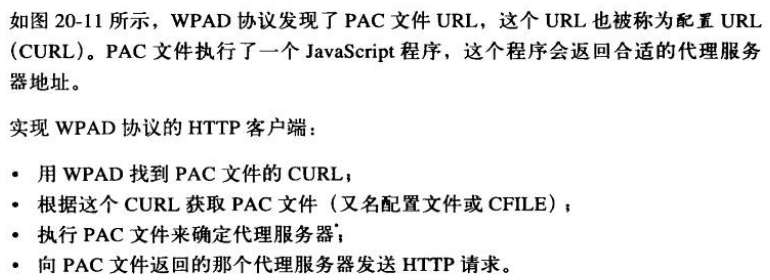

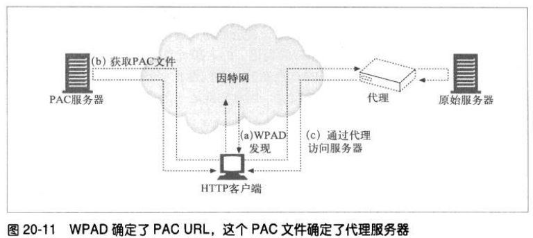

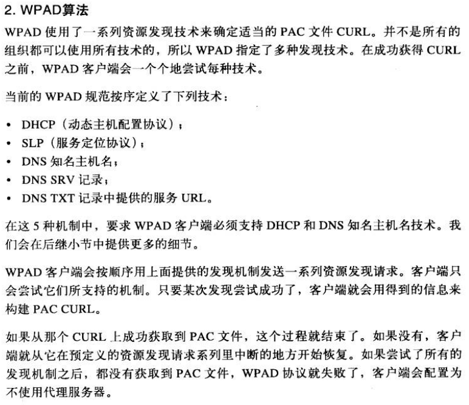

## 缓存重定向方法
Cisco 公司开发的 WCCP 可以使路由器将 Web 流量重定向到代理缓存中去。WCCP 负责路由器和缓存服务器之间的通信，在缓存之间实现负载均衡。

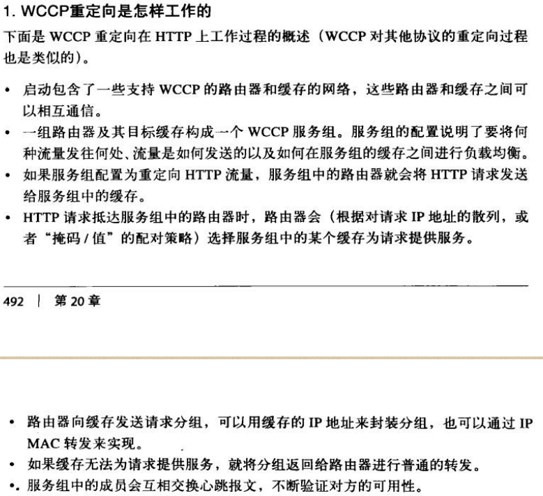

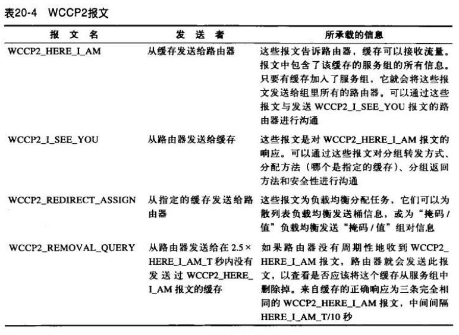

## 因特网缓存协议
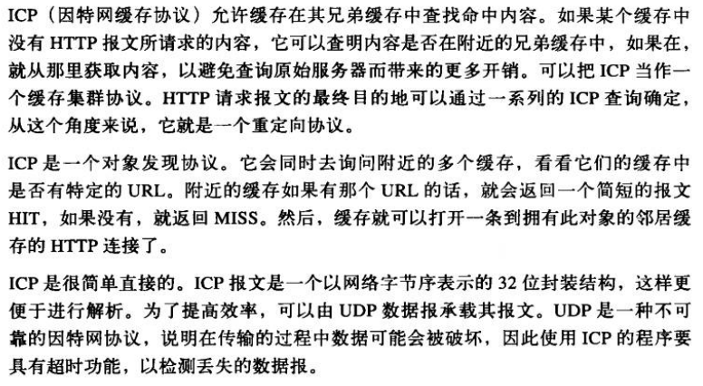

## 缓存阵列路由协议

## 超文本缓存协议
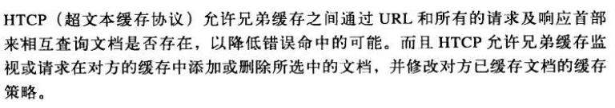