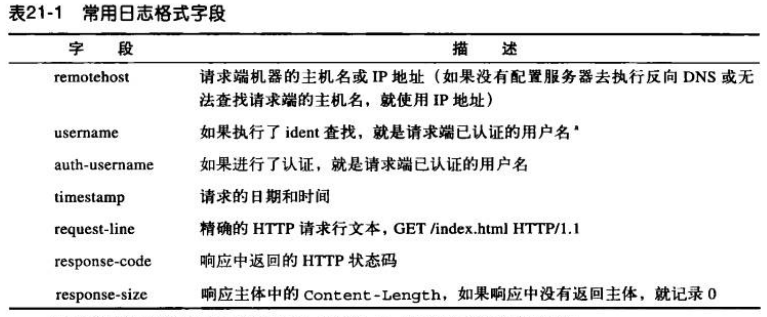
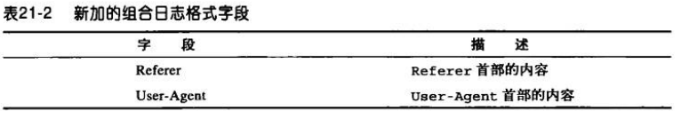
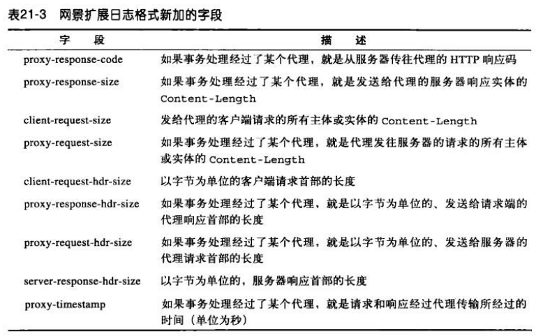
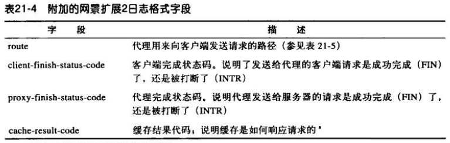

# 日记记录与使用情况跟踪
通常服务器或代理会记录一个请求的以下几个字段：
1. HTTP 方法；
2. 客户端和服务器的 HTTP 版本；
3. 所请求资源的 URL；
4. 响应的 HTTP 状态码；
5. 请求和响应报文的尺寸（包含所有的实体主体部分）；
6. 事务开始时的时间戳；
7. Referer 首部和 User-Agent 首部的值。

## 日志格式
### 常用日志格式
现在最常见的日志格式就是**常用日志格式**，由 NCSA 定义，很多服务器默认使用的日志格式。

### 组合日志格式
Apache 服务器就支持这种格式，它比常用日志格式多了两个字段。

### 网景扩展日志格式
网景的日志格式基于常用日志格式，并对其进行了扩展。

### 网景扩展日志2格式
网景的扩展日志格式2基于网景扩展日志格式，并添加了一些字段。

## 命中率测量
命中率测量协议是对 HTTP 的一种扩展，它要求缓存周期性地向原始服务器汇报缓存访问的统计数据。

命中率测量协议提供了一些基本的功能，缓存和服务器可以实现这些功能来共享访问信息，规范已缓存资源的可使用次数。

命中率测量协议没有得到广泛的实现或应用。