# HTTP 报文
## 报文流
HTTP 使用术语**流入**和**流出**来描述事务处理的方向。

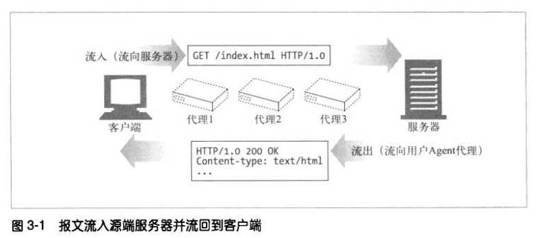

HTTP 报文会像河水一样向下游流动，不管是请求报文还是响应报文，所有报文的发送者都在接收者的上游。

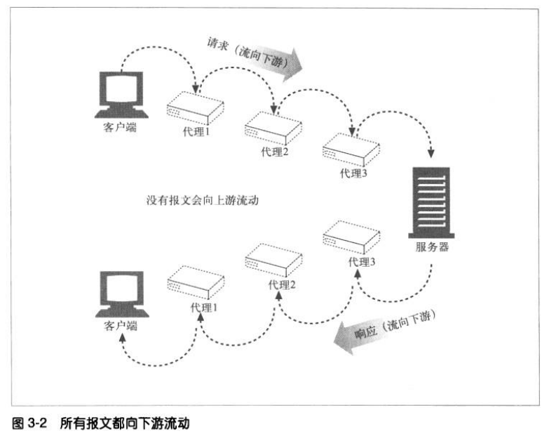

## 报文的组成
起始行和首部就是由行分隔的 ASCII 文本。每行以一个由两个字符组成的行终止序列作为结束，其中包括一个回车符（ASCII 码 13）和换行符（ASCII 码 10）。
这个行终止序列可写做 CRLF。

报文主体是一个可选的数据块，可以为空也可以包含二进制数据。

### 报文的语法
请求和响应报文结构基本相同。

1. 方法，客户端希望服务器对资源执行的动作。
2. 请求 URL，命名了所请求的资源。
3. 版本，报文所使用的 HTTP 版本。
4. 状态码，这三位数字描述了请求过程中所发生的情况。
5. 原因短语，数字状态码的可读版本，包含行终止序列之前的所有文本。
6. 首部，可以有零或多个首部。
7. 实体的主体部分，可以为空也可以包含二进制数据。

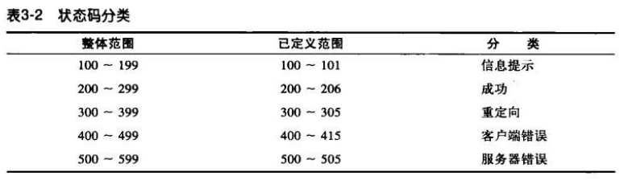

#### 首部分类
1. 通用首部，可以出现在请求或响应报文中。
2. 请求首部，提供更多有关请求的信息。
3. 响应首部，提供更多有关响应的信息。
4. 实体首部，描述主体的长度和内容，或者资源自身。
5. 扩展首部，规范中没有定义的新首部。

## 方法
### GET 和 HEAD
HTTP 的 GET 和 HEAD 方法被称为安全方法，使用这两个方法的 HTTP 请求不会产生什么动作。

HEAD 方法和 GET 方法很类似，但服务器在响应中只返回首部。这就允许客户端在未获取实际资源的情况下，对资源的首部进行检查。使用 HEAD，可以：
1. 在不获取资源的情况下了解资源的情况。
2. 通过查看响应状态码，看看某个对象是否存在。
3. 通过查看首部，了解测试资源是否被修改了。

服务器开发者必须确保返回的首部与 GET 请求所返回的首部完全相同。遵循 HTTP/1.1 规范，就必须实现 HEAD 方法。

### PUT
与 GET 方法从服务器读取文档相反，PUT 方法会向服务器写入文档。PUT 方法的语义就是让服务器用请求的主体部分来创建一个由所请求的 URL 命名的新文档。
如果那个文档已存在，就覆盖它。因为 PUT 允许用户对内容进行修改，所以服务器要求在执行 PUT 之前，要用密码登录。

### POST
POST 方法通常用来向服务器发送表单数据。

### TRACE
客户端发起一个请求时，这个请求可能要穿过路由器、防火墙、代理、网关等。每个中间节点都可能会修改原始的 HTTP 请求，TRACE 方法允许客户端在最终发起请求时，看看它变成了什么样子。

TRACE 请求会在目的服务器端发起一个“环回”诊断。行程最后一站的服务器会弹回一条 TRACE 响应，并在响应主体中携带它收到的原始请求报文。
这样客户端就可以查看在所有中间 HTTP 应用程序组成的请求/响应链上，原始报文是否被毁坏或修改过。

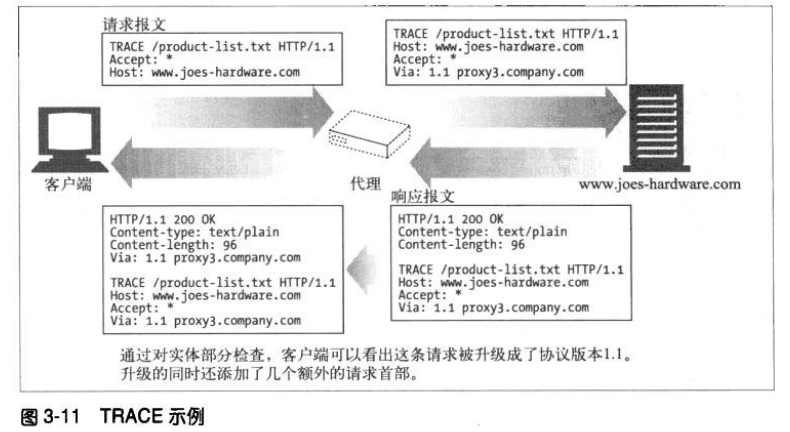

TRACE 方法主要用于诊断，用于验证请求是否如愿穿过了请求/响应链。它也是一种工具，用来查看代理和其他应用程序对用户请求所产生的效果。
TRACE 请求中不能带有实体的主体部分。TRACE 响应的实体主体部分包含了响应服务器收到的请求的精确副本。

### OPTIONS
OPTIONS 方法请求 Web 服务器告知其支持的各种功能。

### DELETE
DELETE 方法就是让服务器删除请求 URL 所指定的资源。

## 状态码
### 100~199 信息性状态码
HTTP/1.1 向协议中引入了信息性状态码。

### 200~299 成功状态码
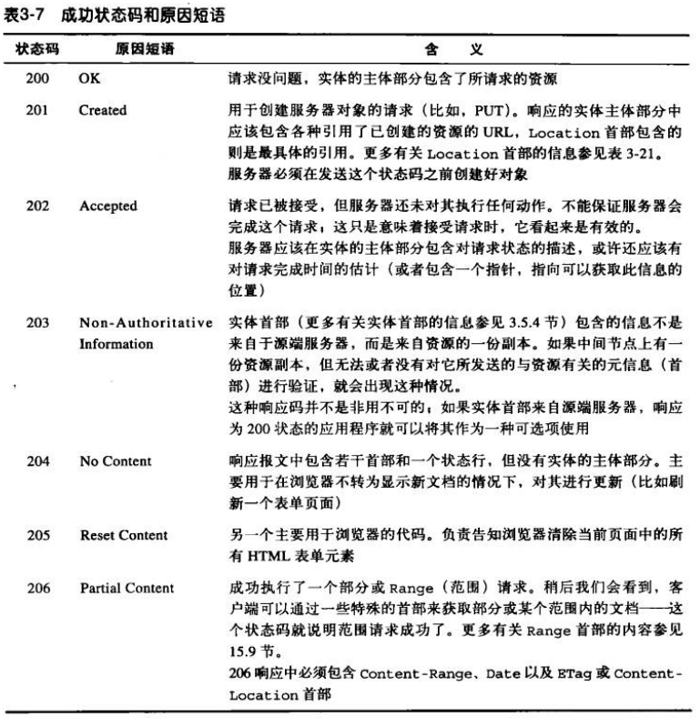

### 300~399 重定向状态码
重定向状态码要么告诉客户端使用替代位置来访问他们感兴趣的资源，要么提供一个替代的响应而不是资源的内容。
如果资源已被移动，可以发送一个重定向状态码和一个可选的 Location 首部来告知客户端资源已被移走，以及现在在哪里可以找到它。这样，浏览器可以在不打扰使用者的情况下，透明地转入新的位置。

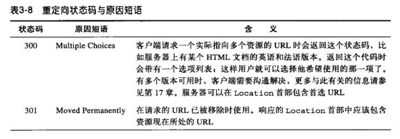

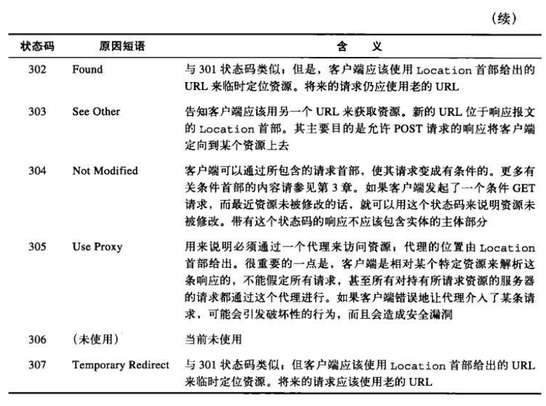

### 400~499 客户端错误状态码
有时客户端会发送一些服务器无法处理的东西，例如格式错误的请求报文、一个不存在的 URL。

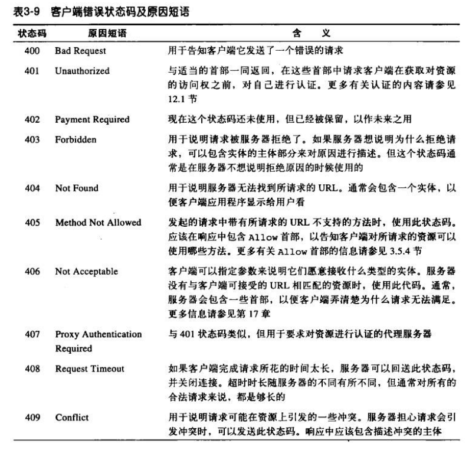

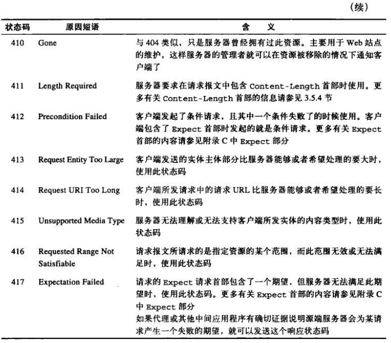
### 500~599 服务器错误状态码
有时客户端发送了一条有效请求，服务器自身却出错了。

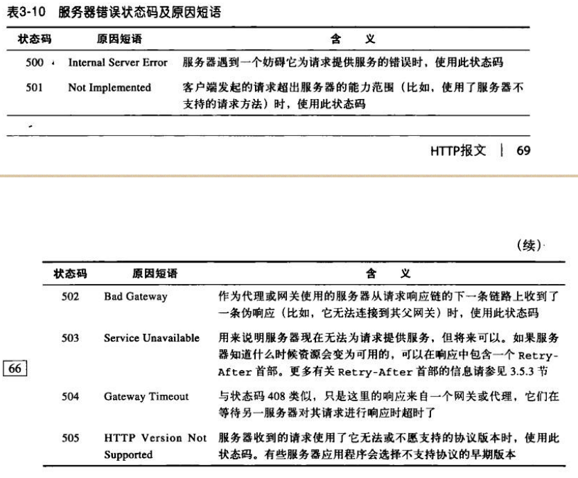

## 首部
首部和方法共同配合工作，决定了客户端和服务器能做什么事情。
### 通用首部
有些首部提供了与报文相关的最基本信息，它们被称为通用首部。

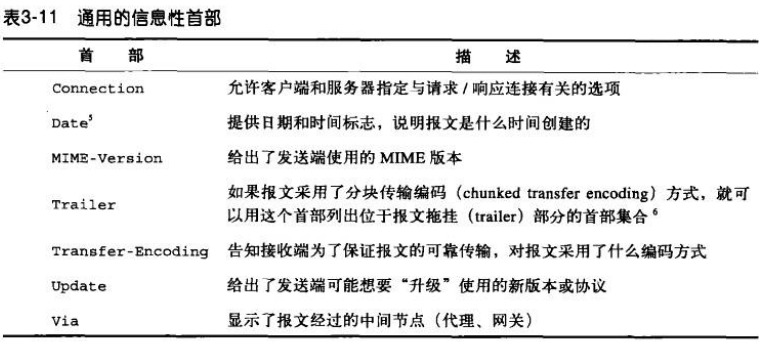

HTTP/1.0 引入了允许 HTTP 应用程序缓存对象本地副本的首部，这样就不用总是从服务器获取资源了。

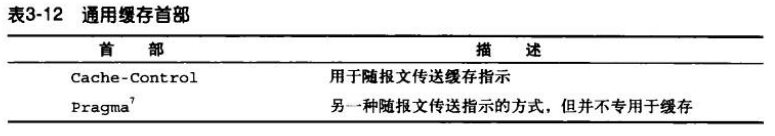
### 请求首部
请求首部是只在请求报文中有意义的首部，用于说明请求的详情。

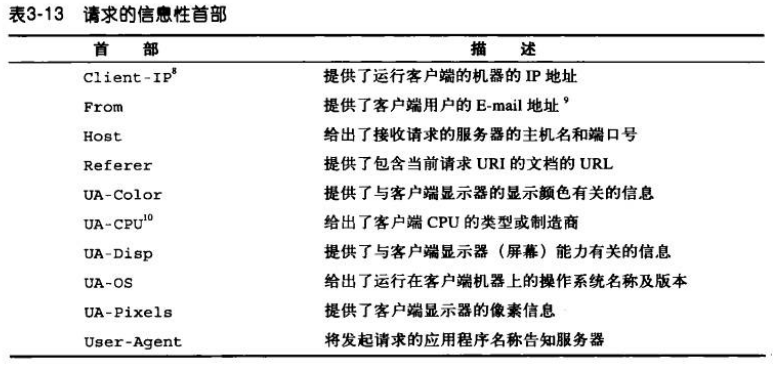

#### Accept 首部
Accept 告诉服务器用户代理能够处理的媒体类型及媒体类型的相对优先级。

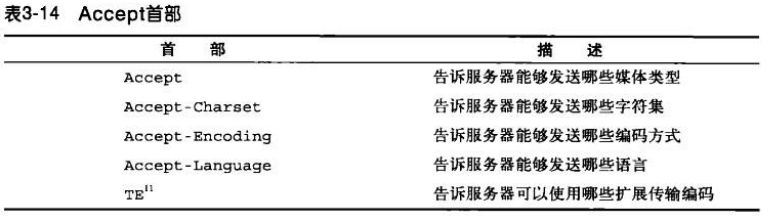

#### 条件请求首部
通过条件请求首部，客户端可以要求服务器在对请求进行响应之前，确保某个条件为真。

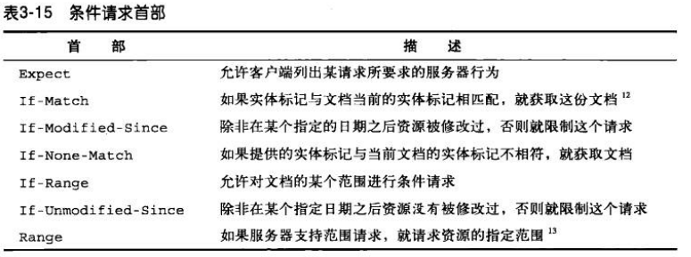

#### 安全请求首部
HTTP 本身支持一种简单的机制，可以对请求进行质询/响应认证。这种机制要求客户端在获取资源之前，先对自身进行认证。

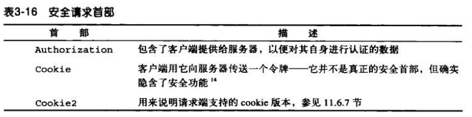

#### 代理请求首部
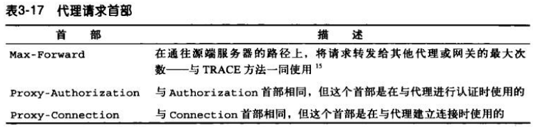

### 响应首部
响应首部为客户端提供了一些额外的信息。

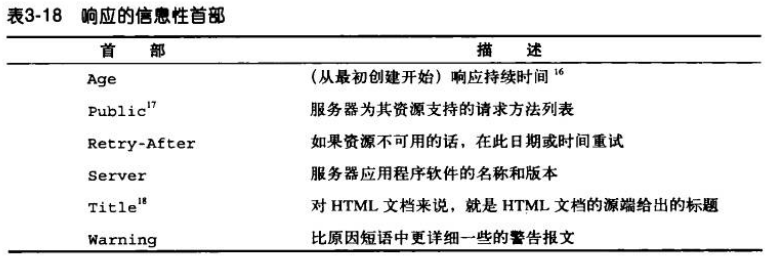

#### 协商首部
如果资源有多种表示方式，HTTP/1.1 可以为服务器和客户端提供对资源进行协商的能力。

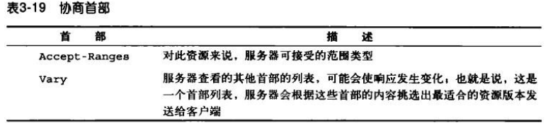

#### 安全响应首部
安全响应首部是 HTTP 的质询/响应认证机制的响应侧。

### 实体首部
实体首部提供了有关实体及其内容的大量信息，从有关对象类型的信息，到能够对资源使用的各种有效的请求方法。

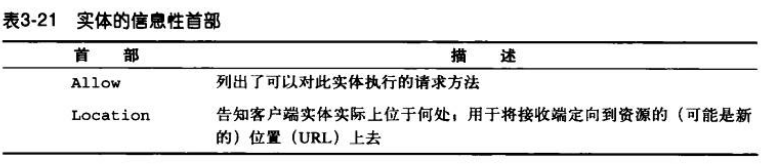

#### 内容首部
内容首部提供了与实体内容有关的特定信息，说明了其类型、尺寸以及处理它所需的其他有用信息。

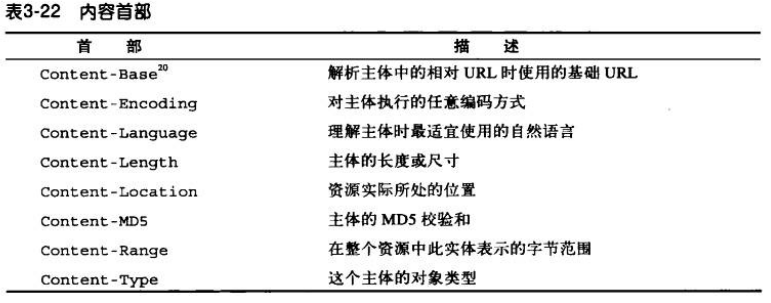

#### 实体缓存首部
通用的缓存首部说明了如何或什么时候进行缓存。实体的缓存首部提供了与被缓存实体有关的信息。

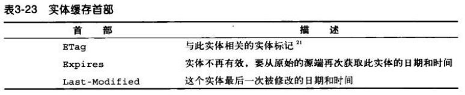