# 连接管理
## TCP 连接
### TCP 的可靠数据通道
TCP 为 HTTP 提供了一条可靠的比特传输管道。从 TCP 连接一端填入的字节会从另一端以原有的顺序、正确地传送过来。

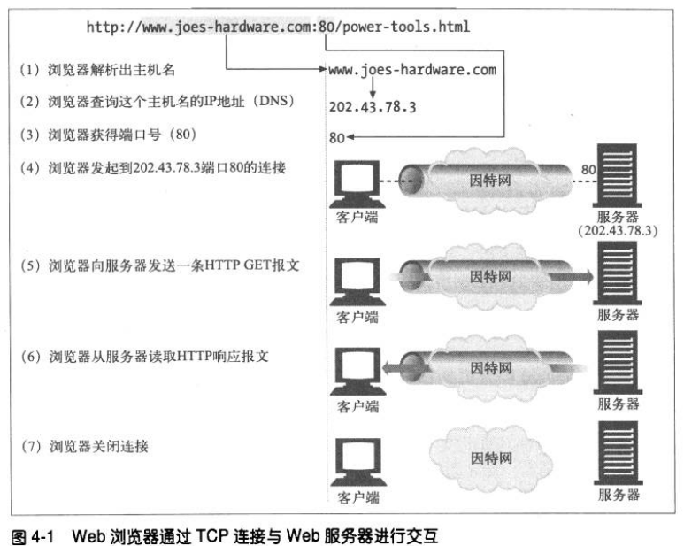

### TCP流是分段的、由 IP 分组传送
TCP 报文段通过 IP 分组（数据报）发送。

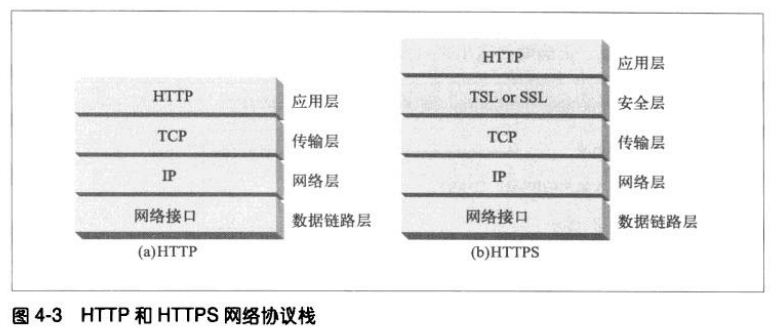

HTTP 要传送一条报文时，会以流的形式将报文数据通过 TCP 按序传输。TCP 收到数据流之后，会将数据流分成被称作段的小数据块，并将段封装成 IP 分组中，通过因特网传输。

### 保持 TCP 连接的正确运行
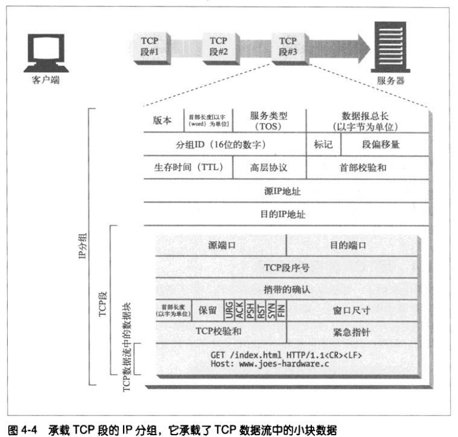

TCP 连接是通过 4 个值来识别的：
```
源 IP 地址、源端口号、目的 IP 地址、目的端口号
```
这 4 个值一起唯一地标识了一条 TCP 连接，两条不同的 TCP 连接不能拥有 4 个相同的地址组件值。

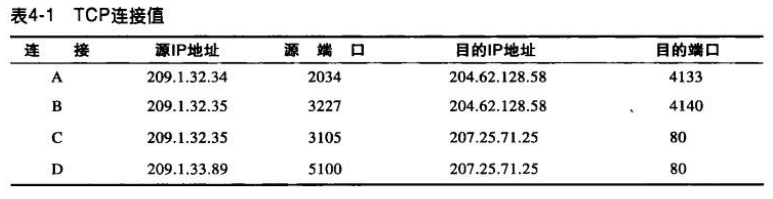

像上图中的 C 和 D，虽然它们的目的 IP 地址和目的端口号相同，但剩下两个字段值不同，所以是正确的。

### 用 TCP 套接字编程
操作系统提供了一系列套接字 API 供程序员操作 TCP。套接字 API 向 HTTP 程序员隐藏了 TCP 和 IP 的所有细节。

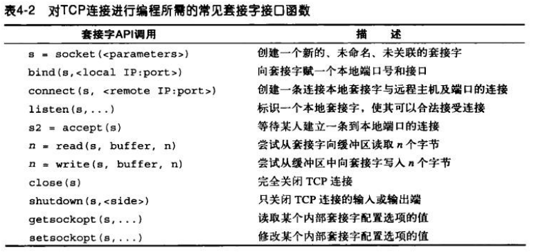

下图显示了浏览器是如何用 HTTP 获取 HTML 页面的。

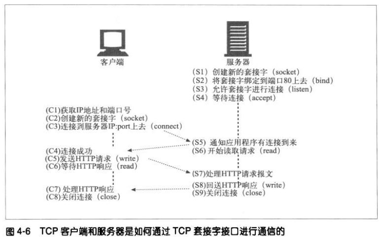

## 对 TCP 性能的考虑
### HTTP 事务时延
HTTP 处理时间线：

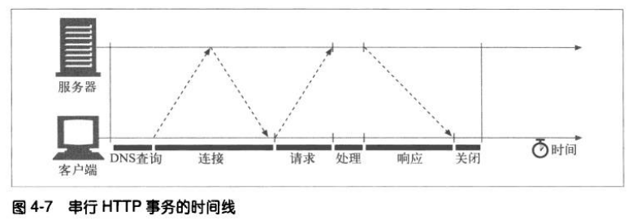

与建立 TCP 连接，以及传输请求和响应报文的时间比，事务处理时间可能是很短的。除非客户端或服务器超载，或处理复杂的资源，否则 HTTP 时延就是由 TCP 时延构成的。

HTTP 事务的时延原因：
1. DNS 查询。
2. TCP 连接建立需要经历三次握手。
3. HTTP 请求传输以及服务器处理都需要时间。
4. 服务器把响应结果传输回来也要时间。

### 性能聚集区域
会对 HTTP 程序员产生影响、最常见的 TCP 相关时延，其中包括：
1. TCP 连接建立握手。
2. TCP 慢启动拥塞。
3. 数据聚集的 Nagle 算法。
4. 用于捎带确认的 TCP 延迟确认算法。
5. TIME_WAIT 时延和端口耗尽。

### TCP 连接建立的握手时延
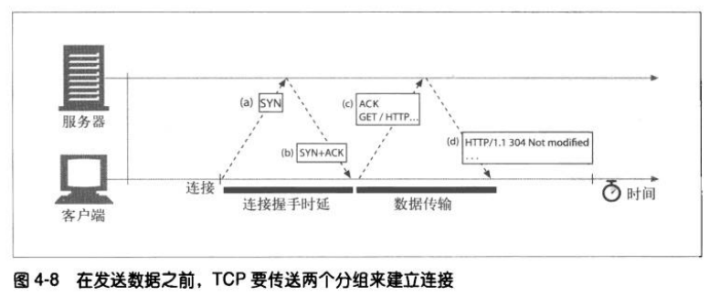

在建立 TCP 连接时，TCP 之间会交换一系列的分组用来沟通有关参数。如果连接只用来交换少量数据，这些交换过程就会严重降低 HTTP 性能。

### 延迟确认
TCP 发送后需要收到 TCP 接收方发回的 ACK 确认报文才能确认这个报文段被对方收到。如果在规定时间内没有收到确认信息就会重传刚才发送的报文段。
由于确认报文很小，所以 TCP 允许在发往相同方向的输出数据分组中对其进行“捎带”，这样可以更有效地利用网络。

为了增加确认报文找到同向传输数据分组的可能性，很多 TCP 栈都实现了一种“延迟确认”算法。延迟确认算法会在一个特定的窗口时间（通常为 100 ~ 200 毫秒）内将确认信息存放在缓冲区中，以寻找能够捎带它的输出数据分组。如果在那个时间段内没有输出数据分组，就将确认信息放在单独的分组中发送。

但是 HTTP 具有双峰特征的请求-应答行为降低了捎带信息的可能性。当希望有相反方向回传分组的时候，偏偏没有那么多。
通常，延迟确认算法会引入相当大的时延。根据操作系统的不同，我们可以调整或禁止延迟确认算法。

### TCP 慢启动
为了防止因特网突然过载和拥塞，TCP 在一开始能传输的数据很少，每成功发送一个分组并收到确认信息，就可以将发送数据量翻倍，直到达到阈值才减少。

### Nagle 算法和 TCP_NODELAY
Nagle 算法试图在发送一个分组这前，将大量 TCP 数据捆绑在一起，以提高网络效率。

Nagle 算法发送过程：
1. 发送方把第一个字节发送出去，把后面到达的字节缓存起来。
2. 在收到对第一个字节的确认后，再把缓存中的数据组装成一个报文段发送出去，随后继续缓存数据。
3. 只有收到对前一个报文段的确认后，才会继续发送下一个报文段。
4. 另外，如果缓存数据达到发送窗口的一半或者达到报文段的最大长度时，就立即发送一个报文段。

Nagle 算法会引发几种 HTTP 性能问题。首先，小的 HTTP 报文可能无法填满一个分组，可能会因为等待那些永远不会到来的确认分组而产生时延。
其次，Nagle 算法与延迟确认之间的交互存在问题——Nagle 算法会阻止数据的发送，直到收到一个确认分组，但确认分组自身会被延迟确认算法延迟 100 ~ 200 毫秒。

HTTP 应用程序可以在自己的栈中设置参数 TCP_NODELAY，禁用 Nagle 算法，提高性能。

### TIME_WAIT 累积
当 TCP 关闭连接时，会在内存中维护一个小的控制块，用来记录最近所关闭连接的 IP 地址和端口号。这类信息只会维持一小段时间，通常是最大分段使用期的两倍（称为 2MSL，通常为 2 分钟）左右，以确保在这段时间内不会创建具有相同地址和端口号的新连接。

有些操作系统将 2MSL 设置为一个较小的值，但超过此值时要特别小心。如果来自之前连接的复制分组插入了具有相同连接值的新 TCP 流，会破坏 TCP 的数据。

## HTTP 连接的处理
### 常被误解的 Connection 首部
HTTP 的 Connection 首部字段（逐跳首部）中有一个由逗号分隔的**连接标签**列表，这些标签指定了一些不会传播到其他连接中去的选项。

Connection 首部可以承载 3 种不同类型的标签：
1. HTTP 首部字段名，列出了只与此连接有关的首部。
2. 任意标签值，用于描述此连接的非标准选项。
3. close，说明操作完成后要关闭此连接。

如果 HTTP 应用程序收到一条包含 Connection 首部字段的报文时，接收端会解析并应用发送端请求的所有选项。在将此连接转发出去前，删除 Connection 首部以及 Connection 中列出的所有首部。

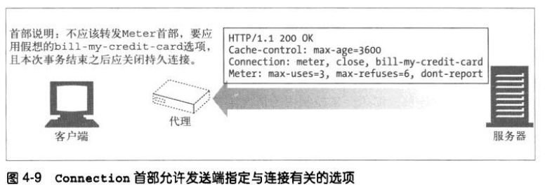

### 串行事务处理时延
串行事务处理就是处理完一个请求再处理下一个请求，这会造成时延过大的问题。
现在有几种解决办法：
1. 并行连接，通过多条 TCP 连接发起并发的 HTTP 请求。
2. 持久连接，重用 TCP 连接，以消除连接及关闭时延。
3. 管道化连接，通过共享的 TCP 连接发起并发的 HTTP 请求。
4. 复用的连接，交替传送请求和响应报文。

## 并行连接
并行连接的速度不一定更快。假如客户端网络带宽不足，并行加载多个对象时，每个对象都去竞争有限的带宽，每个对象都会以较慢的速度按比例加载，这样可能就没什么性能提升。
而且，打开大量的连接会消耗很多内存资源，从而引发自身的性能问题。实际上，浏览器会限制并行连接的数量。

## 持久连接
HTTP/1.1 允许 HTTP 设备在事务处理结束之后将 TCP 连接保持在打开状态，以便为将来的 HTTP 请求重用现存的连接，这种连接称为持久连接。非持久连接会在每个事务处理结束之后关闭，而持久连接会在不同事务之间保持打开状态，直到客户端或服务器决定将其关闭为止。

### 持久及并行连接
并行连接缺点：
1. 每个事务都会打开/关闭一个 TCP 连接，会耗费时间和带宽。
2. 由于 TCP 慢启动特性的存在，每条新连接的性能都会有所降低。
3. 可打开的并行连接数量有限。

持久连接降低了时延和连接建立的开销，而且减少了打开连接的潜在数量。持久连接和并行连接配合使用可能是最高效的方式。
现在很多 Web 应用程序都会打开少量的并行连接，其中的每一个都是持久连接。持久连接有两个类型：
1. HTTP/1.0 + "keep-alive"。
2. HTTP/1.1 "persistent" 连接，默认就是持久连接。

### Keep-Alive
Keep-Alive 是一个通用消息头，允许消息发送者暗示连接的状态，还可以用来设置超时时长和最大请求数。
可以用 Keep-Alive 通用首部中指定的、由逗号分隔的选项来调节 Keep-Alive 的行为:
1. 参数 timeout，指定了一个空闲连接需要保持打开状态的最小时长（以秒为单位）。需要注意的是，如果没有在传输层设置 keep-alive TCP message 的话，大于 TCP 层面的超时设置会被忽略。
2. 参数 max，在连接关闭之前，在此连接可以发送的请求的最大值。在非管道连接中，除了 0 以外，这个值是被忽略的，因为需要在紧跟着的响应中发送新一次的请求。HTTP 管道连接则可以用它来限制管道的使用。
3. Keep-Alive 支持任意未经处理的属性，这些属于主要用于诊断和调试。语法为 name[=value]。

Keep-Alive 首部是可选的，只有在 Connection: Keep-Alive 时才生效。同时需要注意的是，在 HTTP/2 协议中， Connection 和 Keep-Alive  是被忽略的；在其中采用其他机制来进行连接管理。

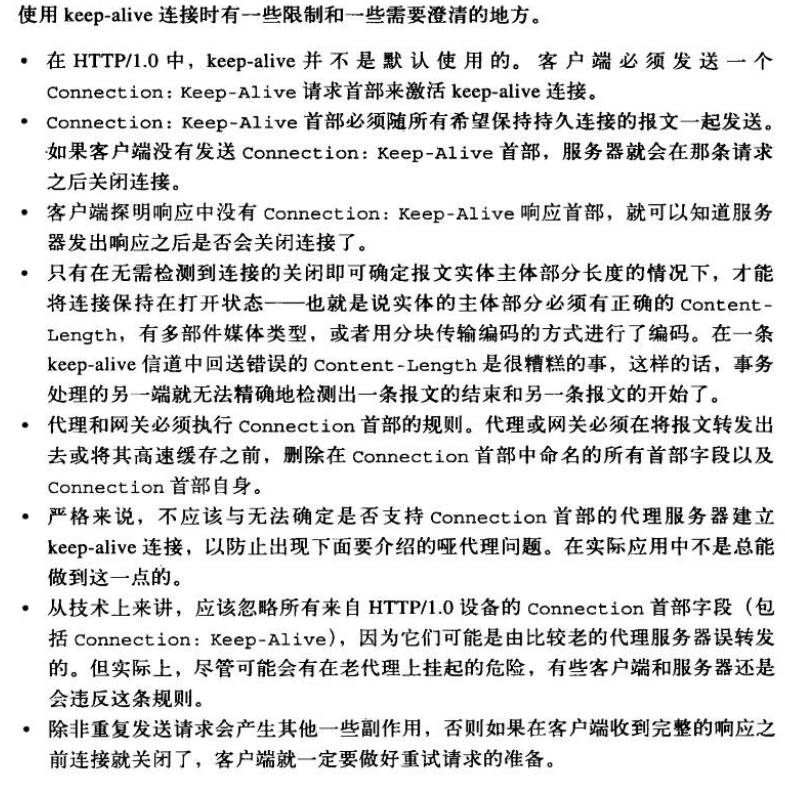

### Keep-Alive 与哑代理
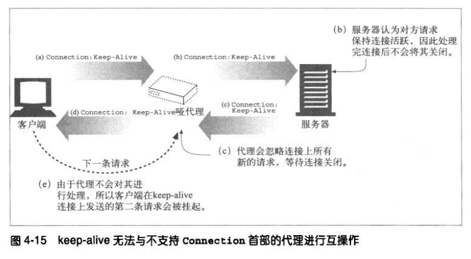

在上图中，客户端和服务器都收到了 keep-alive 的请求或响应，所以连接一直保持打开状态。但由于哑代理不理解 Connection 首部的意思，所以也不知道连接一直保持着打开状态。在完成一次请求后，就一直挂在那等着源端或服务器关闭连接，它不会认为同一连接还会有其他请求到来。当客户端新请求到达时，请求被忽略，浏览器就一直在转圈，不会有任何进展。

为了避免此类代理通信问题的发生，现代的代理都绝不能转发 Connection 首部和所有名字出现在 Connection 值中的首部。
另外还有几个不能作为 Connection 首部值列出，也不能被代理转发或作为缓存响应使用的首部。
其中包括 Proxy-Authenticate、Proxy-Connection、Transfer-Encoding、Upgrade。

### HTTP/1.1 持久连接
HTTP/1.1 逐渐停止了对 Keep-Alive 连接的支持，用一种名为持久连接（persistent connection）的改进型设计取代了它。持久连接的目的与 Keep-Alive 连接的目的相同，但工作机制更优一些。HTTP/1.1 持久连接在默认下是激活的，如果要在事务处理之后将连接关闭，应用程序必须向报文显示地添加一个 Connection: close 首部。

### 持久连接的限制和规则
* 只有当连接上所有的报文都有正确的、自定义报文长度时——也就是说，实体主体部分的长度都和相应的 Content-Length 一致，或者是用分块传输编码方式编码的——连接才能持久保持。
* 除非重复发起请求会产生副作用，否则如果在客户端收到整条响应之前连接关闭了，客户端就必须重新发起请求。

## 管道化连接
HTTP/1.1 允许在持久连接上可选地使用请求管道。在响应到达之前，可以将多条请求放入队列。当第一条请求通过网络流向服务器时，第二条和第三条请求也可以开始发送了。

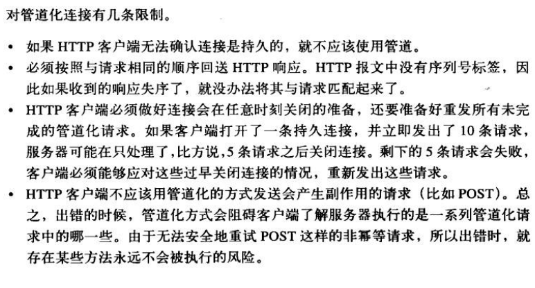

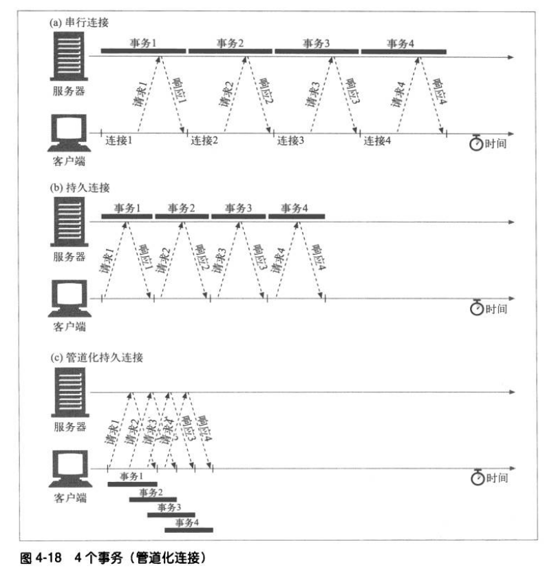

## 关闭连接的奥秘
所有 HTTP 客户端、代理、服务器都可在任意时刻关闭 TCP 连接。通常会在一条报文结束时关闭连接，但出错的时候，也可能在首部行的中间或其他任意位置关闭连接。

副作用是很重要的问题，如果连接非正常关闭了，有些事务可以重新发起请求，有些事务则不行。例如 GET 一个静态页面，就可以反复执行多次；向一个在线书店 POST 一个订单就不能重复执行。

### 幂等性
如果一个事务不管执行多少次，其结果都是一样的，这个事务就是**幂等的**。客户端不应该用管道化方式传送非幂等请求（比如 POST），否则，传输连接的过早终止就会造成一些不确定的后果。

### 正常关闭连接
每个 TCP 连接都有一个输入和输出信道，用于数据的读或写。应用程序可以关闭 TCP 输入和输出信道中的任意一个，或者两者都关闭了。
套接字调用 close() 会将 TCP 连接的输入和输出信道都关闭了，这称为“完全关闭”。套接字调用 shutdown() 单独关闭输入或输出信道，这称为“半关闭”。

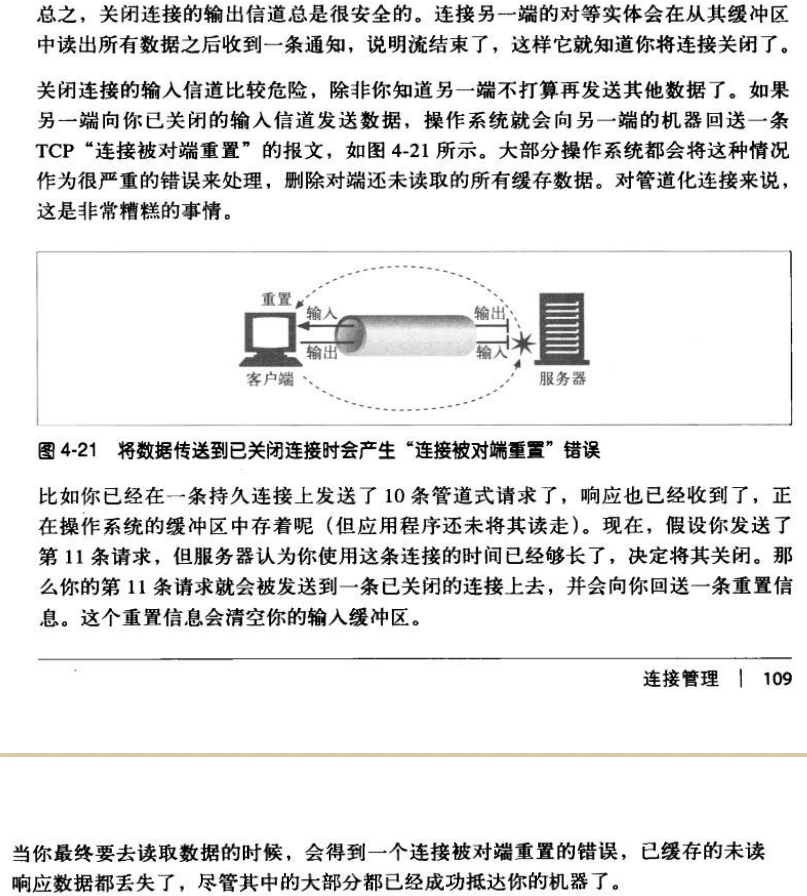

HTTP 规范建议，当客户端或服务器突然要关闭连接时，应该要“正常地关闭传输连接”，但它并没有说明要如何去做。

实现正常关闭的应用程序应该首先关闭它的输出信道，然后周期性地检查其输入信道的状态（查找数据，或流的末尾），等待另一端关闭它的输出信道。如果在一定的时间区间内对端没有关闭输出信道，应用程序可以强制关闭连接，以节省资源。