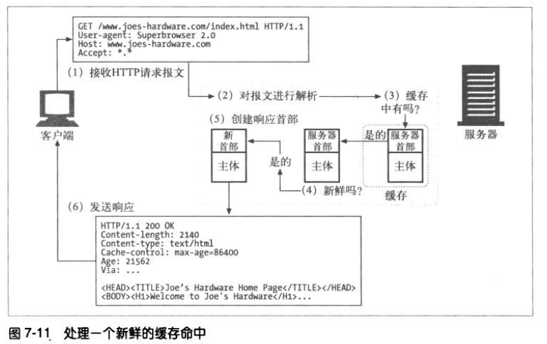

# 缓存
使用缓存的优点:
1. 缓存减少了冗余的数据传输，节省了你的网络费用。
2. 缓存缓解了网络瓶颈的问题，不需要更多的带宽就能够更快地加载页面。
3. 缓存降低了对原始服务器的要求，服务器可以更快地响应，避免过载的出现。
4. 缓存降低了距离时延，因为从较远的地方加载页面会更慢一些。

## 缓存命中
如果请求的资源在缓存能够找到，就称为缓存命中；如果没有，就称为缓存未命中。

### 再验证
原始服务器的内容可能会发生变化，缓存要不时对其进行检测，看看保存的副本是否仍是服务器上最新的副本。这些“新鲜度检测”称为 HTTP 再验证。
大部分的缓存只有在客户端发起请求，并且副本旧得足以需要检测的时候，才会对副本进行再验证。

缓存对副本进行再验证时，会向服务器发送一个小的再验证请求。如果内容没有变化，服务器会返回一个小的 304 Not Modified 进行响应，这称为再验证命中。
HTTP 提供了几个用来对缓存对象进行再验证的工具，但最常用的是 If-Modified-Sice 首部。

>If-Modified-Since 是一个条件式请求首部，服务器只在所请求的资源在给定的日期时间之后对内容进行过修改的情况下才会将资源返回，状态码为 200  。如果请求的资源从那时起未经修改，那么返回一个不带有消息主体的  304  响应，而在 Last-Modified 首部中会带有上次修改时间。 不同于  If-Unmodified-Since, If-Modified-Since 只可以用在 GET 或 HEAD 请求中。
>当与 If-None-Match 一同出现时，它（If-Modified-Since）会被忽略掉，除非服务器不支持 If-None-Match。
>最常见的应用场景是来更新没有特定 ETag 标签的缓存实体。

语法
```
If-Modified-Since: <day-name>, <day> <month> <year> <hour>:<minute>:<second> GMT
```

### 命中率
由缓存提供服务的请求所占的比例称为**缓存命中率**。

**字节命中率**表示的是缓存提供的字节在传输的所有字节中所占的比例。

客户端有一种方法可以判断响应是否来自缓存，就是使用 Date 首部。将响应中的 Date 首部的值与当前时间进行比较，如果响应中的日期值比较早，通常可以认为这是一条缓存的响应。

## 缓存的拓扑结构
### 代理缓存的拓扑结构
在实际中，实现层次化的缓存是很有意义的。在这种结构中，在较小缓存中未命中的请求会被导向较大的父缓存。


在层次结构很深的情况下，请求可能要穿过很长一溜缓存，每个拦截代理都会添加一些性能损耗，当代理链过长时，这种损耗会变得非常明显。

### 网状缓存、内容路由以及对等缓存
网状缓存中的代理缓存之间会以更复杂的方式进行对话，这种代理缓存会决定选择何种路由对内容进行访问、管理和传送，因此可将其称为**内容路由器**。

网状缓存中为内容路由设计的缓存功能：
1. 根据 URL 在父缓存或原始服务器之间进行动态选择。
2. 根据 URL 动态地选择一个特定的父缓存。
3. 前往父缓存之前，在本地缓存中搜索已缓存的副本。
4. 允许其他缓存对其缓存的部分内容进行访问，但不允许因特网流量通过它们的缓存。

缓存之间允许不同的组织互为对等实体，将它们的缓存连接起来以实现共赢。提供对等支持的缓存被称为兄弟缓存，HTTP 不支持兄弟缓存，需要通过一些协议进行扩展，例如因特网缓存协议 ICP 和超文本缓存协议 HTCP。


## 缓存的处理步骤
1. 接收——缓存从网络中读取抵达的请求报文。
2. 解析——缓存对报文进行解析，提取出 URL 和各种首部。
3. 查询——缓存查看是否有本地副本可用，如果没有，就获取一份副本并保存在本地。
4. 新鲜度检测——缓存查看已缓存副本是否足够新鲜，如果不是，就向服务器询问是否有更新。
5. 创建响应——缓存会用新的首部和已缓存的主体来构建一条响应报文。
6. 发送——缓存通过网络将响应发回给客户端。
7. 日志——缓存可选地创建一个日志文件条目来描述这个事务。




HTTP 有一些简单的机制可以在不要求服务器记住有哪些缓存的情况下，保持已缓存数据和服务器数据一致。这些机制分别称为**文档过期**和**服务器再验证**。

## 保持副本的新鲜
### 文档过期
通过 HTTP 的 Cache-Control 首部和 Expires 首部，HTTP 让原始服务器向每个文档附加一个“过期日期”。

在缓存文档过期前，缓存可以随意使用文档而不用和服务器联系，除非客户端请求中包含有阻止提供已缓存或未验证资源的首部。如果缓存文档过期，缓存就必须与服务器进行核对，询问文档是否被修改，如果被修改过，就获取一份新的副本。

### 过期日期和使用期


