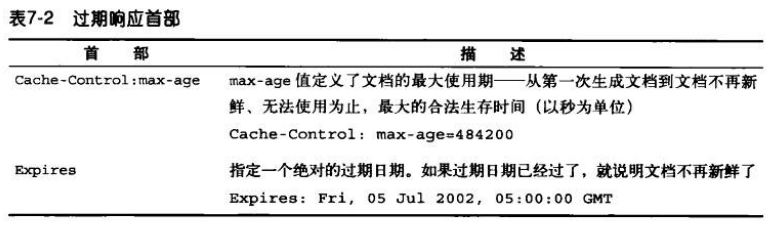
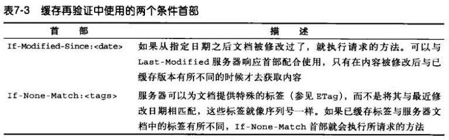
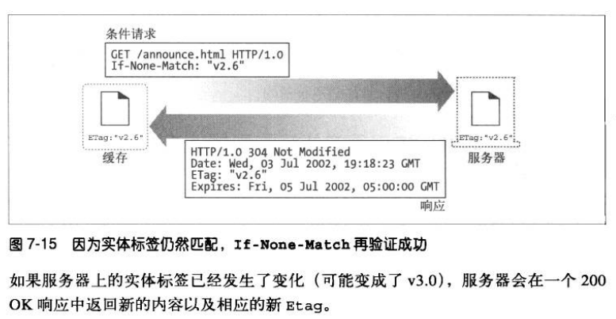
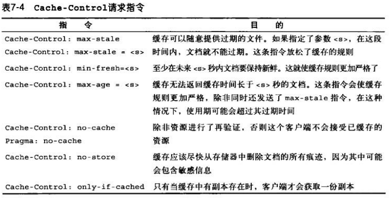

# 缓存
使用缓存的优点:
1. 缓存减少了冗余的数据传输，节省了你的网络费用。
2. 缓存缓解了网络瓶颈的问题，不需要更多的带宽就能够更快地加载页面。
3. 缓存降低了对原始服务器的要求，服务器可以更快地响应，避免过载的出现。
4. 缓存降低了距离时延，因为从较远的地方加载页面会更慢一些。

## 缓存命中
如果请求的资源在缓存能够找到，就称为缓存命中；如果没有，就称为缓存未命中。

### 再验证
原始服务器的内容可能会发生变化，缓存要不时对其进行检测，看看保存的副本是否仍是服务器上最新的副本。这些“新鲜度检测”称为 HTTP 再验证。
大部分的缓存只有在客户端发起请求，并且副本旧得足以需要检测的时候，才会对副本进行再验证。

缓存对副本进行再验证时，会向服务器发送一个小的再验证请求。如果内容没有变化，服务器会返回一个小的 304 Not Modified 进行响应，这称为再验证命中。
HTTP 提供了几个用来对缓存对象进行再验证的工具，但最常用的是 If-Modified-Sice 首部。

>If-Modified-Since 是一个条件式请求首部，服务器只在所请求的资源在给定的日期时间之后对内容进行过修改的情况下才会将资源返回，状态码为 200  。如果请求的资源从那时起未经修改，那么返回一个不带有消息主体的  304  响应，而在 Last-Modified 首部中会带有上次修改时间。 不同于  If-Unmodified-Since, If-Modified-Since 只可以用在 GET 或 HEAD 请求中。
>当与 If-None-Match 一同出现时，它（If-Modified-Since）会被忽略掉，除非服务器不支持 If-None-Match。
>最常见的应用场景是来更新没有特定 ETag 标签的缓存实体。

语法
```
If-Modified-Since: <day-name>, <day> <month> <year> <hour>:<minute>:<second> GMT
```

### 命中率
由缓存提供服务的请求所占的比例称为**缓存命中率**。

**字节命中率**表示的是缓存提供的字节在传输的所有字节中所占的比例。

客户端有一种方法可以判断响应是否来自缓存，就是使用 Date 首部。将响应中的 Date 首部的值与当前时间进行比较，如果响应中的日期值比较早，通常可以认为这是一条缓存的响应。

## 缓存的拓扑结构
### 代理缓存的拓扑结构
在实际中，实现层次化的缓存是很有意义的。在这种结构中，在较小缓存中未命中的请求会被导向较大的父缓存。


在层次结构很深的情况下，请求可能要穿过很长一溜缓存，每个拦截代理都会添加一些性能损耗，当代理链过长时，这种损耗会变得非常明显。

### 网状缓存、内容路由以及对等缓存
网状缓存中的代理缓存之间会以更复杂的方式进行对话，这种代理缓存会决定选择何种路由对内容进行访问、管理和传送，因此可将其称为**内容路由器**。

网状缓存中为内容路由设计的缓存功能：
1. 根据 URL 在父缓存或原始服务器之间进行动态选择。
2. 根据 URL 动态地选择一个特定的父缓存。
3. 前往父缓存之前，在本地缓存中搜索已缓存的副本。
4. 允许其他缓存对其缓存的部分内容进行访问，但不允许因特网流量通过它们的缓存。

缓存之间允许不同的组织互为对等实体，将它们的缓存连接起来以实现共赢。提供对等支持的缓存被称为兄弟缓存，HTTP 不支持兄弟缓存，需要通过一些协议进行扩展，例如因特网缓存协议 ICP 和超文本缓存协议 HTCP。


## 缓存的处理步骤
1. 接收——缓存从网络中读取抵达的请求报文。
2. 解析——缓存对报文进行解析，提取出 URL 和各种首部。
3. 查询——缓存查看是否有本地副本可用，如果没有，就获取一份副本并保存在本地。
4. 新鲜度检测——缓存查看已缓存副本是否足够新鲜，如果不是，就向服务器询问是否有更新。
5. 创建响应——缓存会用新的首部和已缓存的主体来构建一条响应报文。
6. 发送——缓存通过网络将响应发回给客户端。
7. 日志——缓存可选地创建一个日志文件条目来描述这个事务。


HTTP 有一些简单的机制可以在不要求服务器记住有哪些缓存的情况下，保持已缓存数据和服务器数据一致。这些机制分别称为**文档过期**和**服务器再验证**。

## 保持副本的新鲜
### 文档过期
通过 HTTP 的 Cache-Control 首部和 Expires 首部，HTTP 让原始服务器向每个文档附加一个“过期日期”。

在缓存文档过期前，缓存可以随意使用文档而不用和服务器联系，除非客户端请求中包含有阻止提供已缓存或未验证资源的首部。如果缓存文档过期，缓存就必须与服务器进行核对，询问文档是否被修改，如果被修改过，就获取一份新的副本。

### 过期日期和使用期


Cache-Control: max-age 和 Expires 首部做的事本质上是一样的，只是 Cache-Control 使用的是相对时间不是绝对日期。

### 服务器再验证
缓存到期了就要和服务器核对原始文档是否发生了变化，这称为服务器再验证。

如果再验证显示内容发生了变化，缓存就会获取一份新副本并保存在本地，然后将文档返回给客户端。
如果再验证显示内容没有变化，缓存只需获取新的首部，包括一个新的过期日期，并对缓存中的首部进行更新。

### 用条件方法进行再验证
HTTP 定义了 5 个条件请求首部，对缓存再验证最有用的两个首部是 If-Modified-Since 和 If-None-Match。所有的条件首部都以 If 开头。



### If-Modified-Since:Date 再验证
如果自指定日期后，文档被修改了，If-Modified-Since 条件就为真。携带新首部的新文档会返回给缓存，还包含了一个新的过期日期。
如果文档没有被修改，If-Modified-Since 条件就为假，则给客户端返回一个不包含主体的 304 Not Modified 响应报文。

If-Modified-Since 首部可以和 Last-Modified 服务器响应首部配合工作。服务器会将最后的修改日期附加到所提供的文档上去，当缓存要对已缓存文档进行再验证时，就会包含一个 If-Modified-Since 首部，其中携带有已缓存副本的最后修改日期。
```
If-Modified-Since: <cached last-modified date>
```
如果在此日期后内容被修改了，服务器就会返回新的文档。否则，缓存的最后修改日期和服务器当前文档的最后修改日期相符，就会返回一个 304 Not Modified 响应报文。

### If-None-Match: 实体标签再验证
有些情况下仅使用最后日期进行再验证是不够的。有些文档可能会被周期性地重写，内容没有发生变化，但修改日期变了。

HTTP 允许用户对被称为实体标签（ETag）的版本标识符进行比较。实体标签是附加到文档上的任意标签，可能是版本号、序列号或其他内容。
如果实体标签被修改了，缓存就可以使用 If-None-Match 条件首部来 GET 文档的新副本了。



### 什么时候应该使用实体标签和最近修改日期
如果服务器回送了一个实体标签，HTTP/1.1 客户端就必须使用实体标签验证器。如果服务器只回送了一个 Last-Modified 值，客户端就可以使用 If-Modified-Since 验证。
如果实体标签和最近修改日期都返回了，客户端就应该使用这两种再验证方案。只有这两个条件都满足时，代理或服务器才能返回 304 Not Modified。

## 控制缓存的能力
服务器可以通过 HTTP 定义的几种方式来控制缓存时长，按照优先级递减方式排序，有以下几种方式：
1. Cache-Control: no-store 首部。
2. Cache-Control: no-cache 首部。
3. Cache-Control: must-revalidate 首部。
4. Cache-Control: max-age 首部。
5. Expires。
6. 不附加过期信息，让缓存确定自己的过期日期。

### no-store 和 no-cache 响应首部
标识为 no-store 的响应会禁止缓存对响应进行复制，然后缓存向客户端转发一条 no-store 响应并删除对象。

标识为 no-cache 的响应是可以存储在本地缓存区的，只是在与服务器进行新鲜度再验证之前，缓存不能将其提供给客户端使用。

### max-age 响应首部
设置缓存存储的最大周期，超过这个时间缓存被认为过期(单位秒)。与Expires相反，时间是相对于请求的时间。

### Expires 响应首部
不推荐使用 Expires 响应首部，它指定的是实际的日期而不是秒数。

### must-revalidate 响应首部
must-revalidate 响应首部告诉缓存，在事先没有跟服务器进行再验证的情况下，不能提供这个对象的陈旧副本。
如果缓存在进行 must-revalidate 新鲜度检查时，服务器不可用，缓存就必须返回一条 504 Gateway Timeout 错误。

### 客户端的新鲜度限制
客户端可以通过 Cache-Control 请求首部来强化或放松对过期时间的限制。



## 缓存和广告

