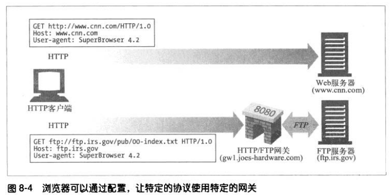
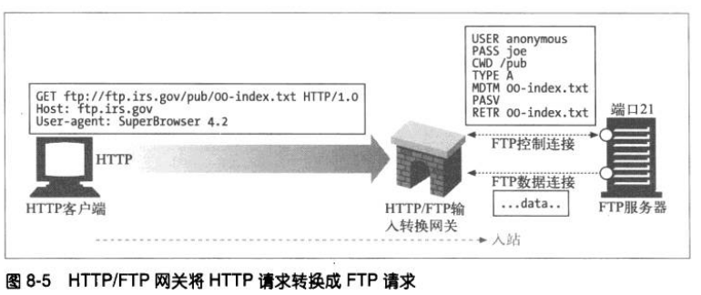
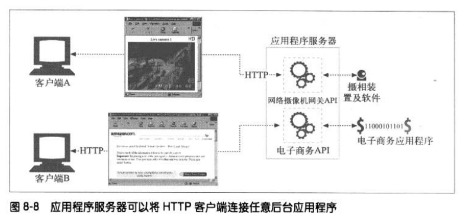
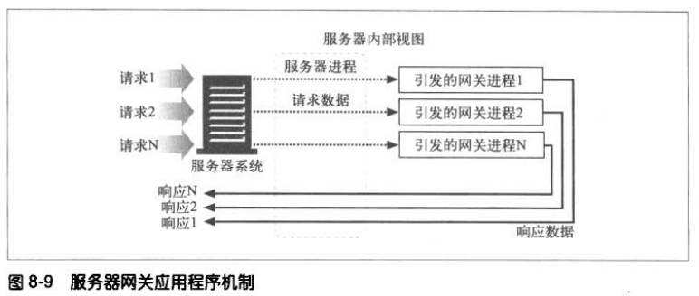
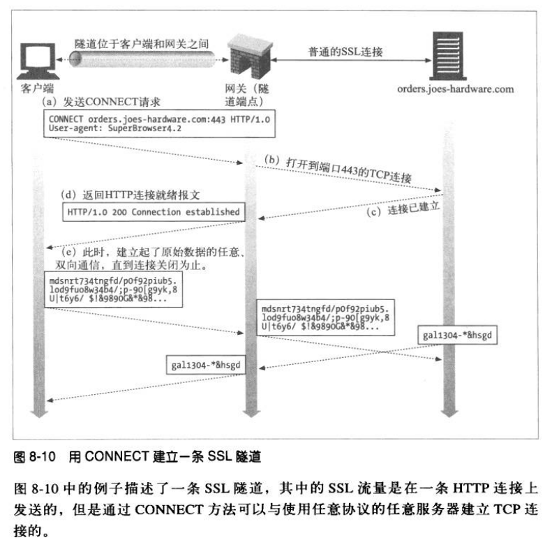
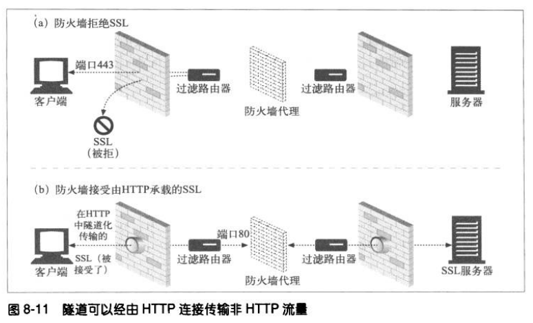

# 集成点：网关、隧道及中继
## 网关
网关顾名思义就是连接两个网络的设备。有些网关有翻译器的作用，可以将一种协议转换成另一种协议。

Web 网关在一侧使用 HTTP 协议，在另一侧使用另一种协议。网关可以这样进行描述：
```
<客户端协议>/<服务器协议>
```
## 协议网关


### HTTP/*：服务器端 Web 网关
请求流入服务器时，服务器 Web 网关会将客户端 HTTP 请求转换为其他协议。



## 资源网关
最常见的网关是应用程序服务器，它将目标服务器和网关结合在一起。应用程序服务器和客户端通过 HTTP 通信，并与服务器端的应用程序相连。





## 隧道
Web 隧道允许用户通过 HTTP 连接发送非 HTTP 流量，这样就可以在 HTTP 上捎带其他协议数据了。
使用 Web 隧道最常见的原因就是要在 HTTP 连接中嵌入非 HTTP 流量，这样，这类流量就可以穿过只允许 Web 流量通过的防火墙了。

### 用 CONNECT 建立 HTTP 隧道
CONNECT 方法请求隧道网关创建一条到达任意目的服务器和端口的 TCP 连接，并对后继数据进行盲转发。



#### CONNECT 请求
除了起始行之外，CONNECT 的语法和其他 HTTP 方法类似。主机和端口都必须指定：
```
CONNECT home.netscape.com:443 HTTP/1.0
User-agent: Mozilla/4.0
```
起始行之后，有零或多个 HTTP 请求首部字段，同样以 CRLF 结尾，首部列表以一个空的 CRLF 结束。

#### CONNECT 响应
响应码 200 代表成功。响应中的原因短语通常被设置为 "Connection Established"：
```
HTTP/1.0 200 Connection Established
Proxy-agent: Netscape-Proxy/1.1
```
这个响应不需要包含 Content-Type 首部。此时连接只是对原始字节进行转接，不再是报文的承载者，所以不需要使用内容类型。

### SSL 隧道
