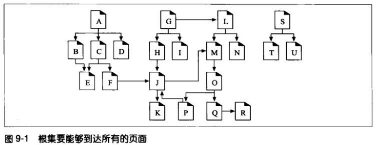
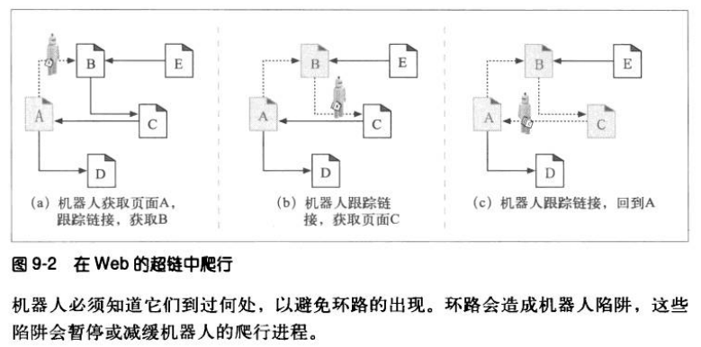
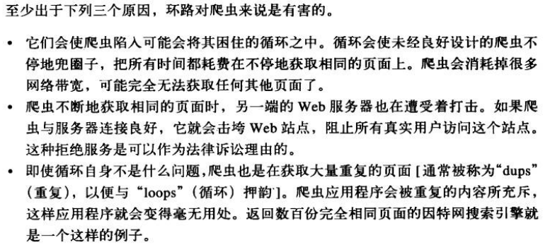
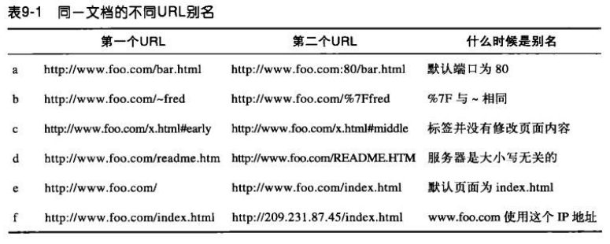
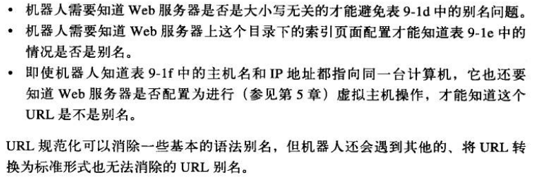
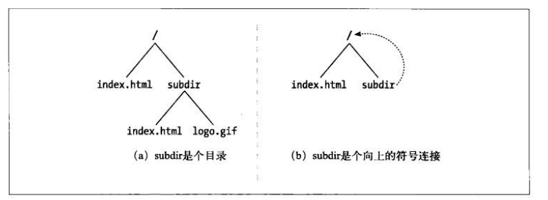
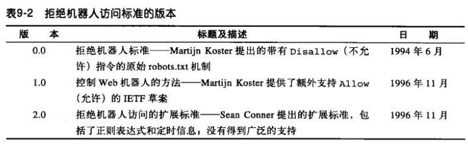
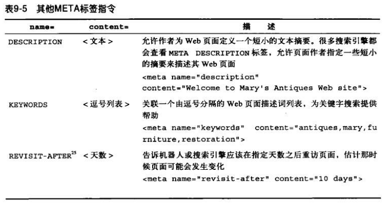
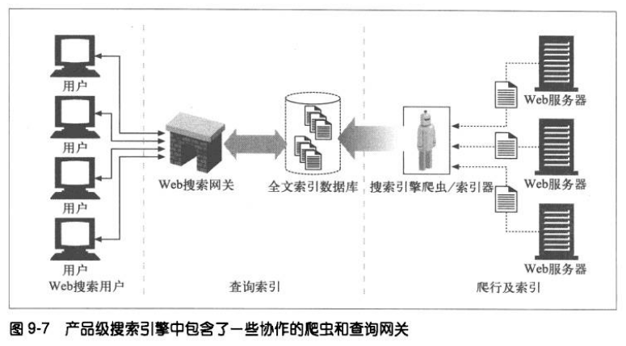

# Web 机器人
Web 机器人是能够在无需人类干预的情况下自动进行一系列 Web 事务处理的软件程序。很多机器人会从一个网站逛到另一个网站，获取内容，跟踪链接，并对它们找到的数据进行处理。

## 爬虫及爬行方式
爬虫是一种机器人，它们会递归地对各种信息网站进行遍历，获取第一个页面，然后获取那个页面指向的所有页面，依次类推。
搜索引擎使用爬虫在 Web 上游荡，并把它们碰到的文档全部拉回来。然后对这些文档进行处理，形成一个可搜索的数据库。

### 从哪儿开始：根集
爬虫开始访问的 URL 初始集合被称作根集。挑选根集时，应该从足够多不同的站点中选择 URL。



### 链接的提取和相对链接的标准化
爬虫在 Web 上移动时，会不停地对 HTML 页面进行解析。它对每个页面的 URL 链接进行分析，并将这些链接添加到需要爬行的页面列表中去。同时要将相对 URL 转换为绝对形式。

### 避免环路的出现


### 循环与复制


### 面包屑留下的痕迹
爬虫对访问过的地址进行管理时使用的一些技术：
1. 树和散列表。
2. 有损的存在位图，将爬行过的 URL 的存在位“置位”。
3. 检查点，一定要将已访问 URL 列表保存到硬盘上，以防机器人程序崩溃。
4. 分类，使用机器人集群来爬行整个 Web。

### 规范化 URL


大多数机器人都试图将 URL “规范化” 为标准格式来消除别名。规范化步骤：
1. 如果没有指定端口，就向主机名中添加“:80”。
2. 将所有转义字符 %xx 都转换成等价字符。
3. 删除 # 标签。

经过这些步骤就可以消除上图中 a~c 所列的别名问题了。



### 文件系统连接环路


### 避免循环和重复
有些技术可以使机器人避免环路的出现：
1. 规范化 URL。
2. 广度优先的爬行。
3. 节流，限制一段时间内机器人可以从一个网站获取的页面数量。
4. 限制 URL 的大小。
5. URL/站点黑名单，将会造成机器人环路的网站加入黑名单。
6. 模式检测，拒绝爬行多于两个或三个重复组件的 URL。
7. 内容指纹，对页面内容进行检验和，如果一个页面的校验和同之前某个检验和一样，就不去爬行这个页面。
8. 人工监视。

## 机器人的 HTTP
机器人和其他 HTTP 客户端程序没有什么区别，都要遵循 HTTP 规范中的规则。

## 行为不当的机器人
不守规矩的机器人会造成很多严重的问题：
1. 失控机器人，由于环路或逻辑错误可能会向服务器发出大量的负载。
2. 失效的 URL，机器人可能会对大量不存在的 URL 发起请求，加重服务器的负担。
3. 很长的错误 URL，如果 URL 太长，会降低服务器的性能。
4. 爱打听的机器人，机器人可能会得到一些私有数据的 URL，从而访问私有数据。
5. 动态网关访问，机器人可能会获取一个内容来自网关应用程序的 URL。

## 拒绝机器人访问
人们定义了一个称为“拒绝机器人访问标准”，服务器在其根目录下提供一个可选的、名为 robots.txt 的文件。这个文件包含的信息说明了机器人可以访问哪些信息。



### HTML 的 robot-control 元标签
HTML 可以通过 META 标签对机器人提供一些限制。
```
<META NAME="ROBOTS" CONTENT="NOINDEX">
```
1. NOINDEX，告诉机器人不要对页面的内容进行处理，忽略文档。
2. NOFOLLOW，告诉机器人不要爬行这个页面的任何外连链接。
3. INDEX，告诉机器人可以对页面的内容进行索引。
4. FOLLOW，告诉机器人可以爬行页面上的任何外连链接。
5. NOARCHIVE，告诉机器人不应该缓存这个页面的本地副本。
6. ALL，等价于 INDEX、FOLLOW。
7. NONE，等价于 NOINDEX、NOFOLLOW。

#### 搜索引擎的 META 标签


## 搜索引擎
现代的搜索引擎都构建了一些名为“全文索引”的复杂本地数据库，装载了全世界的页面及其内容。
### 全文索引
全文索引就是一个数据库，给它一个单词，它可以立即提供包含那个单词的所有文档。



### 对结果进行排序，并提供查询结果
一旦搜索引擎通过其索引得到了结果，网关应用程序就会获取结果，并将其拼成页面提供给用户。