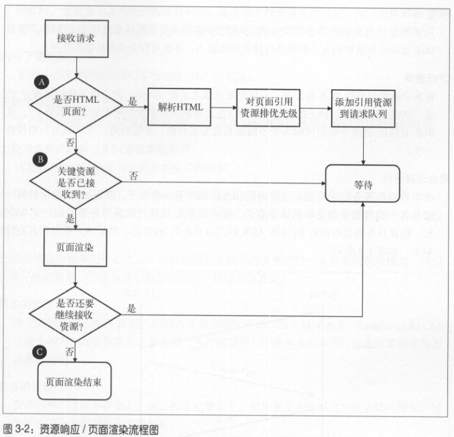
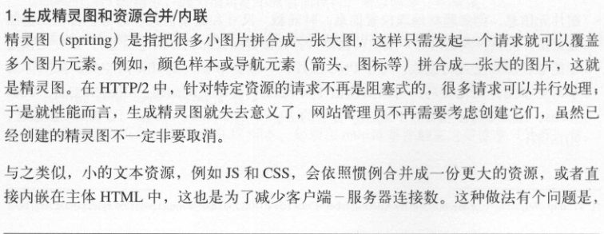
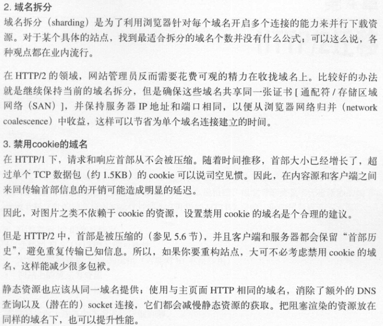

# Web 优化“黑魔法”的动机与方式
## 当前的性能挑战
浏览器请求页面过程会为两部分：资源获取、页面解析/渲染

资源获取

页面解析/渲染

大部分浏览器支持 6 个或更多的并发 TCP 连接。

### 关键性能指标
1. 延迟。延迟是指 IP 数据包从一个网络端点到另一个网络端点所花费的时间。与之相对的是往返时延 RTT，它是延迟的两倍时间。
2. 带宽。
3. DNS查询。
4. 建立连接时间。
5. TLS 协商。
6. 首字节时间（TTFB）。指从客户端开始定位到 Web 页面，至接收到主体页面响应的第一字节所耗费的时间。它包含了之前提到的各种耗时，和服务器处理时间。对于主体页面上的资源，TTFB 是指从浏览器发起请求至其收到第一字节之间的耗时。
7. 内容下载时间。
8. 开始渲染时间。客户端的屏幕上什么时候开始显示内容？这个指标测量的是用户看到空白页面的时长。
9. 文档加载完成时间（又叫页面加载时间）。这是浏览器认为页面加载完毕的时间。

### HTTP/1 的问题
1. 队头阻塞。H1 有个管道化特性，允许一次发送一组请求，但只能按发送顺序依次接收响应。在请求应答过程中，如果出现任何状况，剩下的所有请求都会被阻塞在那次请求应答之后，这就叫**队头阻塞**。
2. 慢启动机制导致的低效的 TCP 利用。
3. 臃肿的消息首部。H1 只能压缩消息内容，而不能压缩首部。如果首部算上 cookie，有几千个字节都很正常。
4. 受限的优先级设置。
5. 第三方资源。

## Web 性能优化技术
### 反模式
HTTP/2 对每个域名只会开启一个连接，所以以下 HTTP/1.1 的一些做法对它来说只会适得其反。

