# HTTP/2 协议
## HTTP/2 分层
HTTP/2 可分为两部分：分帧层、数据或 HTTP 层。

HTTP/2 的特点：
1. 二进制协议；
2. 首部压缩；
3. 多路复用；
4. 加密传输。

## 连接
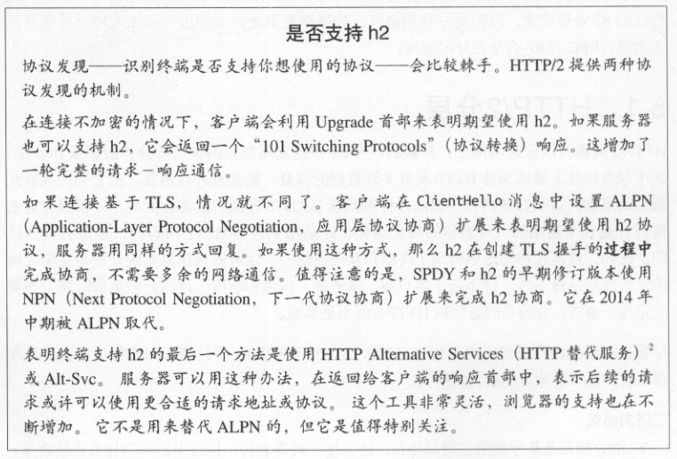

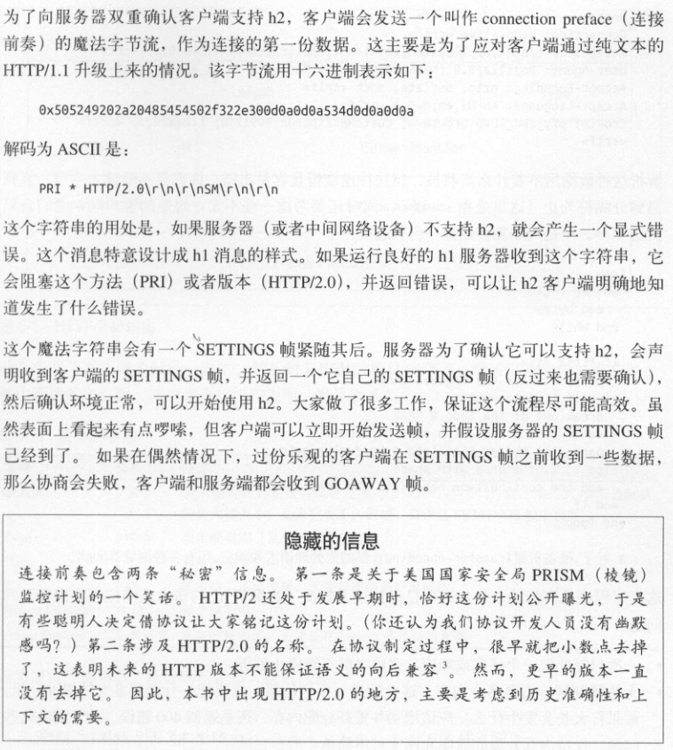

## 帧
HTTP/2 是基于帧的协议。采用分帧是为了将重要信息封装起来，让协议的解析方可以轻松阅读、解析并还原信息。

而 HTTP/1.1 是以文本分隔的。解析 HTTP/1.1 不需要什么高科技，但往往速度慢且容易出错。你需要不断地读入字节，直到遇到分隔符 CRLF 为止，同时还要考虑不守规矩的客户端，它只会发送 LF。

解析 H1 的请求或响应会遇到以下问题：
1. 一次只能处理一个请求或响应，完成之前不能停止解析。
2. 无法预判解析需要多少内存。

H2 有了帧，处理协议的程序就能预先知道会收到什么，并且 H2 有表示帧长度的字段。

前 9 个字节每个帧都是一样的。解析时只需要读取这些字节，就可以知道在整个帧中期望的字节数。

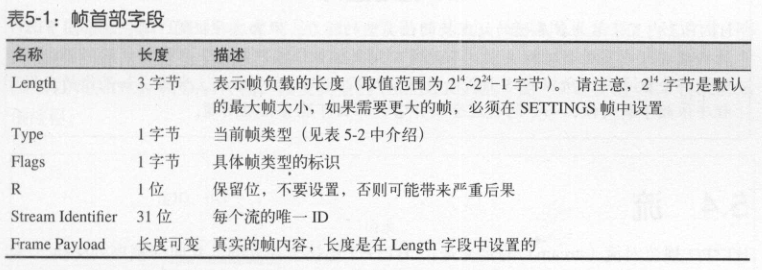

由于 H2 是分帧的，请求和响应可以交错甚至多路复用。多路复用有助于解决类似队头阻塞的问题。

H2 协议有 10 种不同的帧类型。

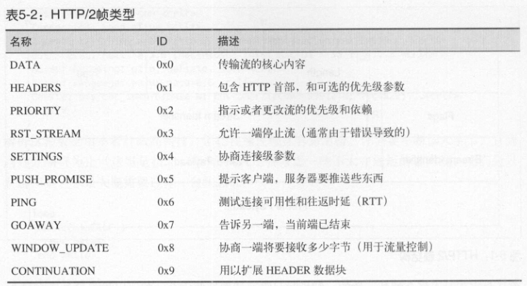

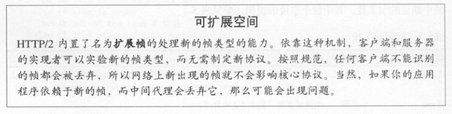

## 流
HTTP/2 规范对流的定义是：HTTP/2 连接上独立的、双向的帧序列交换。如果客户端想要发出请求，它会开启一个新流，然后服务器在这个流上回复。
由于有分帧，所以多个请求和响应可以交错，而不会互相阻塞。流 ID 用来标识帧所属的流。

客户端到服务器的 H2 连接建立后，通过发送 HEADERS 帧来启动新的流。如果首部需要跨多个帧，可能还会发送 CONTINUATION 帧。该 HEADERS 帧可能来自请求或响应。 后续流启动的时候，会发送一个带有递增流 ID 的新 HEADERS 帧。

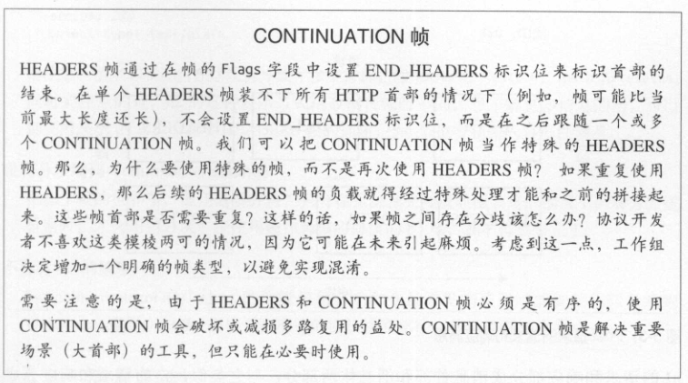

### 消息
HTTP 消息泛指 HTTP 请求或响应。流是用来传输一对请求/响应消息的。

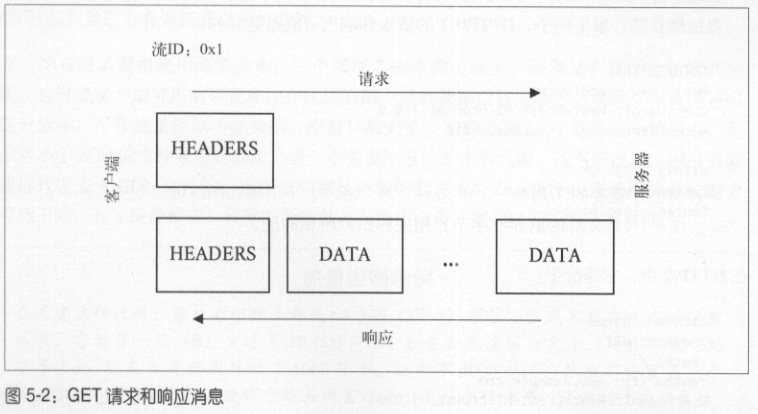

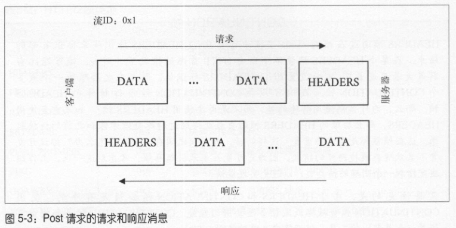

H1 的请求和响应部分都分成消息首部和消息体两部分；H2 的请求和响应分成 HEADERS 帧和 DATA 帧。

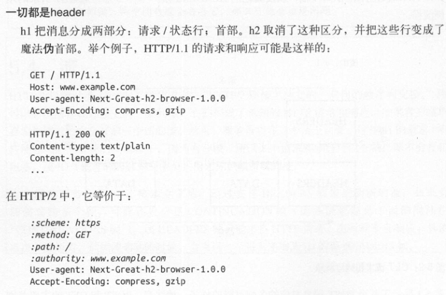

H2 没有分块编码，也不需要。并且不再有 101 响应。

### 流量控制
H2 的新特性之一是基于流的流量控制。WINDOW_UPDATE 帧用来指示流量控制信息。每个帧告诉对方，发送方想接收多少字节。

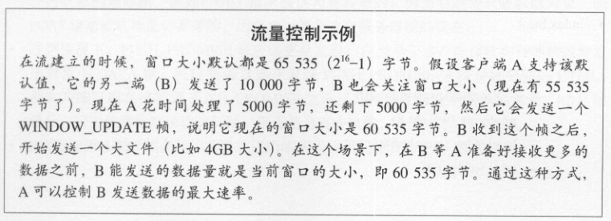

### 优先级
H2 的最后一个重要特性是依赖关系。通过 HEADERS 帧和 PRIORITY 帧，客户端可以明确地和服务器沟通它需要什么，以及它需要这些资源的顺序。

1. 依赖关系为客户端提供了一种能力，通过指明某些对象对另一些对象有依赖，告知服务器这些对象应该优先传输。
2. 权重让客户端告诉服务器如何确定具有共同依赖关系的对象的优先级。

## 服务器推送
推送使服务器能够主动将对象发给客户端，这可能是因为它知道客户端不久将用到该对象。

### 推送对象

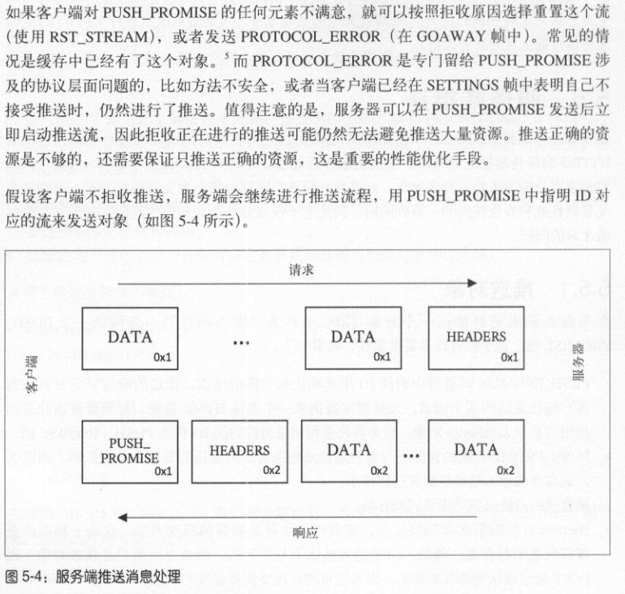

### 选择要推送的资源
如果服务器接收到一个 HTML 页面的请求，它需要决定是推送页面上的资源还是等客户端来请求。决策过程如下：
1. 资源已经在浏览器缓存中的概率；
2. 从客户端来看，这些资源的优先级（CSS、JS等）；
3. 可用的带宽，以及其他类似的会影响客户端接收推送的资源。

如果服务器选择正确，那就有助于提升页面的整体性能，反之则会损耗页面性能。由于这个原因，如今通用的服务端推送方案非常少。

## 首部压缩
HPACK 是种表查找压缩方案，它利用霍夫曼编码获得接近 GZIP 的压缩率。

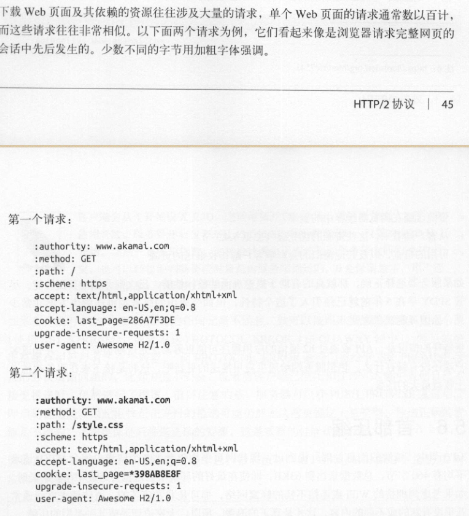

可以看到，前者与后者很多数据重复了。这二者只有 36 字节是不同的，如果仅发送这 36 字节，就可以节省约 85% 的字节数。HPACK 原理就是这样的。

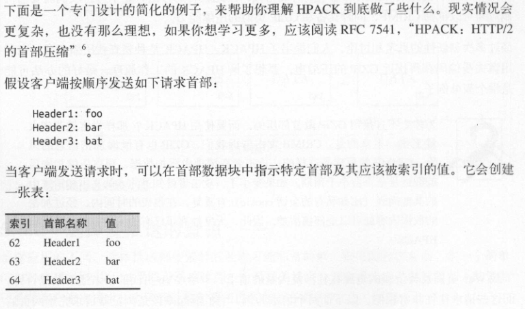

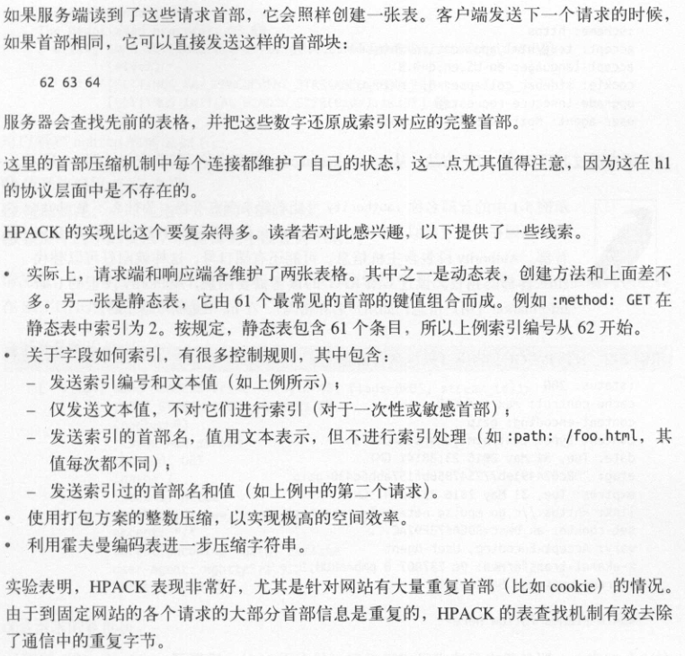