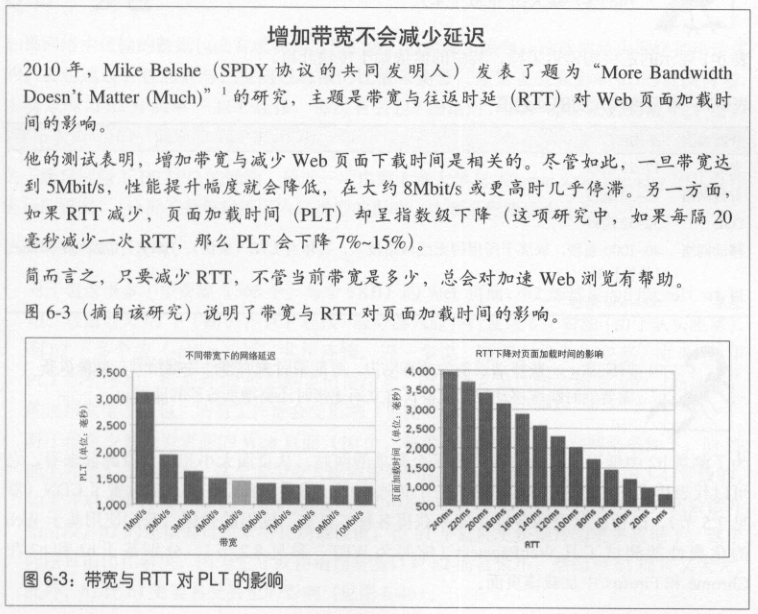
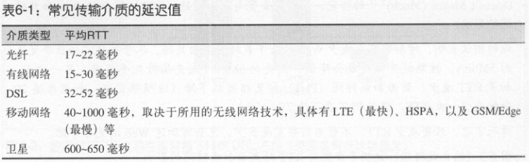
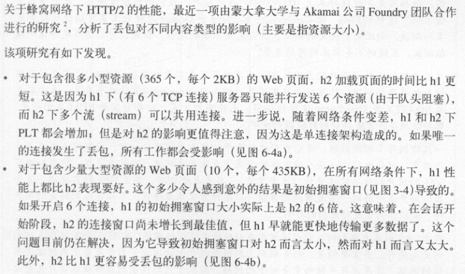
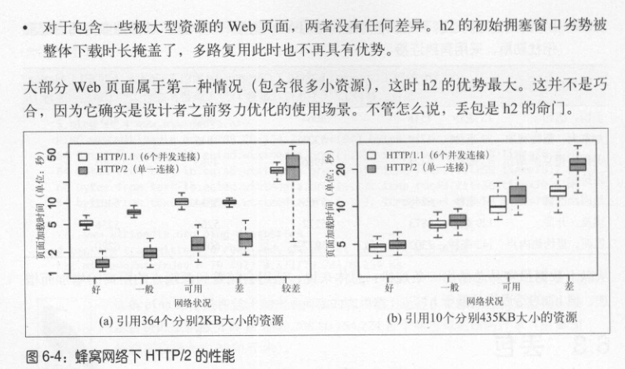
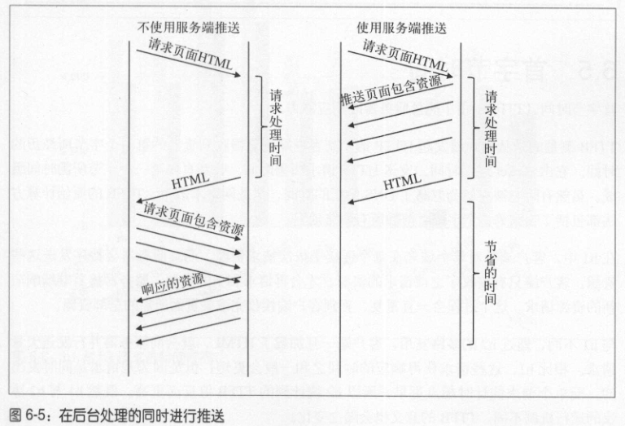

# HTTP/2 性能
## 延迟

## 丢包
如果网络中传输的数据包没有成功到达目的地，就称为丢包；这通常是网络拥堵造成的。

## 服务端推送
如果合理使用推送，页面渲染时间可以减少 20%-50%。尽管如此，推送也会浪费带宽，因为推送的资源在客户端有可能已经缓存，导致客户端收到不需要的数据。

## 首字节时间

下列是 H1 没有，但 H2 实现了的事情：
1. 窗口大小调节
2. 依赖树构建
3. 维持首都信息的静态／动态表
4. 压缩／解压缩首部
5. 优先级调整（H2 允许客户端多次调整单一请求的优先级）
6. 预先推送客户端尚未请求的数据流