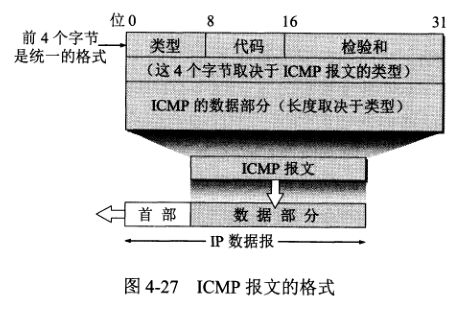
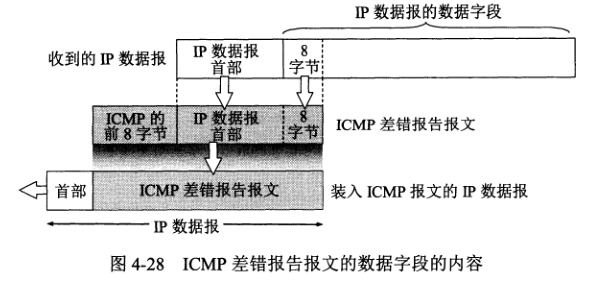

# ICMP 网际控制报文协议文档
ICMP 允许主机或路由器报告差错情况和提供有关异常情况的报告，ICMP 报文是装在 IP 数据报中的，作为其数据部分。

## ICMP 报文
#### 报文种类
1. ICMP 差错报告报文。
2. ICMP 询问报文。

ICMP 报文的前 4 个字节是统一的格式，共有 3 个字段：类型、代码、检验和。接着的 4 个字节的内容与 ICMP 类型有关。
#### 差错报告类型
1. 终点不可达  当终点不可达时向源点发送终点不可达报文。
2. 时间超过 TTL 为零时丢弃报文，还要向源点发送时间超过报文。
3. 参数问题 当路由器或主机收到的数据报中的字段不正确时，就丢弃该数据报，并向源点发送参数问题报文。
4. 改变路由（重定向） 路由器把改变路由报文发给主机，让主机知道下次应将数据报发给另外的路由器（可通过更好的路由）。

ICMP 差错报告报文段中的数据字段都具有同样的格式。它把需要进行差错报告的 IP 数据报首部以及数据部分的前 8 个字节（为了得到运输层的端口号以及运输层报文的发送序号（对于 TCP））提取出来，作为 ICMP 报文段的数据。再加上 ICMP 差错报告报文的前 8 个字节，就构成了 ICMP 差错报告报文。

#### 不应发送差错报告报文的几种情况
1. 对 ICMP 差错报告报文，不再发送 ICMP 差错报告报文。
2. 对第一个分片的数据报片的所有后续数据报片，都不发送 ICMP 差错报告报文。
3. 对具有多播地址的数据报，都不发送 ICMP 差错报告报文。
4. 对具有特殊地址（127.0.0.1 或 0.0.0.0）的数据报，都不发送 ICMP 差错报告报文。

#### 常用的 ICMP 询问报文有两种
1. 回送请求和回答 

ICMP 回送请求向一个特定的目的主机发出询问，收到此报文的主机必须给源发送 ICMP 回答报文，用来测试目的站是否可达以及了解其有关状态。

tracert 出现请求超时的情况：
* 超时的节点设备（如网络设备路由器、服务器等）做了安全设置，禁止ICMP协议即禁ping
* 超时的节点网络拥塞或者网络质量差延时过大所致
* 超时的节点设备宕机/关机等对ICMP协议无法响应

2. 时间戳请求和回答

ICMP 时间戳请求报文请求目的主机或路由器回答当前的日期和时间，时间戳请求和回答可用于时钟同步和测量。

#### ICMP 应用举例
1. 分组网间探测 ping，用来测试两台主机之间的连通性。
2. traceroute(win: tracert)，用来跟踪一个分组从源点到终点的路径。
