# 网络安全
## 网络安全问题概述
计算机网络通信面临两大类威胁，即被动攻击和主动攻击。

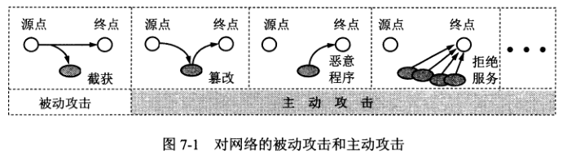

### 被动攻击
被动攻击是指攻击者从网络上窃听他人的的通信内容，通常把这类攻击称为截获。在被动攻击中，攻击者只是观察和分析某一个协议数据单元 PDU 而不干扰信息流。
通过研究 PDU 的协议控制信息部分、长度和传输的频度，从而了解所交换数据的某种性质，这又称为流量分析。

### 主动攻击
#### 篡改
攻击者篡改网络传送的报文，包括中断传送的报文或传送伪造的报文，这种攻击又称为更改报文流。
#### 恶意程序
恶意程序包括以下几种：
1. 计算机病毒，一种会传染其他程序的程序，传染是通过修改其他程序来把自身或变种复制进去而完成的。
2. 计算机蠕虫，一种通过网络的通信功能将自身从一个结点发送到另一个结点并自动启动运行的程序。
3. 特洛伊木马，它执行的功能并非所声称的功能而是某种恶意的功能。
4. 逻辑炸弹，一种当运行环境满足某种特定条件时执行其他特殊功能的程序。
5. 后门入侵，是指利用系统中的漏洞通过网络入侵系统。
6. 流氓软件，一种未经用户允许就在用户计算机上安装运行并损害用户利益的软件，其典型特征是：强制安装、难以卸载、浏览器劫持、广告弹出...

#### 拒绝服务 DoS
指攻击者向互联网上的某个服务器不停地发送大量分组，导致服务器无法提供正常服务，甚至瘫痪。
若从成百上千个地方（网络地址）集中攻击一个网站，称为分布式拒绝服务。

对于主动攻击，可以采取适当的措施加以检测。但对于被动攻击，通常是检测不出来。根据这些特点，计算机网络通信安全的的目标如下：
1. 防止析出报文内容和流量分析。
2. 防止恶意程序。
3. 检测更改报文流和拒绝服务。

### 安全的计算机网络
一个安全的计算机网络应该达到以下四个目标：
1. 保密性，即信息只有接收方和发送方才能识别，截获者无法看懂。
2. 端点鉴别，需要鉴别对方的真实身份。
3. 信息的完整性，必须确认收到的信息是完整的，没有被篡改。
4. 运行的安全性。

### 数据加密模型
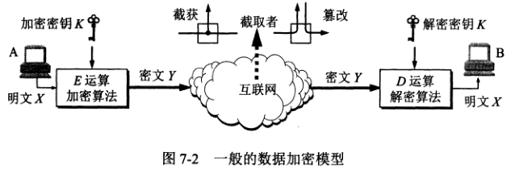

## 两类密码体制
### 对称密钥密码体制
对称密钥密码体制，即加密密钥和解密密钥是使用相同的密码体制。

数据加密标准 DES 属于对称密钥密码体制，它的加强版是三重 DES。
### 公钥密码体制
公钥密码体制使用不同的加密密钥与解密密钥。公钥密码体制产生的主要原因有两个：一是对称密钥密码体制的密钥分配问题，二是对数字签名的需求。
在公钥密码体制中，加密密钥是公开的，解密密钥是需要保密的，加密算法和解密算法也是公开的。

公钥密码体制的加密和解密有如下特点：
1. **密钥对产生器**产生出接收者 B 的一对密钥，即加密密钥 PK 和解密密钥 SK。
2. 发送者 A 用 B 的公钥 PK 作为加密密钥来加密信息，B 接收后用解密密钥 SK 解密。

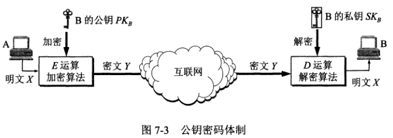

使用对称密钥时，由于双方使用同样的密钥，因此在通信信道上可以进行一对一的双向保密通信，双方都可以用同一个密钥加密解密。

使用公开密钥时，在通信信道上可以是多对一的单向保密信道。即可以有多人持有 B 的公钥，但只有 B 才能解密。

**任何加密方法的安全性取决于密钥的长度，以及攻击密文所需的计算量**。

## 数字签名
数字签名必须能保证以下三个功能：
1. 接收者能够核实发送者对报文的签名，即接收者能确信该报文是发送者发送的。这叫**报文鉴别**。
2. 接收者确信所收到的数据和发送者发送的完全一样而没有被篡改过，这叫**报文的完整性**。
3. 发送者事后不能抵赖对报文的签名，这叫**不可否认**。

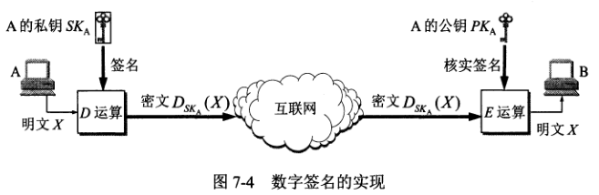

看上图，任何人都能用 A 的公钥 PK 对密文进行 E 运算后得到 A 发送的明文。可见这种通信并非为了保密，而是为了进行签名和核实签名，即确认此信息是 A 发送的。
但上述过程仅对报文进行了签名，对报文 X 本身却未保密，所以要采用下图的方法，同时实现秘密通信和数字签名。

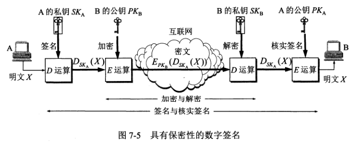

## 鉴别
鉴别是要验证通信的对方的确是自己所要通信的对象，而不是其他冒充者，并且所传送的报文是完整的，没有被篡改过。
鉴别包含了报文鉴别和实体鉴别。

### 报文鉴别
#### 密码散列函数
使用数字签名就可以实现对报文的鉴别，但这个方法有个缺点，就是对较长的报文进行数字签名会使计算机增加很大的负担。
因此，我们需要一种相对简单的方法来对报文进行鉴别，那就是使用密码散列函数。

散列函数特点：
1. 输入长度可以很长，但输出长度固定且较短，散列函数的输出称为散列值。
2. 不同的输入有可能得到相同的散列值，输入和输出是多对一的关系。
3. 单向函数，不能通过输出得到输入。

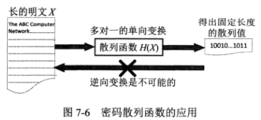

#### MD5 和 SHA-1
MD 是 Message Digest 的缩写，意思是报文摘要，MD5 是报文摘要的第 5 个版本。
由于 MD5 现在可以用系统的方法找出一对与原来报文摘要相同的报文摘要，所以 MD5 被一个叫做安全散列算法 SHA 的标准所取代。

MD5 算法过程：
1. 先把报文按模 2**64 计算余数（64 位），追加在报文后面。
2. 在报文和余数之间填充 1-512 位，使得填充后的总长度是 512 的整数倍。填充的首位是 1，后面都是 0。
3. 把追加和填充后的报文分割为一个个 512 位的数据块，每个 512 位的报文数据再分成 4 个 128 位的数据块依次送到不同的散列函数进行 4 轮计算。每一轮又都按 32 位的小数据块进行复杂的运算，一直到最后计算出 MD5 报文摘要代码（128 位）。

SHA 和 MD5 相似，但码长为 160 位。

#### 报文鉴别码
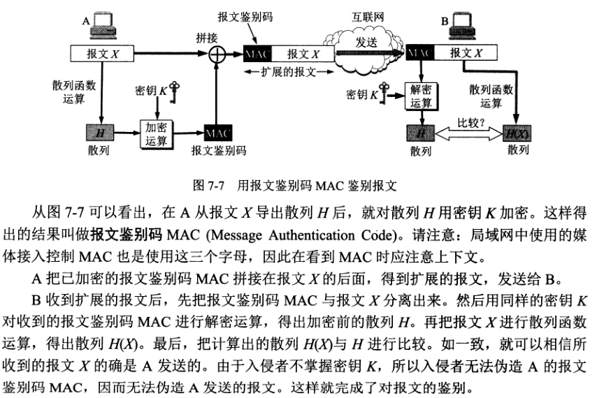

### 实体鉴别
报文鉴别是鉴别报文的发送者，实体鉴别是在系统接入的全部持续时间内对通信的对方实体只验证一次。

## 密钥分配
由于密码算法是公开的，网络的安全性就完全基于密钥的安全保护上。密码学有一个重要的分支——密钥管理。密钥管理包括：密钥的产生、分配、注入、验证和使用。

密钥分配是密钥管理中最大的问题，密钥必须通过最安全的通路进行分配。

### 对称密钥的分配
目前常用的密钥分配方式是设立密钥分配中心 KDC。KDC 是大家都信任的机构，其任务是给需要进行秘密通信的用户一个临时的会话密钥（仅使用一次）。

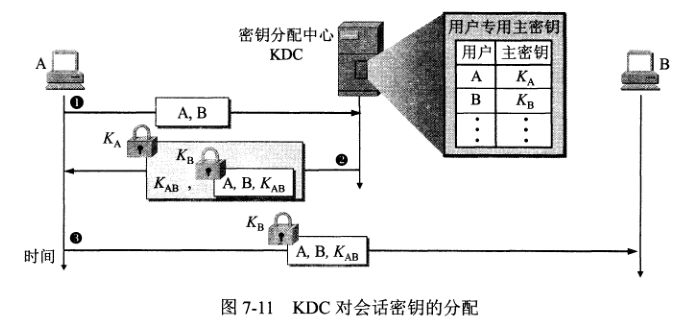

### 公钥的分配
认证中心 CA 将公钥和其对应的实体进行绑定。

## 互联网使用的安全协议
### 网络层安全协议
IPsec 是 IP Security 的缩写，IPsec 不是单一的协议，而是能够在 IP 层提供互联网通信安全的协议族。实际上 IPsec 是个框架，它允许双方选择合适的算法和参数。
为保证互操作性，IPsec 还包含了一套加密算法。

IPsec 协议族可划分为三个部分：
1. IP 安全数据报格式的两个协议：鉴别首部 AH 协议和封装安全有效载荷 ESP 协议。
2. 有关加密算法的三个协议。
3. 互联网密钥交换 IKE 协议。

AH 协议提供源点鉴别和数据完全性，但不能保密。ESP 提供源点鉴别、数据完整性和保密。AH 协议的功能都已包含在 ESP 协议中，使用 ESP 协议就可以不用 AH 协议。

使用 AH 或 ESP 协议的 IP 数据报称为 IP 安全数据报，它有两种工作方式：
1. 运输方式，在整个运输层报文段前后分别添加若干控制信息，再加上 IP 首部，构成 IP 安全数据报。
2. 隧道方式，在原始的 IP 数据报前后分别添加若干控制信息，再加上新的 IP 首部，构成 IP 安全数据报。

#### 安全关联
在发送安全 IP 数据报之前，必须创建一条网络层的逻辑链接，即安全关联 SA。安全关联是从源点到终点的单向连接，它能提供安全服务。如要进行双向安全通信，则两个方向都要建立安全关联。

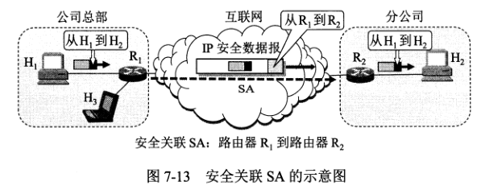

#### IP 安全数据报格式
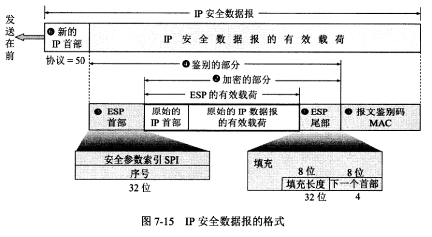

#### IPsec 的其他构件
**安全关联数据库 SAD** 存放了很多条安全关联 SA。当主机要发送 IP 安全数据报时，要在 SAD 中查找对应的 SA，以获得必要的信息，来对该 IP 安全数据报提供保护；当主机要接收 IP 安全数据报时，也要在 SAD 中查找相应的 SA，以获得信息来检查该分组的安全性。

**安全策略数据库 SPD**，SPD 指明什么样的数据需要进行 IPsec 处理。

**互联网密钥交换 IKE** 协议，用于为 IP 安全数据报创建安全关联 SA。

### 运输层安全协议
#### 安全套接字层 SSL 和运输层安全 TLS
SSL 作用在端系统应用层的 HTTP 和运输层之间，在 TCP 之上建立一个安全通道。
IETF 在 SSL3.0 的基础上开发了 TLS 协议，为基于 TCP 的网络应用提供安全数据传输服务。

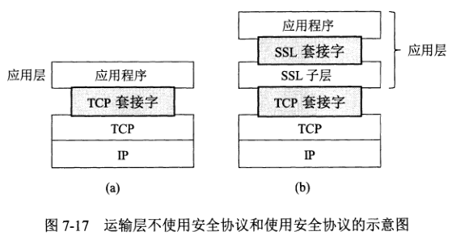

应用层使用 SSL 最多的是 HTTP，但 SSL 并非仅用于 HTTP，而是可用于任何应用层协议。

SSL 提供的安全服务分为三种：
1. SSL 服务器鉴别，允许用户证实服务器的身份。支持 SSL 的客户端通过验证来自服务器的证书，来鉴别服务器的真实身份并获得服务器公钥。
2. SSL 客户鉴别，SSL 的可选服务，允许服务器证实客户的身份。
3. 加密的 SSL 会话，对报文进行加密，并检测报文是否被篡改。

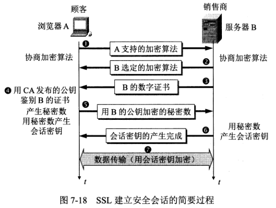

SSL 还缺少一些措施来防止在互联网商务中出现各种可能的欺骗行为。

#### SSL 建立连接与关闭

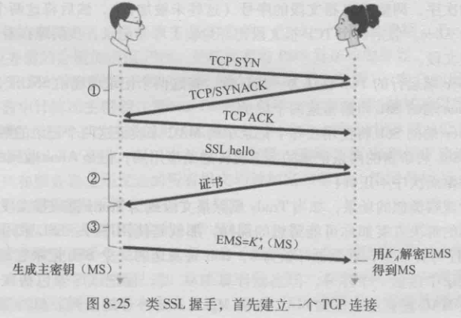

更具体的过程请看参考资料[SSL/TLS 握手过程详解](https://www.jianshu.com/p/7158568e4867)

## 系统安全：防火墙与入侵检测
### 防火墙
防火墙作为一种访问控制技术，通过严格控制进出网络边界的分组，禁止不必要的通信，从而减少潜在入侵的发生。
防火墙是一种特殊编程的路由器，安装在一个网点和网络的其余部分之间，目的是实施访问控制策略。

防火墙技术一般分为两类：
1. 分组过滤路由器是一种具有分组过滤功能的路由器，它根据过滤规则对进出内部网络的分组执行转发或丢弃。过滤规则是基于分组的网络层或运输层首部的信息。例如源/目的 IP 地址、端口号、协议类型等等。
2. 应用网关也称为代理服务器，它在应用层通信中扮演报文中继的角色。在应用网关中，可以实现基于应用层数据的过滤和高层用户鉴别。

防火墙就同时具有以上两种技术。

### 入侵检测系统
入侵检测系统 IDS 对进入网络的分组执行深度分组检查，当观察到可疑分组时，向网络管理员发出告警或执行阻断操作（由于 IDS 误报率高，一般不执行自动阻断）。IDS 能用于检测多种网络攻击，如网络映射、端口扫描、DoS 攻击、蠕虫和病毒、系统漏洞攻击等。 

入侵检测系统一般分为基于特征的入侵检测和基于异常的入侵检测两种。