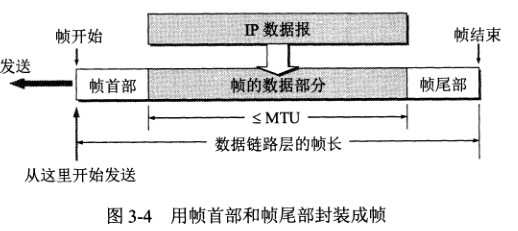
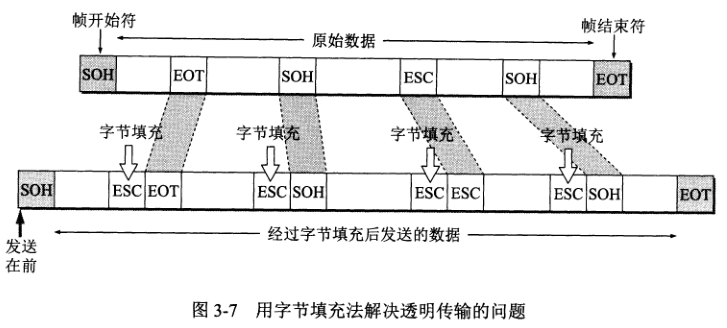
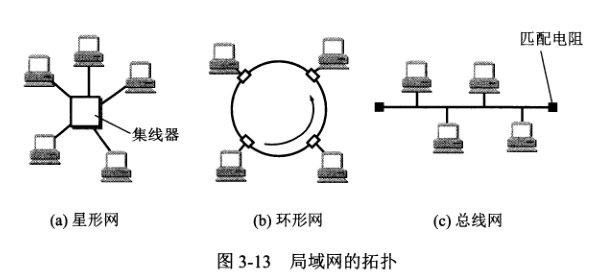
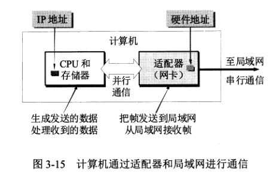
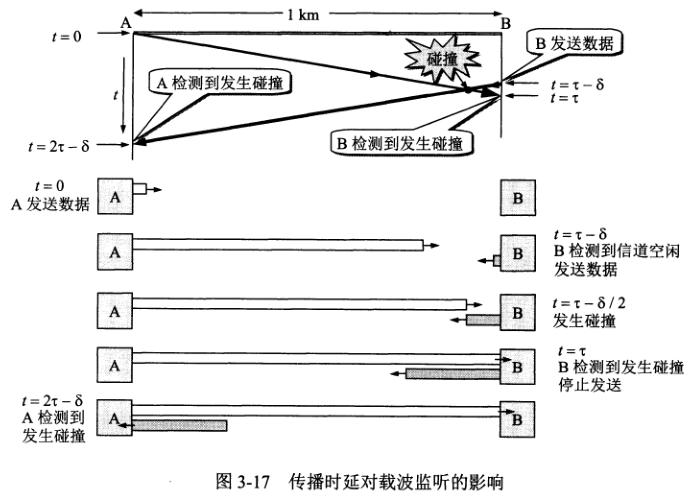
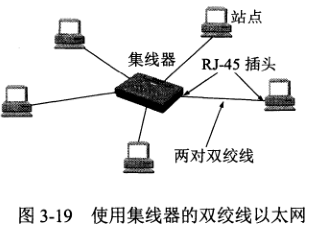
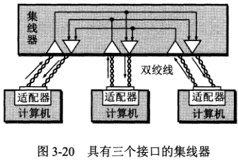

# 数据链路层
一般的网络适配器都包括了数据链路层和物理层功能。

数据链路层使用的信道主要有两种类型：
1. 点对点信道。
2. 广播信道。

数据链路层协议的数据单元称为帧。

数据链路层协议有许多种，但有三个基本问题是共同的：**封装成帧**、**透明传输**、**差错检测**。
### 封装成帧
封装成帧就是在 IP 数据报前后加上首部和尾部，构成帧。帧首部和尾部的作用是进行帧定界（确定帧的界限）。

帧头部开始的控制字符是 SOH(0x01)，帧结束的控制字符是 EOT(0x04)，如果接收到的帧两个控制字符中有一个不对或没有，就代表帧接收不完整或出错，必须丢弃。

### 透明传输
透明传输就是让帧中数据部分的数据不会被解释成 SOH 或 EOT，就像数据是透明一样。

具体做法：发送端的数据链路层在数据中出现的控制字符 SOH 或 EOT 的前面插入一个转义字符 ESC(0x1b)；而接收端的数据链路层在把数据送往网络层前先把转义字符删除；
这个方法称为字节填充。如果转义字符也出现在数据中，那就在转义字符前插入一个转义字符。

### 差错检测
数据在传输中有可能会出错，0 变成 1，或 1 变成 0，这称为**比特差错**。

传输比特的错误数占比特总数的比率称为误码率 BER。为了解决比特差错问题，使用了称为**循环冗余检验 CRC** 的检错技术。

CRC 在数据后面添加供差错检测用的 n 位冗余码，然后构成一个帧发送出去，这种为了检测差错而添加的冗余码被称为**帧检验序列 FCS**。
一种较方便的方法是用多项式来表示循环冗余检验过程。

在数据链路层，发送端 FCS 的生成和接收端的 CRC 检验都是用硬件完成的，处理迅速，不会延误数据的传输。

### 传输差错类型
1. 比特差错
2. 帧丢失、帧重复、帧失序

为了应对第 2 个问题，在 CRC 检错的基础上，增加了帧编号、确认、重传机制，这种方法在历史上曾经起到很好作用。
但现在通信链路的质量比起以前有了很大的提高，由于通信质量问题而引起的差错概率已经大大降低了，因此现在采用了区别对待的方法。

1. 对于通信质量良好的有线传输链路，数据链路层不使用确认和重传机制，将改正差错的任务交由上层协议（例如运输层的 TCP）来完成。
2. 对于通信质量较差的无线传输链路，使用确认和重传机制，即向上提供可靠的传输服务。

## 使用广播信道的数据链路层
局域网最主要的特点：网络为一个单位所拥有，且地理范围和站点数目有限。

局域网按拓扑分类：
1. 星形网
2. 环形网
3. 总线网

### 共享信道的两种方法
#### 静态划分信道
用户只要分配到了信道，就不会和其他用户发生冲突。但是代价较高，不适合局域网使用。

#### 动态媒体接入控制
又称为多点接入，其特点是信道不是固定分配给用户的。这里又分为两类：
1. 随机接入，所有用户可随机地发送信息，但用户在同一时刻发送信息会发生碰撞导致发送失败。因此必须要有解决碰撞的网络协议。
2. 受控接入，用户不能随机地发送信息，必须服从一定的控制。这类典型的代表有分散控制的**令牌环局域网**和集中控制的**多点线路探询**，又称为轮询。

以太网属于随机接入，受控接入在局域网中用得比较少。

### 适配器的作用
适配器实现的功能包含了数据链路层和物理层的功能。

计算机的 MAC 地址就在适配器的 ROM 中，而 IP 地址则在计算机的存储器中。

适配器对于目的地址不是自己的帧采取丢弃行为。

适配器装有处理器和存储器（包括 RAM 和 ROM），适配器和局域网之间的通信通过电缆或双绞线以串行传输的方式进行，适配器和计算机之间通过主板上的 I/O 总线以并行的传输方式进行。因此，适配器的一个重要功能就是对数据的串行传输和并行传输进行转换。同时，适配器还要实现以太网协议。

### CSMA/CD 协议
总线的特点，当一台计算机发送数据时，总线上的所有计算机都能检测到这个数据，这就是广播通信方式（一对多）。

以太网为了通信的简便，采取了两种措施：
1. 采用无连接的工作方式，不必建立连接就能发送数据，适配器对发送的帧不进行编号，不要求对方发回确认。对于是否需要重传则由高层协议决定（例如 TCP）。在总线上同时只允许一台计算机发送数据，为此使用了 CSMA/CD 协议，即载波监听多点接收/碰撞检测。

2. 以太网发送的数据使用曼彻斯特编码的信号。

#### CSMA/CD 协议的要点
1. 多点接入，说明这是总线型的网络，许多计算机以多点接入的方式连接在一根总线上。协议的实质就是载波监听和碰撞检测。
2. 载波监听就是用电子技术检测总线上有没有其他计算机在发送消息（检测信道）。
3. 碰撞检测也就是边发送边监听，即适配器边发送数据边检测信道上的信号电压的变化情况，以便判断是否其他计算机也在发送数据。当几个计算机同时发送信息时，总线上的信号电压会增大。当适配器检测到信号电压变化幅度超过一定的门限值时，就认为有多个计算机在发送数据，表明产生了碰撞。

显然，使用 CSMA/CD 协议时一台计算机不可能同时进行接收和发送（但必须边发送边监听）。因此使用 CSMA/CD 协议的以太网只能进行双向交替通信（半双工通信）。

以太网的端到端往返时间称为**争用期**，又称为**碰撞窗口**。即经过争用期这段时间还没有检测到碰撞（在这段时间内收到信息就是发生了碰撞），才能肯定这次发送不会碰撞。

以太网使用**截断二进制指数退避算法**来确定碰撞后重传的时机。如果重传达 16 次后仍不能成功，则丢弃帧，并报告高层。

为了避免发送的帧太短，以太网规定了最短的帧长必须为 64 字节，即 512 比特。如果要发送的数据太少，则加入一些填充字节。

由于争用期的时间不能太长，所以以太网的最大端到端长度约为 5 KM，但实际上远远没有这么大。

当发送数据的计算机检测到碰撞时，除了立即停止发送数据外，还要继续发送 32 比特或 48 比特的人为干扰信号，这称为**强化碰撞**。

以太网还规定了帧间最小间隔为 9.6 微秒，相当于 96 比特的时间。这样做是为了使刚接收到数据帧的计算机的接收缓存来得及清理，做好接收下一帧的准备。

### 星形拓扑
采用星形拓扑的以太网在星形的中心增加了一种可靠性非常高的设备，叫做集线器。双绞线以太网总是和集线器配合使用。
由于性价比很高的 10BASE-T 双绞线以太网的出现，从此以太网的拓扑就从总线型变成了星形网络。

#### 集线器特点
1. 集线器使用电子器件来模拟实际电缆线的工作，使用集线器的以太网逻辑上仍是一个总线网，各计算机共享逻辑上的总线，使用的还是 CSMA/CD 协议（各计算机中的适配器执行 CSMA/CD 协议）。并且同一时刻只允许一个计算机发送数据。
2. 一个集线器有许多个接口，例如 8 - 16 个。
3. 集线器工作在物理层，它的每个接口仅是简单地转发比特，不进行碰撞检测。若两个接口同时有信号输入（即发生碰撞），那么所有的接口都接收不到正确的帧。

4. 集线器采用了专门的芯片，进行自适应串音回波抵消。

### 以太网的的信道利用率
aaaaaa