# 多媒体网络
多媒体最主要的两个特点：
1. 多媒体信息量往往很大，因此在传输过程中要进行压缩。
2. 在传输多媒体数据时，对时延和时延抖动均有较高要求。

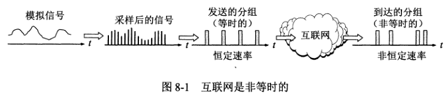

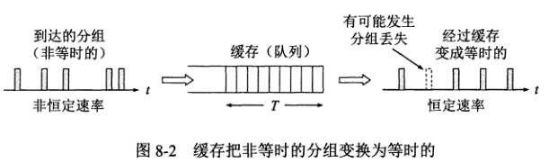

由于互联网是非等时的，为了避免失真，可以在应用层设置缓存，等接收的多媒体数据到了一定量再以恒定速率按顺序读取并进行还原播放。

在传送时延敏感的实时数据时，不仅传输时延不能太大，而且时延抖动也必须受到限制。
因此实时数据的传输在传输层采用 UDP 而不是 TCP，丢失容忍也是实时数据的一个重要特点。
同时发送端还得对多媒体数据的每一个分组增加序号和时间戳，这样接收端就知道在什么时候开始播放缓存中收到的分组。

目前互联网提供的音频/视频服务大体可分为三种类型：
1. 流式存储音频/视频，这种类型是把压缩好的音频/视频文件放在服务器上，用户通过互联网下载文件。这种类型特点是能够边下载边播放。
2. 流式实况音频/视频，它是一对多的通信，特点是发送方边录制边发送。
3. 交互式音频/视频，这种类型是用户使用互联网和他人进行实时交互式通信。

## 流式存储音频/视频
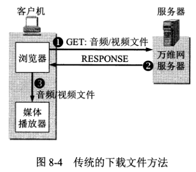

### 具有元文件的万维网服务器
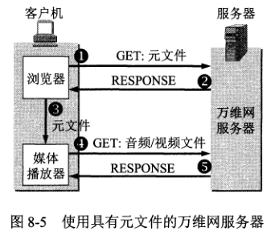

### 媒体服务器
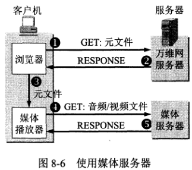

采用 UDP 的缺点：
1. 很多单位的防火墙会阻止外部 UDP 分组的进入。
2. 使用 UDP 传输流式多媒体文件时，如果用户想进行暂停或快进等操作，还需要使用 RTP 和 RTSP 协议，这样就增加了成本和复杂性。

所以现在对于流式存储音频/视频很多公司都采用了 TCP 来传送。

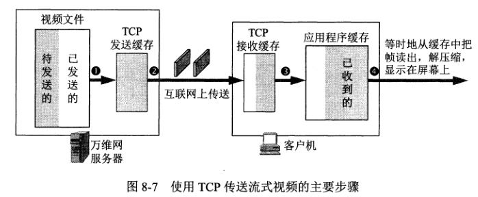

图中步骤 4 的读出速率是严格按照源视频文件的规定速率来播放的，另外三个步骤中的数据传送速率则是任意的。
如果用户暂停播放，那么图中的三个缓存将很快被填满，这时 TCP 发送缓存就暂停读取所存储的视频文件。

### 实时流式协议 RTSP
RSTP 协议以客户服务器的方式工作，它是一个应用层的多媒体播放控制协议。RSTP 本身不传送数据，仅是使媒体播放器能够控制多媒体流的传送（有点像 FTP 的控制信道）。
RSTP 是有状态的协议，控制分组可以在 TCP 或 UDP 上传送。

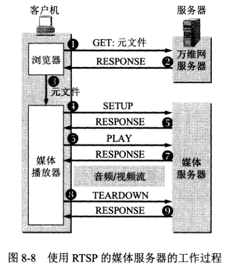

## 交互式音频/视频
在很长一段时间内，分组话音通信发展并不快，主要是：
1. 缺少廉价的高质量、低速率的话音信号编解码软件和相应的芯片。
2. 计算机网络的传输速率和路由器处理速率均不够快，因而导致传输时延大。
3. 没有保证实时通信服务质量的网络协议。
4. 计算机网络的规模较小，而通信网只有在具有一定规模后才能产生经济效益。

### IP 电话网关
IP 电话网关作用：
1. 在电话呼叫阶段和呼叫释放阶段进行电话信令的转换。
2. 在通话期间进行话音编码的转换。

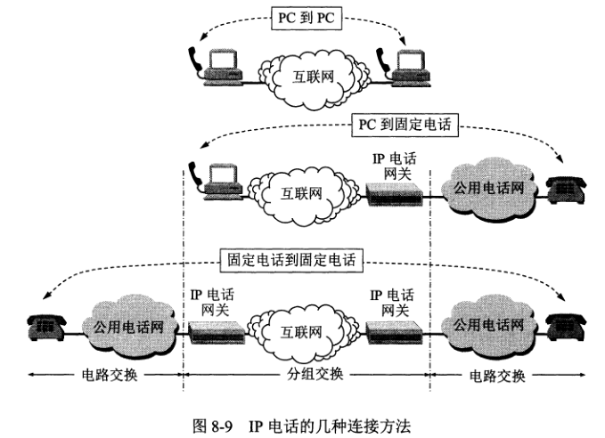

### IP 电话质量
IP 电话通话质量由两个因素决定：
1. 通话双方端到端的时延和时延抖动。
2. 话音分组的丢失率。

这两个因素都取决于当时网络上的通信量。如果通信量巨大导致发生拥塞，那时延、时延抖动和丢失率都很高，导致通话质量下降。
因此，一个用户使用 IP 电话的通话质量取决于当时其他许多用户的行为。
而电路交换电话网则不是，当电话网通信量非常大时，往往使我们无法拨通电话。但只要拨通了电话，那么电信公司就能保证让用户获得满意的通话质量。

### IP 电话所需要的几种应用协议
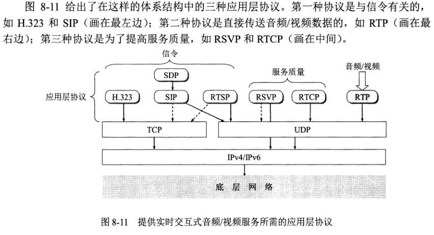

1. 信令协议，它使我们能够在互联网上找到被叫用户。
2. 话音分组的传送协议，它使我们用来进行电话通信的话音数据能够以时延敏感属性在互联网中传送。

### 实时运输协议 RTP
RTP 为实时应用提供端到端的运输，但不提供任何服务质量的保证。多媒体数据块在发送端经过压缩编码后，先送给 RTP 封装成 RTP 分组，再依次传递给 UDP、IP。
RTP 不对多媒体数据块做任何处理，只是向应用层提供一些附加的信息，让应用层知道如何处理。

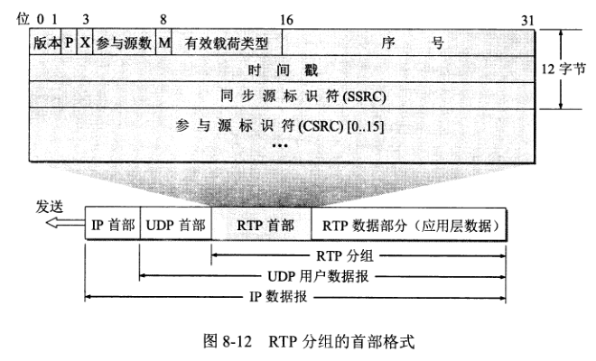

RTP 分组只包含 RTP 数组，而控制是由另一个配套使用的 RTCP 协议提供的。RTP 在端口号 1025-65535 之间选择一个偶数 UDP 端口号，而在同一次会话中的 RTCP 则使用下一个奇数 UDP 端口号。

### 实时运输控制协议 RTCP
RTCP 协议的主要功能是：服务质量的监视和反馈、媒体间的同步（如 RTP 发送的声音和图像的配合），以及多播组中成员的标志。
RTCP 分组也使用 UDP 来传送，但 RTCP 并不对音频/视频分组进行封装。由于 RTCP 分组很短，因此可以把多个 RTCP 分组封装在一个 UDP 用户数据报中。

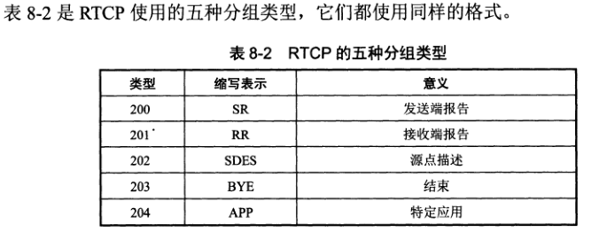

### H.323
现在 IP 电话有两套信令标准：
1. ITU-T 定义的 H.323 协议。
2. IETF 提出的会话发起协议 SIP。

H.323 不是一个单独的协议而是一组协议，它包括系统和构件的描述、呼叫模型的描述、呼叫信令的过程、控制报文、复用、话音编解码器、视像编解码器，以及数据协议等。

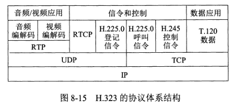

### 会话发起协议 SIP
SIP 使用了 KISS 原则：保持简单、傻瓜（Keep It Simple and Stupid）。
SIP 没有提供像 H.323 那样多的功能。它没有强制使用特定的编解码器，也不强制使用 RIP 协议。
SIP 使用文本方式的客户服务器协议，它有两种构件，即用户代理和网络服务器。

## 改进“尽最大努力交付”的服务
服务质量 QoS 是服务性能的总效果，此效果决定了一个用户对服务的满意程度。
服务质量可用若干基本的性能指标来描述，包括可用性、差错率、响应时间、吞吐量、分组丢失率、连接建立时间、故障检测和改正时间等。

### 调度机制
这里说的调度是指排队的规则，路由器的默认排队规则是**先进先出**，当队列已满时，后到的分组就得丢弃。先进先出最大的缺点就是**不能区分时间敏感分组和一般数组分组**。

在先进先出的基础上增加优先级，就能使优先级高的分组优先得到服务。

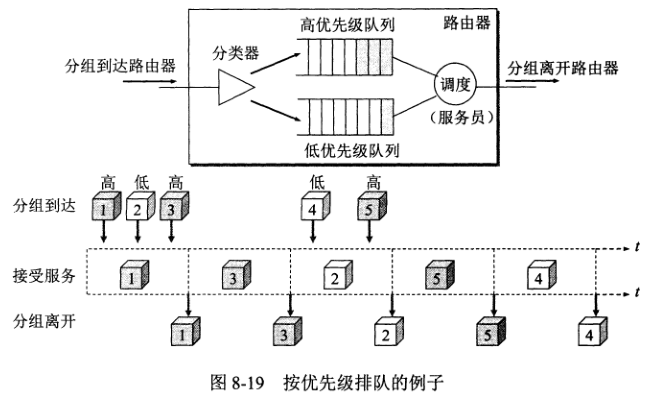

只有处理完高优先级的队列，才会去处理低优先级的队列。不过这样也有一个缺点，就是高优先级队列总是有分组时，低优先级队列永远得不到处理。

**公平排队 FQ** 可解决这一问题。FQ 对每种类别的分组流设置一个队列，然后轮流使每一个队列只能发送一个分组。但公平排队也有不公平的时候，就是长分组得到的服务时间长，短分组比较吃亏，并且公平排队没有区分分组的优先级。

为了使高优先级队列中的分组有更多的机会得到服务，可增加队列权重的概念，这就是**加权公平排队 WFQ**。

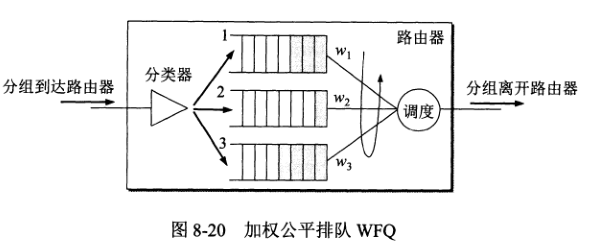

WFQ 给每个分组流分配不同的权重，每个分组流根据不同的权重获得不同的服务时间。下图中分组流 1 的权重为 0.5，剩下的 10 个分组流各为 0.05。在 a 和 b 两种方式中，分组流 1 都能获得更多的服务时间。

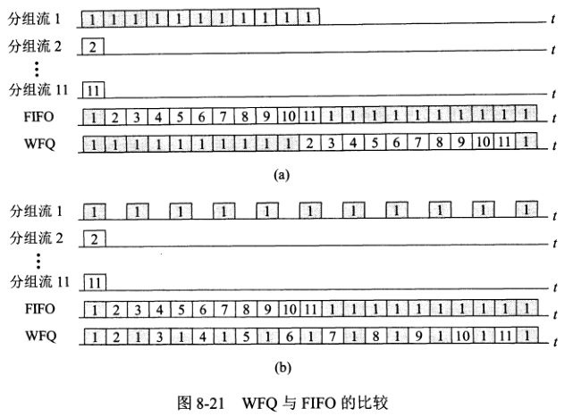

### 管制机制
管制机制可以提供服务质量，对一个数据流，可以在三个方面进行管制：平均速率、峰值速率、突发长度。
漏桶管制器可以对这三个指标进行管制。

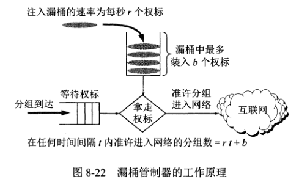

漏桶机制与加权公平排队相结合

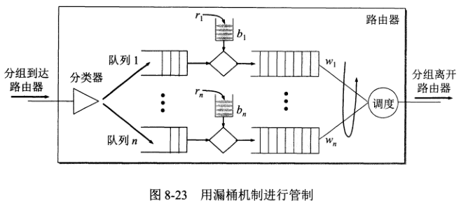

### 综合服务 IntServ 和资源预留协议 RSVP
IntServ 可对单个应用会话提供服务质量的保证，其特点有二：资源预留和呼叫建立。

IntServ 定义了两类服务：
1. 有保证的服务，可保证一个分组在通过路由器时的排队时延有一个严格的上限。
2. 受控负载的服务，可以使应用程序得到比通常的“尽最大努力”更加可靠的服务。

IntServ 由四个部分组成：
1. 资源预留协议 RSVP，它是 IntServ 的信令协议。
2. 接纳控制，用来决定是否同意对某一资源的请求。
3. 分类器，用来把进入路由器的分组进行分类，并根据分类的结果把不同类别的分组放入特定的队列。
4. 调度器，根据服务质量要求决定分组发送的前后顺序。

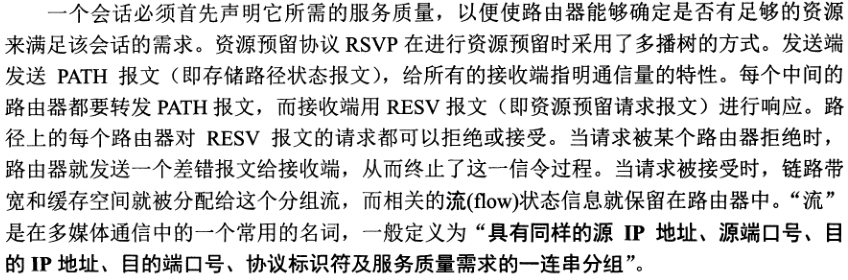

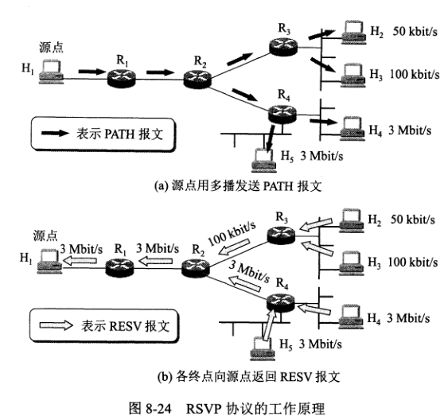

IntServ/RSVP 使得互联网的体系结构发生了根本的变化，因为 IntServ/RSVP 使得互联网不再是提供“尽最大努力交付”的服务。

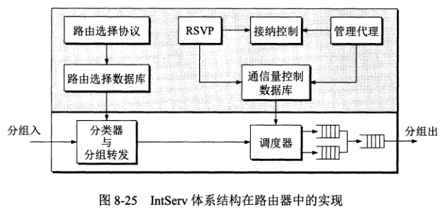

### 区分服务 DiffServ
由于 IntServ/RSVP 较复杂，很难在大规模的网络中实现，因此 IETF 提出了一种新策略，即区分服务 DiffServ。

要点如下：
1. 力图不改变网络的基础结构，但在路由器中增加区分服务的功能。
2. 网络被划分为许多个 DS 域，一个 DS 域在一个管理实体的控制下实现同样的区分服务策略。
3. 边界路由器可分为分类器和通信量调节器两大部分。调节器又由标记器、整形器、测定器组成。
4. DiffServ 提供了一种聚合功能，它不是为网络中的每一个流维持供转发时使用的状态信息，而是把若干个流根据其 DS 值聚合成少量的流。路由器对相同 DS 值的流都按相同的优先级进行转发。

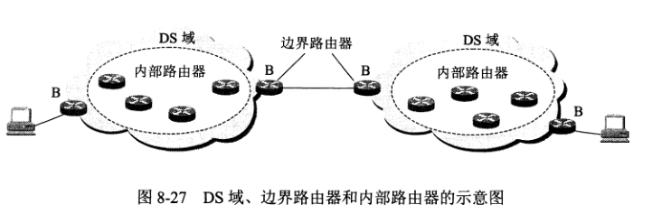

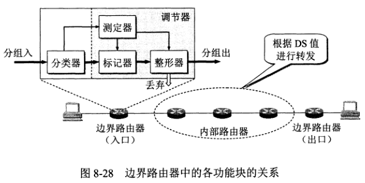

#### 每跳行为 PHB
“行为”就是指在转发分组时路由器对分组是怎样处理的。“行为”例子可以是：首先转发这个分组或最后丢弃这个分组。
“每跳”是强调这里所说的行为只涉及到本路由器转发的这一跳的行为，而下一个路由器怎样处理和本路由器的处理无关。

PHB 可分为迅速转发 PHB 和确保转发 PHB。