# 物理层
数据在通信线路上的传输方式一般是串行传输（出于经济上的考虑），即逐个比特按照顺序传输。
## 数据通信的基础知识
数据通信系统可分为三大部分：
1. 源系统，即发送端。
2. 传输系统或传输网络。
3. 目的系统，即接收端。

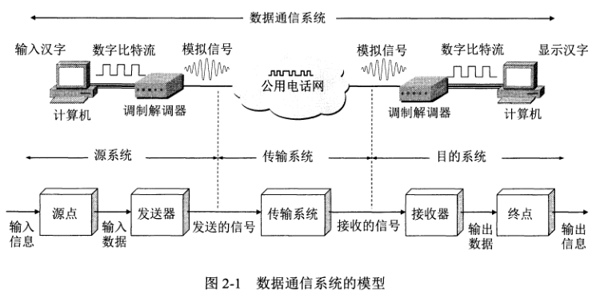

#### 源系统
源系统一般包括两部分：
1. 源点（源站、信源），源点设备产生要传输的数据。
2. 发送器，源点生成的数字比特流要通过发送器编码后才能够在传输系统传输。

#### 目的系统
目的系统一般包括两部分：
1. 接收器，接收传输系统传送过来的信号，并转换为能够被目的设备处理的信息。
2. 终点，终点设备从接收器获取传过来的数字比特流，然后把信息输出。

#### 信号
信号可分为两大类：
1. 模拟信号或连续信号，代表消息的参数的取值是连续的。
2. 数字信号或离散信号，代表消息的参数的取值是离散的。在使用时间域的波形表示数字信号时，代表不同离散数值的基本波形被称为码元。
在使用二进制编码时，只有两种不同的码元，一种状态代表 0，另一种状态代表 1。

### 信道
信道一般用来表示向某一个方向传输信息的媒体。因此，一条通信电路通常包含一条发送信道和接收信道。

从通信的双方信息交互的方式来看，有三种基本方式：
1. 单向通信（单工通信），即只能有一个方向的通信而没有反方向的交互。无线电广播、有线电广播、电视广播就属于这种方式。
2. 双向交替通信（半双工通信），双方都能发送信息，但同时只能有一个方向的通信。
3. 双向同时通信（全双工通信），双方能同时发送和接收信息。

单向通信只需一个信道，双向交替、双向同时通信都需要两个信道（每个方向一条）。

#### 基带信号
来自信源的信号称为基带信号，像计算机输出的信号就属于基带信号。
基带信号往往含有较多地低频成分，甚至有直流成分，而许多信道不能传输这种低频分量或直流分量，所以需要对基带信号进行**调制**。

调制可分为两大类：
1. 仅对基带信号的波形进行转换，使它与信道特性相适应，变换后的信号仍然是基带信号，称为基带调制，又称为编码。
2. 需要使用载波进行调制，把基带信号的频率范围转移到较高的频段，并转换为模拟信号，这样能更好地在模拟信道中传输。经载波调制后的信号称为带通信号，而使用载波的调制称为带通调制。

#### 常用编码方式
1. 不归零制，正电平代表 1，负电平代表 0。
2. 归零制，正脉冲代表 1，负脉冲代表 0。
3. 曼彻斯特编码，位周期中心的向上跳变代表 0，位周期中心的向下跳变代表 1。
4. 差分曼彻斯特编码，在每一位的中心处始终都有跳变。位开始边界有跳变代表 0，而位开始边界没有足迹代表 1。

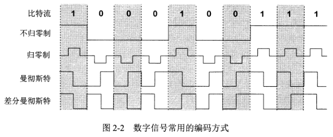

#### 基本的带通调制方法
1. 调幅，即载波的振幅随基带数字信号变化。
2. 调频，即载波的频率随基带数字信号变化。
3. 调相，即载波的初始相位随基带数字信号变化。

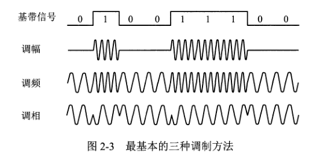

### 信道的极限容量
信号在信道上传输由于各种原因会导致失真。信道所能通过的频率范围总是有限的，信号中的许多高频分量往往不能通过信道。


限制码元在信道上传输速率的因素：信道能够通过的频率范围和信噪比。
#### 信道能够通过的频率范围
在接收端收到的信号波形由于传输时受到衰减而失去了码元之间的清晰界限，这种现象称为**码间串扰**。在任何信道中，码元传输的速率是有上限的，传输速率超过上限，就会出现严重的码间串扰问题。如果信道的频宽越宽，能够通过的信号高频分量就越多，那么可以用更高的速率传送码元而不出现码间串扰。

#### 信噪比
噪声存在于所有电子设备中（随机产生），噪声会使接收端对码元的判决产生错误（0 认为 1，1 认为 0）。如果信号相对较强，那么噪声的影响相对较小。因此，信噪比很重要。信噪比就是信号的平均功率和噪声的平均功率之比，记为 S/N，并用分贝（DB）作为度量单位。
```
信噪比(db) = 10 * log10(S/N) (db) 
```
信道的带宽或信道中的噪声比越大，信息的极限传输速率就越高。

## 物理层下面的传输媒体
传输媒体分为导引型传输媒体和非导引型传输媒体。在导引型传输媒体中，电磁波被导引沿着固体媒体传播；在非导引型传输媒体中，电磁波的传输被称为无线传输。

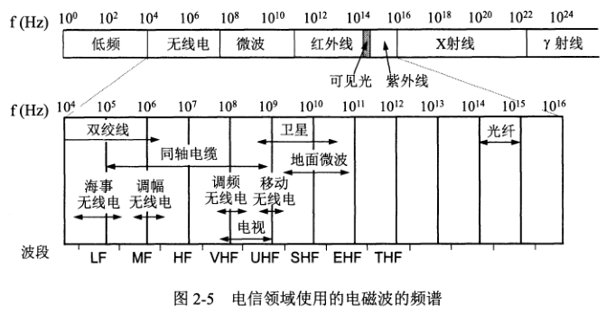

### 导引型传输媒体
#### 双绞线
双绞线是最古老也是最常用的传输媒体。
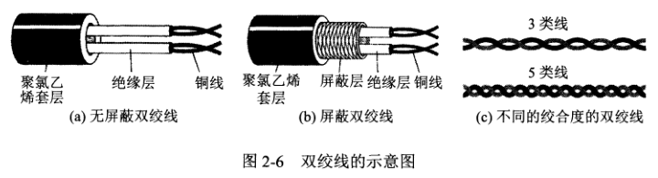


#### 同轴电缆
在局域网早期曾广泛地使用同轴电缆，但随着技术的进步，现在基本上都使用双绞线。目前同轴电缆主要用在有线电视网的居民小区中。
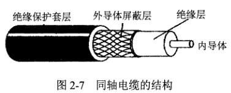

#### 光缆
光纤特点：
1. 传输损耗小，中继距离长，对远距离传输特别经济。
2. 抗雷电和电磁干扰性能好。
3. 无串音干扰，保密性好，不易被窃听和截取数据。
5. 体积小，重量轻。
6. 通信容量非常大。

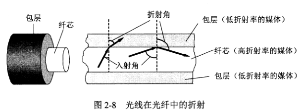

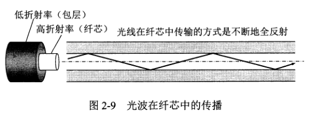
### 非导引型传输媒体
#### 短波
短波通信主要靠电离层反射，但电离层不稳定导致短波通信质量较差。

#### 微波
无线电微波通信在数据通信中占有重要地位，微波在空间主要是直线传播。传统的微波通信有两种方式：地面微波接力通信和卫星通信。

微波接力通信特点：
1. 微波波段频率很高，其频段范围也很宽，因此通信信道的容量很大。
2. 因为工业干扰和天电干扰的主要频谱成分比微波频率低得多，因而微波传输质量较高。
3. 与相同容量和长度的电缆载波通信比较，微波接力通信建设投资少，见效快，易于跨越山区、江河。
4. 相邻站之间必须直视，不能有障碍物。
5. 微波的传播有时也会受恶劣天气的影响。
6. 与电缆通信系统比较，微波通信的隐蔽性和保密性较差。
7. 对大量中继站的使用和维护要耗费较多的人力、物力。

卫星通信特点：
1. 利用同步地球卫星作为中继站的一种微波接力通信。
2. 通信距离远，且通信费用与距离无关。同步地球卫星发射的电磁波能覆盖的区域跨度达一万八千多公里，面积约占地球的三分之一，只要 3 颗卫星就能覆盖全球。
3. 由于距离远，导致传播时延大。
4. 保密性相对较差。
5. 费用较高。

## 信道复用技术
### 频分复用、时分复用和统计时分复用
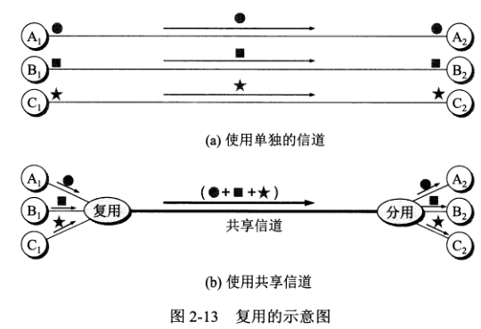

最基本的复用就是频分复用 FDM 和时分复用 TDM。

频分复用在用户分配到一定的频带后，在通信过程中自始至终都占用这个频带。可见频分复用的用户在同样的时间占用不同的带宽（频率带宽）资源。

时分复用是将时间划分为一段段等长的时分复用帧，每一个用户在每一个 TDM 帧中占用固定序号的时隙。时分复用的用户是在不同的时间占用同样的频带带宽。

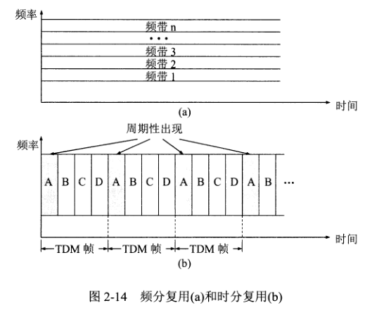

统计时分复用是一种改进的时分复用，它能明显地提高信道的利用率。

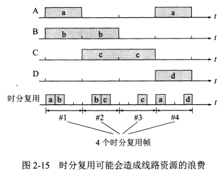

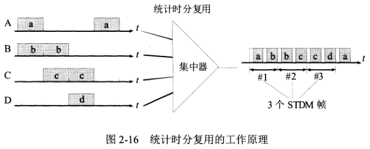

### 波分复用
波分复用 WDM 就是光的频分复用。

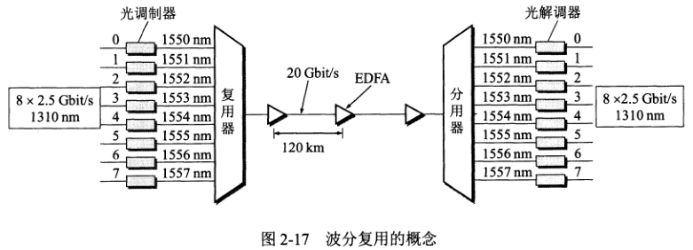