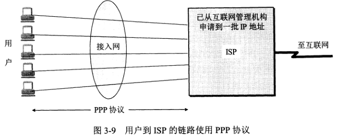
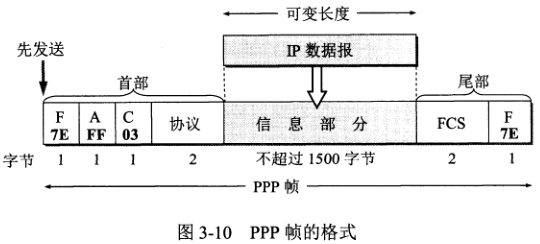

# ppp 点对点协议文档

在通信线路质量较差的年代，高级数据链路控制 HDLC 成为当时比较流行的数据链路层协议。
但现在已经很少使用了，相对简单的点对点协议 PPP 是目前使用最广泛的数据链路层协议。
PPP 协议是用户计算机和 ISP 进行通信时所使用的数据链路层协议。



PPP 不需要进行纠错，不需要设置序号，也不需要进行流量控制，只支持点对点的链路通信，只支持全双工链路。
### PPP 通信过程
1. 结点 A 的数据链路层把网络层下发的 IP 数据报添加首部和尾部封装成帧。
2. 结点 A 把封装好的帧发送给结点 B 的数据链路层。
3. 若结点 B 收到的帧出错，则丢弃；否则从帧中提取 IP 数据报上交给网络层。


### PPP 协议设计需求
1. 简单，对接收到的帧进行 CRC 检测，正确则收下，错误则丢弃，其他什么都不做。
2. 封装成帧，必须有帧定界符。
3. 透明性，必须保证数据传输的透明性。
4. 多种网络层协议，能够在同一条物理链路上同时支持多种网络层协议运行。
5. 多种类型链路，必须能够在多种类型的链路上运行。
6. 差错检测，对帧进行检测，并丢弃错误的帧。
7. 检测连接状态，必须有一种机制能够及时（不超过几分钟）检测链路是否处于正常工作状态。
8. 最大传送单元（MTU），MTU 是数据链路层的帧可以载荷的数据部分的最大长度，不是帧的总长度。
9. 网络层地址协商，提供一种机制使连接的双方的网络层能够通过协商知道彼此的网络层地址。
10. 数据压缩协商，提供一种方法来协商使用数据压缩算法。

运行在以太网上的 PPP 协议叫 PPPoE(PPP over Ethernet)，这个协议把 PPP 帧封装在以太网帧中。

### PPP 协议的组成
PPP 协议有三个组成部分
1. 一个将 IP 数据报封装到串行链路的方法。
2. 一个用来建立、配置和测试数据链路连接的链路控制协议 LCP。
3. 一套网络控制协议 NCP。

### PPP 协议的帧格式


1. 标志字段 F(flag)，规定为 0x7E，表示为一个帧的开始或结束。
2. 地址字段 A，规定为 0xFF。
3. 控制字段 C，规定为 0x03。
4. 协议字段，0x0021 表示信息字段是 IP 数据报；0xC021，表示是 LCP 的数据；0x8021 表示是网络层的控制数据。
5. 信息字段，长度可变，不超过 1500 字节。
6. FCS 字段，是使用 CRC 的帧检验序列 FCS。

### 字节填充
当信息字段中出现和标志字段一样的比特组合时（0x7E），将使用转义字符 0x7D 对其进行转义。
```
0x7E -> 0x7D, 0x5E
0x7D -> 0x7D, 0x5D
```
若信息字段中出现 ASCII 码的控制字符（数值小于 0x20 的字符），则在该字符前面加上 0x7D，同时将该字符的编码加以改变。
```
0x03 -> 0x7D, 0x23
```

### 零比特填充
PPP 协议用在 SONET/SDH 链路时将使用同步传输，在这种情况下，PPP 协议采用零比特填充方法。
具体做法：在发送前，对信息字段扫描，只要发现有 5 个连续的 1，则填入一个 0，接收端则相反。

### PPP 协议的工作状态
