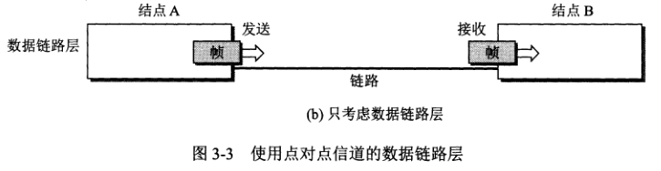

# ppp 点对点协议文档

## PPP 协议通信过程
1. 结点 A 的数据链路层把网络层下发的 IP 数据报添加首部和尾部封装成帧。
2. 结点 A 把封装好的帧发送给结点 B 的数据链路层。
3. 若结点 B 收到的帧出错，则丢弃；否则从帧中提取 IP 数据报上交给网络层。

## 数据链路层
一般的网络适配器都包括了数据链路层和物理层功能。

数据链路层使用的信道主要有两种类型：
1. 点对点信道。
2. 广播信道。

点对点信道的数据链路层的协议数据单元--帧。

数据链路层协议有许多种，但有三个基本问题是共同的：封装成帧、透明传输、差错检测。
### 封装成帧
封装成帧就是在 IP 数据报前后加上首部和尾部，构成帧。帧首部和尾部的作用是进行帧定界（确定帧的界限）。

帧头部开始的控制字符是 SOH(0x01)，帧结束的控制字符是 EOT(0x04)，如果接收到的帧两个控制字符中有一个不对或没有，就代表帧接收不完整或出错，必须丢弃。

### 透明传输
透明传输就是让帧中数据部分的数据不会被解释成 SOH 或 EOT，就像数据是透明一样。

具体做法：发送端的数据链路层在数据中出现的控制字符 SOH 或 EOT 的前端插入一个转义字符 ESC；而接收端的数据链路层在把数据送往网络层前先把转义字符删除；
这个方法称为字节填充。
