# 无线网络和移动网络
## 无线局域网 WLAN
无线局域网可分为两大类，第一类是有固定基础设施的，第二类是无固定基础设施的。
### IEEE802.11
802.11 是无线以太网的标准，它使用星形拓扑，其中心叫做接入点 AP(access point)，在 MAC 层使用 CSMA/CA 协议。
使用 802.11 系列协议的局域网又叫 Wi-Fi。

802.11 标准规定无线局域网的最小构件是基本服务集 BSS。一个 BSS 包括一个基站和若干个移动站，所有的站在本 BSS 内都可直接通信，但和本 BSS 以外的站点通信就得通过本 BSS 的基站。在 802.11 的术语中，上面提到的 AP 就属于 BSS 的基站。基本服务集的服务范围是由基站所发射的电磁波的辐射范围确定的。

AP 有一个不超过 32 字节的服务集标识符 SSID 和一个通信信道，SSID 其实就是指使用该 AP 的无线局域网的名称。
一个 BSS 所覆盖的地理范围叫做基本服务区，一般直径不超过 100 米。

BSS 可以通过 AP 连接到一个分配系统 DS，然后再连接到另一个 BSS，这样就构成了一个扩展的服务集 ESS。

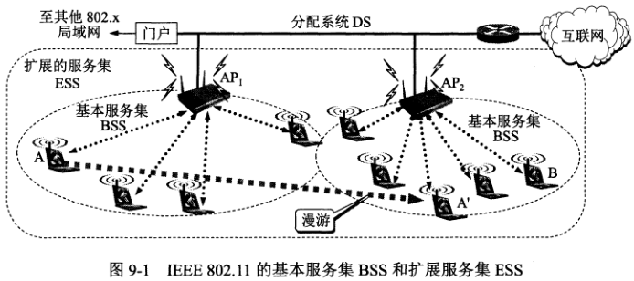

ESS 还可为无线用户提供到 802.x 局域网（非 802.11 无线局域网）的接入。这种接入是通过叫做门户的设备来实现的，作用相当于网桥。

移动站要和 AP 建立关联的方式有两种：
1. 被动扫描，即移动站等待接收 AP 周期性发出的信标帧，信标帧中包含有若干系统参数。
2. 主动扫描，即移动站主动发出探测请求帧，然后等待从 AP 发回的探测响应帧。

### 移动自组网络
无固定基础设施的无线局域网，又叫自组网络。

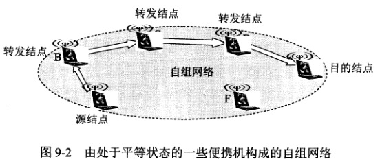

### 802.11 局域网的物理层
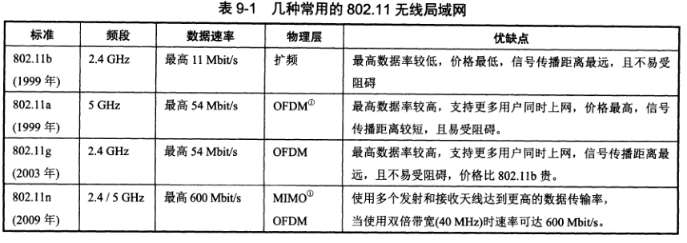

以上几种标准都使用共同的媒体接入控制协议，都可以用于有固定基础设施或无固定基础设施的无线局域网。

### CSMA/CA 协议
CSMA/CD 协议的前一部分 CSMA 能够在无线局域网中使用，在发送数据之前先对媒体进行载波监听。但碰撞检测（CD）在无线环境下却不能使用，理由如下：
1. 碰撞检测要求在发送数据的同时，还要不间断地检测信道。在无线局域网的适配器上实现碰撞检测，硬件花费会很大。
2. 即使在硬件上实现无线局域网的碰撞检测，也仍然无法避免碰撞的发生。

无线局域网不需要进行碰撞检测是由无线信道本身的特点决定的。

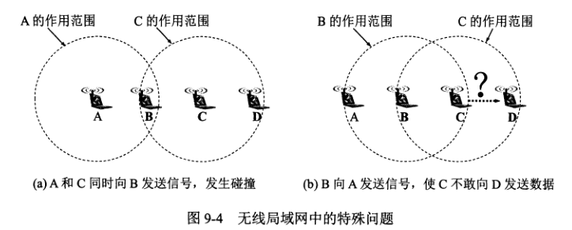

图 9-4a，A 和 C 都想和 B 通信，由于 A 和 C 相距较远，彼此听不到对方。所以都以为信道空闲，而同时向 B 发送数据，这种未能检测出信道上其他站点信号的问题叫做隐蔽站问题。

图 9-4b，B 向 A 发送数据，C 检测到 B 的信号，导致其不敢向 D 发送数据，这就是暴露站问题。

由此可见，无线局域网可能出现检测错误的情况：检测到信道空闲，其实并不空闲；检测到信道忙，其实并不忙。

无线局域网使用的是 CSMA/CA 协议，CA 的意思是碰撞避免，即要尽量减少碰撞发生的概率。同时 802.11 局域网还使用了停止等待协议（可靠传输协议），每发完一帧后，都要等到收到对方的确认帧后才会发送下一帧，这叫链路层确认。

802.11 的 MAC 层包括两个子层：
1. 分布协调功能 DCF。DCF 不采用中心控制，而是每一个结点使用 CSMA 机制的分布式接入算法，让各站通过争用信道来获取发送权。
2. 点协调功能 PCF。PCF 是选项，是用 AP 集中控制整个 BSS 内的活动。PCF 用类似于探询的方法把发送数据权轮流交给各站，从而避免了碰撞的发生。

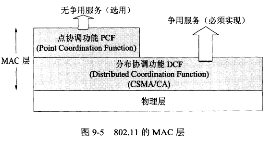

为了尽量避免碰撞，802.11 规定，所有的站在完成发送后，必须等待一段很短的时间（继续监听）才能发送下一帧，这称为帧间间隔 IFS。
帧间间隔的长短取决于该站要发送的帧的类型，高优先级的帧等待时间短，低优先级的帧等待时间长。
1. SIFS，短时间间隔，长度为 28 微秒，它是最短的帧间间隔，用来分隔开属于一次对话的各帧。在这段时间内，一个站应当能从发送方式切换为接收方式。使用 SIFS 的帧类型有：ACK 帧、CTS 帧、由过长的 MAC 帧分片后的数据帧，以及所有回答 AP 探询的帧和在 PCF 方式中 AP 发出的任何帧。
2. DIFS，分布协调功能帧间间隔，它比 SIFS 的帧间间隔要长得多，长度为 128 微秒。在 DCF 方式中，DIFS 用于发送数据帧和管理帧。

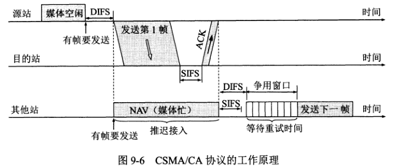

为什么信道空闲还要再等待一段时间 DIFS 呢？要考虑到有其他高优先级的帧要发送。

目的站收到帧后，经过时间间隔 SIFS 后，向源站发送 ACK 帧。若源站没有收到 ACK 帧，则重传数据帧，或者经过若干次重传失败后放弃发送。

802.11 标准还采用了一种叫做**虚拟载波监听的机制**，就是让源站把它要占用信道的时间通知给其他站，以便让其他站在这一段时间都停止发送数据，这样就大大减少碰撞的机会。“源站的通知”就是源站在其 MAC 帧首部中的第二个字段“持续时间”中，填入在本帧结束后还要占用信道的时间。当一个站检测到正在信道中传送的 MAC 帧首部的“持续时间”字段时，就调整自己的**网络分配向量 NAV**。NAV 指出必须经过多少时间才能完成数据帧的这次传输，从而使信道转入空闲的状态。

当信道从忙态转为空闲时，任何一个站要发送数据，必须等待一个 DIFS 的间隔（如果要发送的不是第一个帧，还得进入争用窗口），并计算随机退避时间，以便再次试图接入到信道。

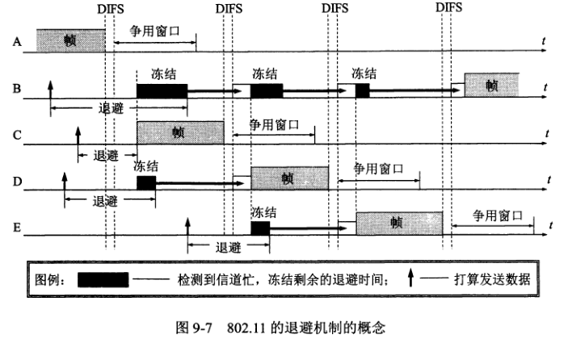

若检测到信道忙，就冻结退避计时器的剩余时间，等待信道重新变成空闲并再经过时间间隔 DIFS 后，从剩余时间开始继续倒计时。如果倒计时减少到 0，就开始发送整个数据帧。
冻结退避计时器剩余时间的做法是为了使协议对所有站点更加公平。

**CSMA/CA 算法归纳如下**

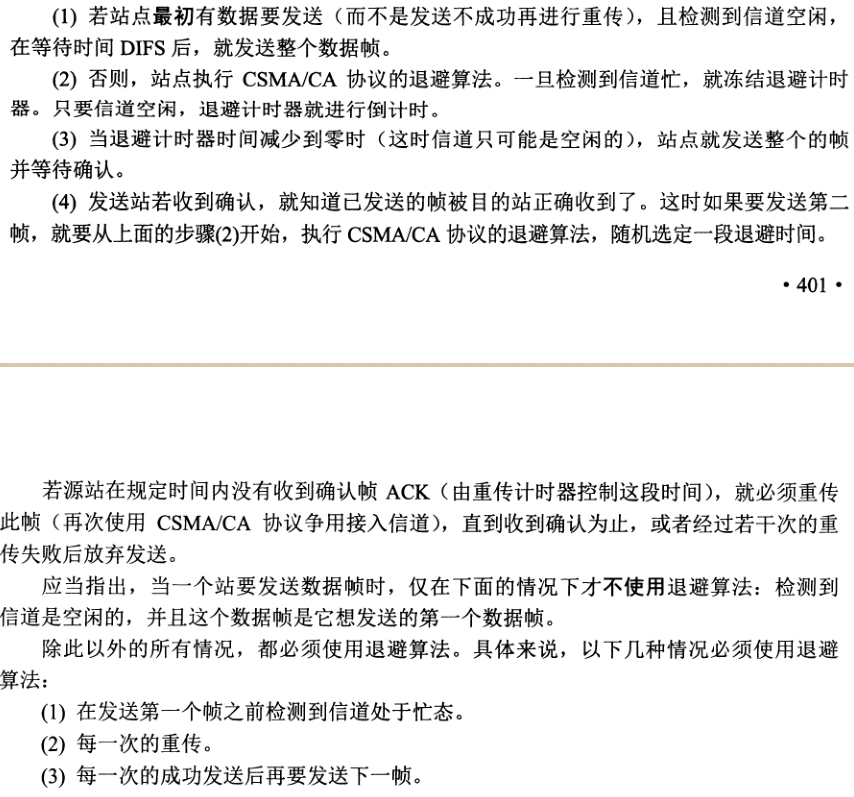

#### 对信道进行预约
802.11 允许源站对信道进行预约。

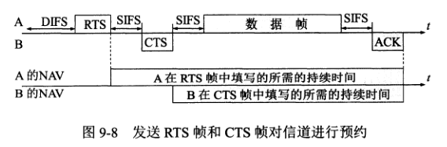

1. 请求发送 RTS 控制帧，它包括源地址、目的地址和这次通信所需的时间。
2. 允许发送 CTS 控制帧，它也包括这次通信所需的时间。

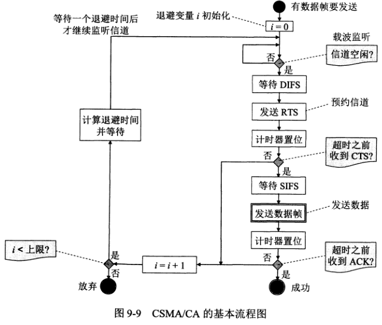

### 802.11 局域网的 MAC 帧
802.11 帧有三种类型：控制帧、数据帧、管理帧。

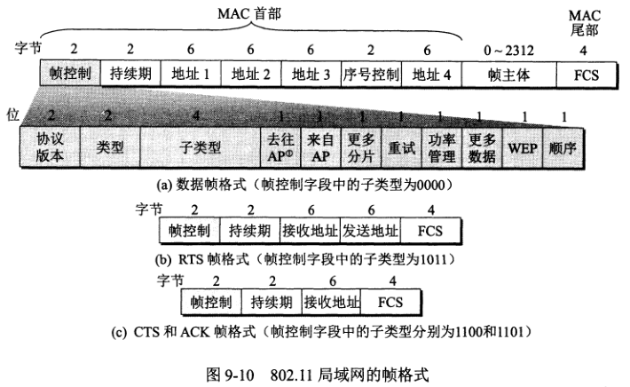

1. MAC 首部，共 30 字节，帧的复杂性都在帧的首部。
2. 帧主体，即数据部分，不超过 2312 字节。
3. 帧检验序列 FCS 是 MAC 尾部，共 4 字节。

#### 数据帧的地址
帧有 4 个地址字段，地址 4 用于自组网络。

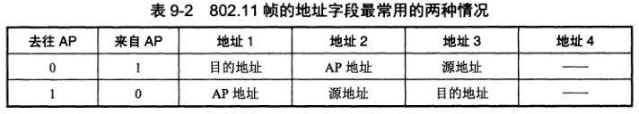

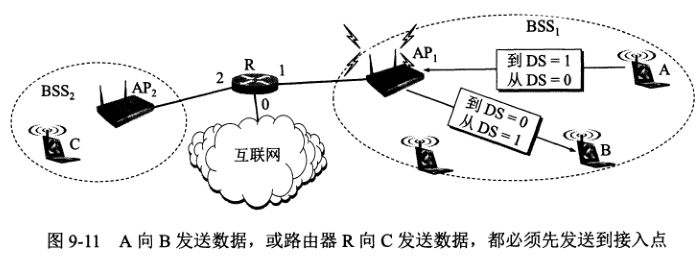

## 无线个人区域网 WPAN
无线个人区域网就是个人把电子设备用无线技术连接起来的自组网络，不需要接入 AP，整个网络的范围约为 10 米。

1. 蓝牙系统
2. 低速 WPAN
3. 调整 WPAN

## 无线城域网 WMAN
WMAN 可提供“最后一英里”的宽带无线接入。在许多情况下，无线城域网可用来代替现有的有线宽带接入。

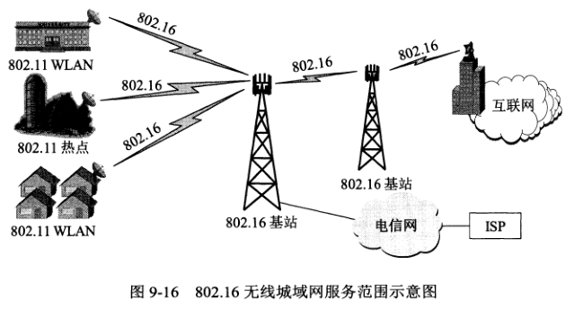

## 蜂窝移动通信
Wi-Fi 无线局域网可以接入到互联网，但必须是当计算机处在某个 Wi-Fi 的热点之中，并且一个热点的覆盖范围只有 10-100 米。

蜂窝移动通信又称为小区制移动通信，它的特点是把整个网络服务区划分成许多小区（cell，也就是蜂窝），每个小区设置一个基站，负责本小区各个移动站的联络与控制。移动站的发送与接收都得经过基站完成。

蜂窝移动网络的发展非常迅速，到现在已经有很多标准：
1. 第一代蜂窝移动通信是为话音通信设计的模拟 FDM 系统。1G 的蜂窝无线网络早已淘汰。
2. 第二代蜂窝移动通信的代表性体制就是最流行的 GSM 系统。这个系统带宽只有 200 KHz，除了基本的话音通信，它只能提供低速数字通信（短信服务）。
3. 第三代蜂窝移动通信使用的带宽增大到 5 MHz，从 3G 开始以后的各代蜂窝移动通信都是以传输数据业务为主的通信系统。
4. 第四代蜂窝移动通信的目标峰值数据率是：固定的和低速移动通信时应达到 1G/s，在高速移动通信时（如火车）应达到 100M/s。由此可见，目前全世界所声称的 4G 蜂窝无线网络，其实都远未达到真正的 4G 标准。

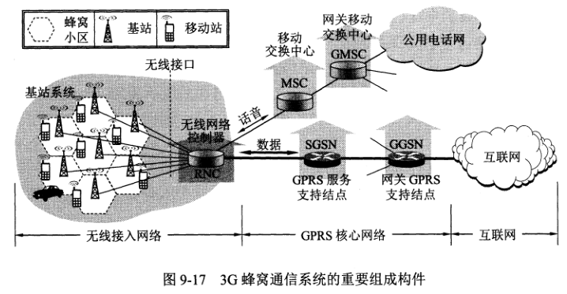

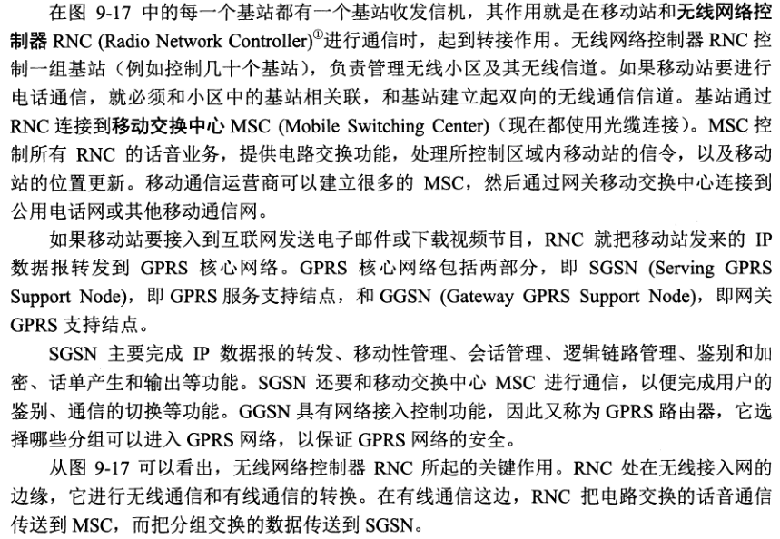

### 移动 IP
移动 IP 协议是由 IETF 开发的一种技术，这种技术允许计算机移动到外地时，仍然保留其原来的 IP 地址。
详情请看 414 页。

### 蜂窝移动通信网中对移动用户的路由选择
详情请看 418 页。

### GSM 中的切换
切换就是移动用户与相关联的基站发生了改变，并会使得呼叫的传输路由发生变化。切换发生的原因是：
1. 当前基站和移动用户之间的信号减弱，有使呼叫中断的可能。
2. 蜂窝小区的用户太多，基站不堪重负。这时会把移动用户切换到相邻的不太拥塞的蜂窝小区的基站相关联， 以减轻原来基站的负荷。

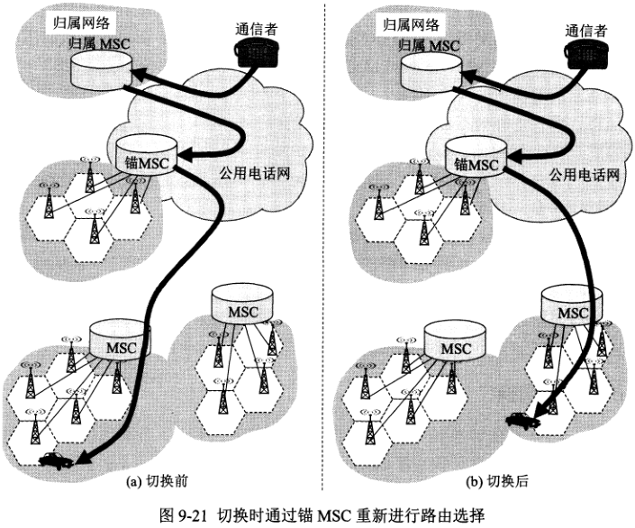

### 无线网络对高层协议的影响
移动用户由于移动到不同地方导致切换相关联的基站时，网络连接会发生短时间的中断。假如使用 TCP，这会造成 TCP 报文段的丢失，这时 TCP 的拥塞机制就会减少其拥塞窗口，
从而减少 TCP 发送报文段的速率。

可以使用三种方法来处理这个问题：
1. 本地恢复，指差错发生在什么地方，就在什么地方改正。例如无线局域网的自动请求重传 ARQ 协议就属于本地恢复措施。
2. 让 TCP 发送方知道什么地方使用了无线链路。只有 TCP 确认是有线网络部分发生了拥塞，才采用拥塞控制的策略，这需要一些特殊的技术。
3. 把含有移动用户的端到端 TCP 连接拆分成两个互相串接的 TCP 连接。

## 两种不同的无线上网
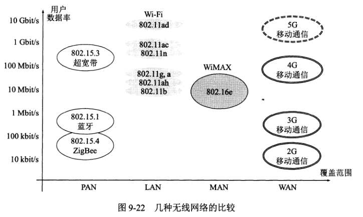